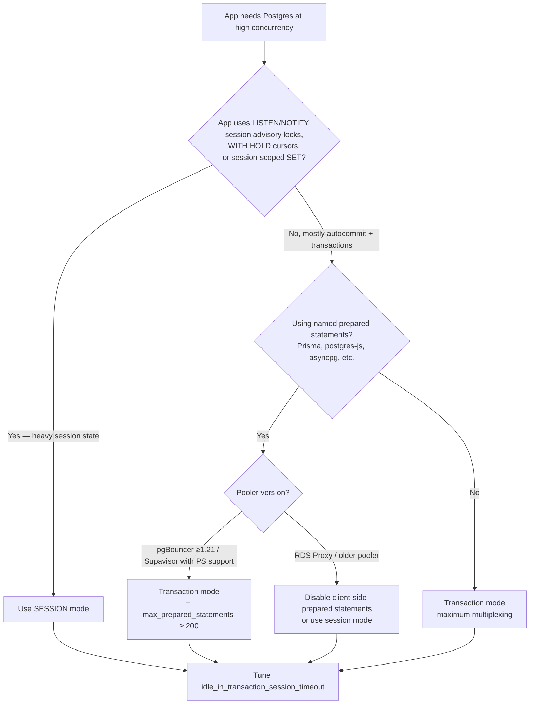

# Postgres Connection Pooling

> **TL;DR**: Pick a pool mode based on what session-state your app uses, not on raw concurrency. **Session mode** is safe but caps you at one client per backend. **Transaction mode** multiplexes — but breaks `LISTEN`, `SET`, session advisory locks, `WITH HOLD` cursors, and historically prepared statements (fixed in pgBouncer 1.21+ with `max_prepared_statements`). **AWS RDS Proxy for Postgres pins** on every `SET`, `PREPARE`, temp object, or 16+ KB statement. Always tune `idle_in_transaction_session_timeout` to prevent leaks.

---

## Jump to your fire

| Symptom | Section |
|---|---|
| "Too many connections, can't add more lambdas" | [Pool mode comparison](#1-pool-mode-comparison) |
| "Prisma/asyncpg/postgres-js says prepared statements broke" | [Prepared statements](#2-prepared-statements-the-pgbouncer-121-flip) |
| "Supabase 5432 vs 6543 — which port?" | [Supabase Supavisor](#3-supabase-port-per-mode-pattern) |
| "RDS Proxy showing high pinned-session count" | [RDS Proxy pinning](#4-aws-rds-proxy-pinning-triggers) |
| "`idle in transaction` connections holding locks" | [Diagnostics](#5-pg_stat_activity-diagnostics) |
| "Need a quick connection-string cheatsheet" | [Cheatsheet](#connection-string-cheatsheet) |

---

## Decision diagram



---

## 1. Pool mode comparison

From [pgbouncer.org/features.html](https://www.pgbouncer.org/features.html), the three pool modes:

| Mode | What's pooled | Quote (verbatim) |
|---|---|---|
| **Session** | One server backend per client connection, for the connection's lifetime | "Most polite method... This mode supports all PostgreSQL features." |
| **Transaction** | One server backend per transaction; returned at COMMIT/ROLLBACK | "This mode breaks a few session-based features of PostgreSQL. You can use it only when the application cooperates by not using features that break." |
| **Statement** | One server backend per statement; multi-statement txns disallowed | "This is meant to enforce 'autocommit' mode on the client, mostly targeted at PL/Proxy." |

### Feature compatibility (from pgbouncer.org/features.html)

| Feature | Session | Transaction |
|---|:---:|:---:|
| Startup parameters (client_encoding, DateStyle, IntervalStyle, Timezone, standard_conforming_strings, application_name) | ✅ | ✅ |
| `SET` / `RESET` | ✅ | ❌ Never |
| `LISTEN` | ✅ | ❌ Never |
| `NOTIFY` | ✅ | ✅ |
| `WITHOUT HOLD CURSOR` | ✅ | ✅ |
| `WITH HOLD CURSOR` | ✅ | ❌ Never |
| Protocol-level prepared plans | ✅ | ✅¹ |
| SQL-level `PREPARE` / `DEALLOCATE` | ✅ | ❌ Never |
| `ON COMMIT DROP` temp tables | ✅ | ✅ |
| `PRESERVE/DELETE ROWS` temp tables | ✅ | ❌ Never |
| `LOAD` statement | ✅ | ❌ Never |
| Session-level advisory locks (`pg_advisory_lock`) | ✅ | ❌ Never |

¹ "You need to change `max_prepared_statements` to a non-zero value to enable this support."

**The decision rule**: if your code uses any of the "Never" features, you must be in session mode (or refactor away the dependency). The most common silent killers are:
- ORMs that emit `SET search_path = ...` per session (turns transaction mode into pinned-session-mode)
- Background workers that hold session-level advisory locks
- Code using `LISTEN` for change notifications

---

## 2. Prepared statements: the pgBouncer 1.21+ flip

The historical advice — *"disable prepared statements when using pgBouncer transaction mode"* — flipped in late 2023. From [the pgBouncer 1.21.0 changelog](https://www.pgbouncer.org/changelog.html) (2023-10-16, "The one with prepared statements"):

> Add support for protocol-level named prepared statements! This is probably one of the most requested features for PgBouncer. Using prepared statements together with PgBouncer can reduce the CPU load on your system a lot.

pgBouncer 1.22+ enables it by default with `max_prepared_statements = 200`.

From [pgbouncer.org/config.html](https://www.pgbouncer.org/config.html):

> When this is set to a non-zero value PgBouncer tracks protocol-level named prepared statements... PgBouncer makes sure that any statement prepared by a client is available on the backing server connection. **Even when the statement was originally prepared on another server connection.**

### The two caveats that still bite

**1. SQL-level `PREPARE`/`EXECUTE`/`DEALLOCATE` are not tracked** — only protocol-level (extended-query) prepared statements are. Code that does `PREPARE my_stmt AS SELECT ...; EXECUTE my_stmt(...)` still breaks in transaction mode.

**2. The "cached plan must not change result type" gotcha**:

> If the return or argument types of a prepared statement changes across executions then PostgreSQL currently throws... `ERROR: cached plan must not change result type`... One of the most common ways of running into this issue is during a DDL migration where you add a new column or change a column type.

After a column-altering migration, every long-lived pooled backend may hold a stale plan. Two fixes: rolling-restart the application after migrations, or send `DISCARD ALL` (pgBouncer forwards this) to flush plans cluster-wide.

### Client-side opt-outs (still useful for older poolers / RDS Proxy)

| Client library | Disable named prepared statements |
|---|---|
| `postgres` (postgres-js) | `postgres(url, { prepare: false })` |
| `pg` (node-postgres) | Use simple-query path; don't pass values via parameterized form |
| `asyncpg` (Python) | `statement_cache_size=0` |
| SQLAlchemy + asyncpg | URL: `?prepared_statement_cache_size=0&statement_cache_size=0` |
| Prisma | `?pgbouncer=true` enables transaction-pool-friendly mode |

---

## 3. Supabase port-per-mode pattern

From [supabase.com/docs/guides/database/connecting-to-postgres](https://supabase.com/docs/guides/database/connecting-to-postgres):

| Endpoint | Host / Port | When to use |
|---|---|---|
| **Direct** | `db.<ref>.supabase.co:5432` | Long-lived persistent app, IPv6 OK, full session features |
| **Supavisor session** | `aws-0-<region>.pooler.supabase.com:5432` | Persistent backend that needs IPv4, full session features |
| **Supavisor transaction** | `aws-0-<region>.pooler.supabase.com:6543` | Serverless functions, edge runtimes, short-lived workloads |
| **Dedicated PgBouncer** (paid plans) | Co-located with Postgres | Best latency, full PgBouncer feature set |

> The session mode connection string connects to your Postgres instance via a proxy.

> The transaction mode connection string connects to your Postgres instance via a proxy which serves as a connection pooler.

Critical rule: **Supavisor and PgBouncer share the Postgres `max_connections` budget**. From the docs:

> Supavisor and PgBouncer work independently, but both reference the same pool size setting.

`Supavisor backend connections + PgBouncer backend connections ≤ Postgres max_connections`. Misconfigured pool sizes here are a common cause of Supabase outages on heavy load.

---

## 4. AWS RDS Proxy pinning triggers

From [docs.aws.amazon.com/AmazonRDS/latest/UserGuide/rds-proxy-pinning.html](https://docs.aws.amazon.com/AmazonRDS/latest/UserGuide/rds-proxy-pinning.html):

> When a connection is pinned, each later transaction uses the same underlying database connection until the session ends. Other client connections also can't reuse that database connection until the session ends.

A pinned session reverts to session-mode behavior — multiplexing is lost. Heavy pinning silently caps your effective concurrency.

### Pinning triggers for RDS Proxy + PostgreSQL (from the docs)

- Any statement with text size > **16 KB** (all engines)
- Using `SET` commands (no exceptions for Postgres — every `SET` pins)
- `PREPARE`, `DISCARD`, `DEALLOCATE`, or `EXECUTE` for prepared statements
- Creating temporary sequences, tables, or views

> RDS Proxy doesn't support session pinning filters for PostgreSQL.

(MySQL has filter support; Postgres does not. So the only mitigation is not triggering pin in the first place.)

### Mitigations

> If you use SET statements to perform identical initialization for each client connection, you can do so while preserving transaction-level multiplexing. In this case, you move the statements that set up the initial session state into the **initialization query** used by a proxy.

Steps:
1. Move `SET search_path`, `SET timezone`, `SET application_name` to the proxy's `InitQuery`.
2. Disable client-side named prepared statements (see §2 table) for libraries that emit `PREPARE`.
3. Avoid `CREATE TEMP TABLE` patterns; use CTEs or transient real tables.
4. Watch the CloudWatch metric **`DatabaseConnectionsCurrentlySessionPinned`** — set an alarm if it grows past a small fraction of `max_connections`.

---

## 5. `pg_stat_activity` diagnostics

From [postgresql.org/docs/current/monitoring-stats.html](https://www.postgresql.org/docs/current/monitoring-stats.html):

> The `pg_stat_activity` view will have one row per server process, showing information related to the current activity of that process.

Key columns: `pid`, `usename`, `application_name`, `client_addr`, `backend_start`, `xact_start`, `query_start`, `state_change`, `wait_event_type`, `state` (`active`, `idle`, `idle in transaction`, `idle in transaction (aborted)`), `query`, `backend_type`.

### The leak query

```sql
-- Find sessions stuck idle in transaction holding locks
SELECT
  pid,
  usename,
  application_name,
  client_addr,
  state,
  now() - state_change AS idle_duration,
  query
FROM pg_stat_activity
WHERE state IN ('idle in transaction', 'idle in transaction (aborted)')
  AND now() - state_change > interval '60 seconds'
ORDER BY state_change ASC;
```

### The fix: timeouts

From [postgresql.org/docs/current/runtime-config-client.html](https://www.postgresql.org/docs/current/runtime-config-client.html):

> **`idle_in_transaction_session_timeout`** — Terminate any session that has been idle (that is, waiting for a client query) within an open transaction for longer than the specified amount of time... A value of zero (the default) disables the timeout.

> Even when no significant locks are held, an open transaction prevents vacuuming away recently-dead tuples that may be visible only to this transaction.

Recommended baseline: `SET idle_in_transaction_session_timeout = '60s'` cluster-wide. Stops the most common cause of unbounded bloat.

> **`idle_session_timeout`** — Terminate any session that has been idle... but not within an open transaction... Be wary of enforcing this timeout on connections made through connection-pooling software or other middleware, as such a layer may not react well to unexpected connection closure.

Don't enable `idle_session_timeout` if pgBouncer/Supavisor/RDS Proxy is in front; the pool will reconnect, but the disconnect storms can mask other problems.

---

## Connection-string cheatsheet

| Setup | Host / Port | Notes |
|---|---|---|
| **Supabase direct** | `db.<ref>.supabase.co:5432` | IPv6, full session features |
| **Supabase Supavisor session** | `aws-0-<region>.pooler.supabase.com:5432` | IPv4, full session features |
| **Supabase Supavisor transaction** | `aws-0-<region>.pooler.supabase.com:6543` | Serverless; client may need `prepare: false` |
| **Self-hosted pgBouncer session** | `pgbouncer-host:6432` (`pool_mode=session`) | Drop-in for direct |
| **Self-hosted pgBouncer transaction** | `pgbouncer-host:6432` (`pool_mode=transaction`, `max_prepared_statements=200`) | No SQL-level PREPARE / LISTEN / session advisory locks |
| **AWS RDS Proxy (Postgres)** | `<proxy>.proxy-<id>.<region>.rds.amazonaws.com:5432` | Avoid SET / PREPARE / temp objects; move init SQL to InitQuery |

---

## Anti-patterns

| Anti-pattern | Why it bites | Fix |
|---|---|---|
| Transaction mode + ORM emitting `SET search_path` per session | Every connection effectively pins | Move `search_path` to default at role/db level, or use `SET LOCAL` inside transactions |
| Disabling prepared statements globally with pgBouncer 1.22+ | Loses 5-10x query throughput improvement | Re-enable; verify `max_prepared_statements ≥ 200` |
| `idle_in_transaction_session_timeout = 0` (default) | Connection leaks → table bloat → vacuum starvation | Set to 60s cluster-wide |
| Sharing one `Pool` across all forked workers | Each child clones the pool; effective concurrency × N | Create pool per worker; downsize per-worker `max` |
| RDS Proxy + `CREATE TEMP TABLE` per request | Session pinned forever | Use CTEs or persistent tables with random suffix |
| Mixing 5432 and 6543 in the same Supabase deploy haphazardly | Some workers session-pinned, some multiplexed; confusing capacity numbers | Pick by workload class explicitly: serverless → 6543, persistent → 5432 |
| `SHOW pool_mode` from app and switching behavior at runtime | Couples app to pool config; brittle | Set behavior in app config, document the contract |

---

## Novice / Expert / Timeline

| | Novice | Expert |
|---|---|---|
| **First pool config** | Default pgBouncer install | Pool mode chosen explicitly per workload, max_prepared_statements set |
| **Sees connection limit** | Increases `max_connections` | Profiles pool: are sessions pinned? `idle in transaction`? |
| **Migration breaks queries** | "Random" production errors | Knows about cached plan + `DISCARD ALL` + rolling restart |
| **RDS Proxy** | Wonders why it's not faster | Watches `DatabaseConnectionsCurrentlySessionPinned`, refactors away `SET` |
| **Supabase serverless** | Connects to 5432 from Lambda, exhausts pool | Uses 6543 with `prepare: false` |

**Timeline test**: how long after a column-changing migration does a stale-cached-plan error reach an end user? Expert answer: zero (rolling restart in the deploy), or seconds (DISCARD ALL emitted from migration tooling). Novice answer: until the pgBouncer process restarts, hours later.

---

## Quality gates

A pool change ships when:

- [ ] **Test:** Pool mode is explicit in config (not default-relying); CI lints for missing `pool_mode` / `max_prepared_statements`.
- [ ] **Test:** `idle_in_transaction_session_timeout` is set on the database; verified by a startup health check that runs `SHOW idle_in_transaction_session_timeout`.
- [ ] **Test:** A leak-detector query (the §5 query) runs as a Grafana alert; threshold = "any session > 60s idle in transaction".
- [ ] **Test (RDS Proxy):** CloudWatch alarm on `DatabaseConnectionsCurrentlySessionPinned > N`.
- [ ] **Test (transaction mode):** Integration test that runs the app's full smoke suite against a pgBouncer in transaction mode — catches `LISTEN`, session advisory lock, etc. usage that'd silently break in prod.
- [ ] **Manual:** Migration runbook includes either rolling restart or `DISCARD ALL` to flush cached plans across pooled backends.

---

## NOT for this skill

- ORM-specific connection config (use `prisma-connection-config`, `sqlalchemy-async-engine`, etc.)
- Postgres replication / read replicas (use `postgres-replication-design`)
- Non-Postgres pooling (PgPool, ProxySQL for MySQL) — different feature sets
- General Postgres performance tuning (use `postgres-explain-analyzer`)
- Long-running migrations themselves (use `zero-downtime-database-migration`)

---

## Sources

- pgBouncer: [Features and Pool Modes](https://www.pgbouncer.org/features.html)
- pgBouncer: [Configuration reference](https://www.pgbouncer.org/config.html) — `max_prepared_statements`, `pool_mode`, etc.
- pgBouncer: [Changelog 1.21.0 — "The one with prepared statements"](https://www.pgbouncer.org/changelog.html)
- Supabase: [Connecting to your database](https://supabase.com/docs/guides/database/connecting-to-postgres) — direct vs Supavisor session vs transaction
- AWS: [RDS Proxy pinning](https://docs.aws.amazon.com/AmazonRDS/latest/UserGuide/rds-proxy-pinning.html)
- PostgreSQL: [Monitoring statistics — `pg_stat_activity`](https://www.postgresql.org/docs/current/monitoring-stats.html)
- PostgreSQL: [Client connection defaults — `idle_in_transaction_session_timeout`](https://www.postgresql.org/docs/current/runtime-config-client.html)
