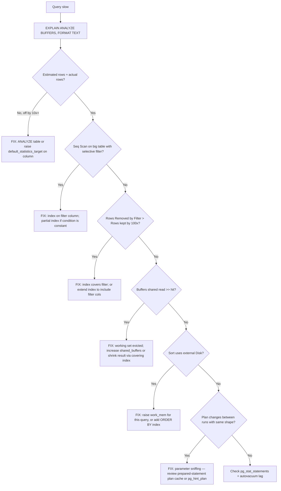

# Postgres EXPLAIN Analyzer

Postgres tells you exactly what it's doing. Most "slow query" issues are the planner choosing a bad path because statistics are stale or the query forces it. EXPLAIN ANALYZE with BUFFERS is the single best diagnostic tool the database ships with.

## Decision diagram



## When to use

- A query that worked yesterday is now timing out.
- p99 latency regressed and you suspect a query plan flip.
- `pg_stat_user_tables.seq_scan` is climbing for a table you indexed.
- Autovacuum logs (`pg_stat_activity` shows `autovacuum:`) are noisy.
- A new index was added but the planner ignores it.
- Disk usage growing unexpectedly (`pg_stat_user_tables.n_dead_tup` blowup).

## Core capabilities

### Reading EXPLAIN ANALYZE output

Run with BUFFERS so you see I/O. Always.

```sql
EXPLAIN (ANALYZE, BUFFERS, FORMAT TEXT)
SELECT id FROM orders WHERE customer_id = 42 AND created_at > now() - interval '7 days';
```

```
Index Scan using orders_customer_created_idx on orders
  (cost=0.43..152.18 rows=37 width=8) (actual time=0.024..0.412 rows=39 loops=1)
  Index Cond: ((customer_id = 42) AND (created_at > (now() - '7 days'::interval)))
  Buffers: shared hit=12 read=2
Planning Time: 0.187 ms
Execution Time: 0.451 ms
```

What each piece means:

- **`cost=startup..total`** — abstract planner units. Compare costs between plans, never use them as a latency unit.
- **`rows=N`** — planner's estimate. If `actual rows` is 100x off, statistics are stale or the predicate is poorly modeled.
- **`width=W`** — average bytes per row. Matters for sort/hash memory estimates.
- **`actual time=startup..total`** — milliseconds. Multiply by `loops` for true total in nested loops.
- **`Buffers: shared hit=H read=R`** — pages from cache (`hit`) vs disk (`read`). `read` numbers blow up I/O latency.
- **`Rows Removed by Filter: N`** — rows touched but discarded. High here means the index isn't selective enough; consider a covering or partial index.

### Node types you'll see

| Node | When it's good | When it's bad |
|------|----------------|----------------|
| **Seq Scan** | Small tables, or you need >20% of rows. | Big tables where a selective predicate exists. |
| **Index Scan** | Selective predicates, ordered output. | Hot inner loop with millions of iterations. |
| **Index Only Scan** | Covering index hits, vacuumed table. | Table not vacuumed → many heap fetches anyway. |
| **Bitmap Heap Scan** | Multiple indexes combined, medium-selectivity. | "Recheck Cond" doing a lot of work. |
| **Nested Loop** | Tiny outer side (< 1000 rows). | Large outer side without an index on inner. |
| **Hash Join** | Both sides fit in memory. | Spills to disk → look at `work_mem`. |
| **Merge Join** | Both sides already sorted (or indexed). | Forced sort step is expensive. |
| **Sort** | Small N, or supports a Merge Join. | "Sort Method: external merge Disk: 200MB" → bump `work_mem`. |
| **Hash Aggregate** | Distinct/group by with bounded keys. | OOM if estimate was wrong. |

### When the planner picks the wrong plan

1. **Stale stats.** `ANALYZE schema.table;` is the cheapest first move.
2. **Bad row estimates from correlated columns.**
   ```sql
   CREATE STATISTICS orders_cust_status (dependencies)
     ON customer_id, status FROM orders;
   ANALYZE orders;
   ```
   Use `mcv` for skewed categorical data, `ndistinct` for combinations.
3. **Function/cast wrapping a column.** `WHERE lower(email) = 'x'` can't use a btree on `email`. Build an expression index or store normalized.
4. **Type mismatch.** `WHERE bigint_col = '42'` → cast forces seq scan in some versions. Match types explicitly.
5. **Generic vs custom plans.** Prepared statements switch to a generic plan after 5 executions. If parameter selectivity varies wildly, force custom: `SET plan_cache_mode = force_custom_plan;` per session.

### Index types — when to choose each

- **btree** — default. Equality, range, ORDER BY. 99% of indexes.
- **gin** — `jsonb` containment, full-text, array overlap. Big indexes; expensive writes; fast lookups.
- **gist** — ranges, geometry, exclusion constraints. Cheaper writes than gin.
- **brin** — append-mostly tables (timeseries, logs). Tiny index, scans large heap blocks. Useless for random-access patterns.
- **hash** — equality only, since 11 they're WAL-logged. Rarely beats btree in practice.
- **partial** — `WHERE active` on a status column, only the active rows are indexed. Dramatically smaller.
- **expression** — `((lower(email)))` to support case-insensitive lookups.
- **covering (`INCLUDE`)** — extra payload columns avoid heap fetches for Index Only Scan.

### Autovacuum tuning

```sql
ALTER TABLE hot_writes SET (
  autovacuum_vacuum_scale_factor = 0.05,    -- default 0.2
  autovacuum_vacuum_cost_limit = 2000       -- default 200; allow more I/O per pass
);
```

Watch:

```sql
SELECT relname, n_live_tup, n_dead_tup, last_autovacuum
FROM pg_stat_user_tables
WHERE n_dead_tup > 1000
ORDER BY n_dead_tup DESC;
```

If `n_dead_tup / n_live_tup > 0.2`, you'll start seeing seq scans on what should be indexed reads. HOT updates (no indexed column changing, fillfactor leaves room) reduce this dramatically. Set `fillfactor = 80` on hot-update tables.

### pg_stat_statements

```sql
SELECT queryid, calls, total_exec_time, mean_exec_time, rows
FROM pg_stat_statements
ORDER BY total_exec_time DESC
LIMIT 20;
```

Track regressions by `queryid` (stable across parameters). After a deploy, snapshot top-20 by total_exec_time; alarm on any new entry or any 2x mean_exec_time growth.

## Anti-patterns

### "I added an index but the planner ignores it"

**Symptom:** EXPLAIN still shows Seq Scan after `CREATE INDEX`.
**Diagnosis:** Type mismatch (`text` column, `varchar(50)` parameter binding), function wrapping (`WHERE date(ts) = …`), or selectivity too low (planner correctly chose a seq scan because the index would return 60% of rows).
**Fix:** Check pg_index for the index, run `ANALYZE`, verify types match, and if it's selectivity, accept the seq scan or add a partial index.

### "EXPLAIN ANALYZE is fast, production is slow"

**Symptom:** Local `EXPLAIN ANALYZE` runs in 5ms; prod query latency p99 is 800ms.
**Diagnosis:** Parameter sniffing on a prepared statement that locked a generic plan, or an autovacuum lull leaving 30M dead tuples on a table you sampled small.
**Fix:** Run `EXPLAIN (ANALYZE, BUFFERS) EXECUTE prep(…)` against prod. If buffers/timings differ, force a custom plan or fix vacuum.

### Bitmap Heap Scan recheck dominating

**Symptom:** Plan shows `Recheck Cond:` reading thousands of pages.
**Diagnosis:** Bitmap index returned more candidates than `work_mem` could hold; index is lossy (gin) or selectivity dropped.
**Fix:** Bump `work_mem` for the session, or replace gin with a btree on a normalized column.

### Wrapping indexed columns in functions

**Symptom:** Index unused on `email` despite a query like `WHERE lower(email) = 'x'`.
**Diagnosis:** Postgres can't prove the function is index-eligible without an expression index.
**Fix:** Either query without the function (case-fold at write time and store normalized) or `CREATE INDEX ON users (lower(email))`.

### Over-indexing

**Symptom:** Insert latency rising; `pg_stat_user_indexes.idx_scan = 0` for several indexes.
**Diagnosis:** Every index pays a write cost; unused ones are pure overhead.
**Fix:** Drop indexes with `idx_scan = 0` and `pg_relation_size > 100MB`. Keep evidence: capture pg_stat_user_indexes for 30 days first.

### Vacuum lag on hot tables

**Symptom:** `n_dead_tup > n_live_tup`; query latency rises during business hours.
**Diagnosis:** Default autovacuum thresholds (20% dead tuples) too lax for write-heavy tables.
**Fix:** Per-table `autovacuum_vacuum_scale_factor = 0.05`, raise `autovacuum_vacuum_cost_limit`, set `fillfactor = 80` to enable HOT updates.

## Worked example: the post-deploy p99 cliff

**Scenario.** Tuesday deploy, by 3pm the orders API p99 latency jumped from 80ms to 1.4s. Rollback would lose unrelated fixes. Pager has been firing for 90 minutes.

**Novice would:** Open the slow query log, see a `SELECT * FROM orders WHERE customer_id = $1 ORDER BY created_at DESC LIMIT 50` taking 800ms, add an index on `customer_id`. Maybe it helps, maybe `customer_id` was already indexed and the issue is elsewhere.

**Expert catches:**
1. **Capture the actual plan, not a guess.** `EXPLAIN (ANALYZE, BUFFERS) SELECT ...` against a live replica. Plan shows `Index Scan` on `customer_id` BUT `Rows Removed by Filter: 8423`. The filter is `status = 'open'` post-index-fetch.
2. **Compare to last week.** `pg_stat_statements` shows the same query was hitting `idx_orders_customer_status` (composite) before deploy. After deploy, planner switched to `idx_orders_customer_id` — the other index got dropped in a "cleanup" migration.
3. **Stats vs reality.** `EXPLAIN` estimates 50 rows; actuals are 8473. ANALYZE is fresh, but the stats target on `status` is too low — `'open'` is 1% of rows, but the histogram only has 100 buckets.
4. **Fix order:** (a) `CREATE INDEX CONCURRENTLY idx_orders_customer_status ON orders (customer_id, status, created_at DESC)` — restores the lost composite. (b) `ALTER TABLE orders ALTER COLUMN status SET STATISTICS 1000` so future planner decisions are stable.
5. **Verify with the canary.** Re-run EXPLAIN; plan now `Index Scan` on the composite, no Rows Removed, 4ms.

**Timeline.** Novice's `customer_id`-only index helps a bit (~400ms p99), incident drags into the evening as other queries hit similar issues. Expert restores the composite + raises stats in 20 minutes; p99 is back under 100ms. The deploy review then catches the migration as the regression source and adds an `idx_scan` audit guard before drops.

## Quality gates

- [ ] **Test:** every query path with p99 ≥ 100ms has a captured `EXPLAIN (ANALYZE, BUFFERS)` saved alongside the query (in `runbooks/queries/` or as a regression-test fixture).
- [ ] **Test:** new migrations that DROP an index require a justification comment AND an EXPLAIN of the affected queries showing they still hit a different index (review checklist).
- [ ] No `Seq Scan` on tables >100k rows in any query path under 100ms p99. Verified by `pg_stat_statements` query against `pg_class.relpages`.
- [ ] Every foreign key column has an index unless deletes/updates on the parent are rare and documented.
- [ ] `pg_stat_user_tables.n_dead_tup / n_live_tup` < 0.2 on hot tables. Alert in `grafana-dashboard-builder` panel.
- [ ] `pg_stat_statements` top-20 reviewed weekly; new entries explained. Capture in `weekly-db-review.md`.
- [ ] Indexes with `idx_scan = 0` and size > 100MB are documented or dropped within 30 days. Verified by a scheduled query against `pg_stat_user_indexes`.
- [ ] `work_mem` sized so the worst common Sort/Hash node doesn't spill to disk. Verified: grep EXPLAIN output for `Disk:` — should be absent in p99 query plans.
- [ ] Critical queries pinned with `pg_hint_plan` or rewritten to be selectivity-stable. Documented in runbook.
- [ ] Plan-regression test in CI: replay top 10 queries against a staging snapshot post-migration; fail if any plan loses an index scan.

## NOT for

- **Schema design from scratch** — different concern; pair with a database-design-patterns skill.
- **Postgres replication / failover** — pg_basebackup, logical replication, pgbouncer pooling.
- **MySQL/Aurora-specific tuning** — different planner, different stats infrastructure.
- **pgvector / vector indexes** — IVFFLAT/HNSW have their own tuning surface.
- **Connection pooling** — see a pooling-specific skill (no dedicated skill yet).
- **Migration mechanics on Postgres** (D1/Supabase CLI quirks, repair vs apply) — → `d1-and-supabase-migrations`.
- **Latency dashboards over the slow queries** — → `grafana-dashboard-builder`.
