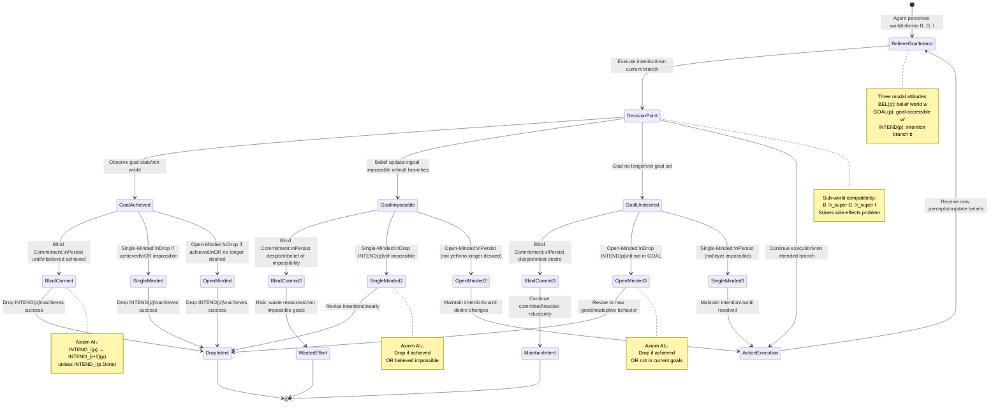

# BDI Mental State Transitions & Commitment Strategies

```mermaid
stateDiagram-v2
    [*] --> BelieveGoalIntend: Agent perceives world\nforms B, G, I

    BelieveGoalIntend --> DecisionPoint: Execute intention\non current branch

    DecisionPoint --> GoalAchieved: Observe goal state\nin world
    DecisionPoint --> GoalImpossible: Belief update:\ngoal impossible on\nall branches
    DecisionPoint --> GoalUndesired: Goal no longer\nin goal set
    DecisionPoint --> ActionExecution: Continue execution\non intended branch

    ActionExecution --> BelieveGoalIntend: Receive new percepts\nupdate beliefs

    GoalAchieved --> BlindCommit: Blind Commitment:\nPersist until\nbelieved achieved
    GoalAchieved --> SingleMinded: Single-Minded:\nDrop if achieved\nOR impossible
    GoalAchieved --> OpenMinded: Open-Minded:\nDrop if achieved\nOR no longer desired

    BlindCommit --> DropIntent: Drop INTEND(p)\nachieves success
    SingleMinded --> DropIntent: Drop INTEND(p)\nachieves success
    OpenMinded --> DropIntent: Drop INTEND(p)\nachieves success

    GoalImpossible --> BlindCommit2: Blind Commitment:\nPersist despite\nbelief of impossibility
    GoalImpossible --> SingleMinded2: Single-Minded:\nDrop INTEND(p)\nif impossible
    GoalImpossible --> OpenMinded2: Open-Minded:\nPersist (not yet\nno longer desired)

    BlindCommit2 --> WastedEffort: Risk: waste resources\non impossible goals
    SingleMinded2 --> DropIntent: Revise intentions\nearly
    OpenMinded2 --> ActionExecution: Maintain intention\nuntil desire changes

    GoalUndesired --> BlindCommit3: Blind Commitment:\nPersist despite\nlost desire
    GoalUndesired --> OpenMinded3: Open-Minded:\nDrop INTEND(p)\nif not in GOAL
    GoalUndesired --> SingleMinded3: Single-Minded:\nPersist (not\nyet impossible)

    BlindCommit3 --> MaintainIntent: Continue committed\naction reluctantly
    OpenMinded3 --> DropIntent: Revise to new goals\nadaptive behavior
    SingleMinded3 --> ActionExecution: Maintain intention\nuntil resolved

    MaintainIntent --> [*]
    DropIntent --> [*]
    WastedEffort --> [*]

    note right of BelieveGoalIntend
        Three modal attitudes:
        BEL(p): belief world w
        GOAL(p): goal-accessible w'
        INTEND(p): intention branch b
    end note

    note right of DecisionPoint
        Sub-world compatibility:
        B ⊃_super G ⊃_super I
        Solves side-effects problem
    end note

    note right of BlindCommit
        Axiom AI₁:
        INTEND_i(p) → INTEND_{i+1}(p)
        unless INTEND_i(p Done)
    end note

    note right of SingleMinded2
        Axiom AI₂:
        Drop if achieved
        OR believed impossible
    end note

    note right of OpenMinded3
        Axiom AI₃:
        Drop if achieved
        OR not in current goals
    end note
```
