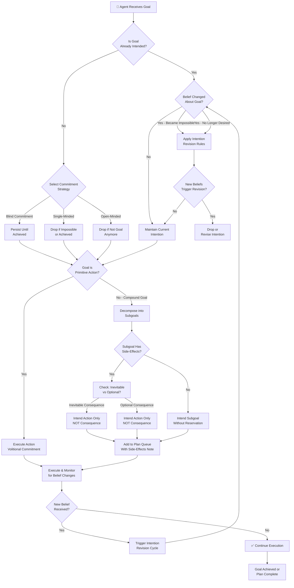

# Goal Decomposition & Side-Effects Reasoning (Decision Framework)

```mermaid
flowchart TD
    A["🎯 Agent Receives Goal"] --> B{"Is Goal<br/>Already Intended?"}
    B -->|Yes| C{"Belief Changed<br/>About Goal?"}
    B -->|No| D{"Select Commitment<br/>Strategy"}
    
    C -->|Yes - Became Impossible| E["Apply Intention<br/>Revision Rules"]
    C -->|Yes - No Longer Desired| E
    C -->|No| F["Maintain Current<br/>Intention"]
    
    D -->|Blind Commitment| G["Persist Until<br/>Achieved"]
    D -->|Single-Minded| H["Drop if Impossible<br/>or Achieved"]
    D -->|Open-Minded| I["Drop if Not Goal<br/>Anymore"]
    
    E --> J{"New Beliefs<br/>Trigger Revision?"}
    J -->|Yes| K["Drop or<br/>Revise Intention"]
    J -->|No| F
    
    G --> L{"Goal is<br/>Primitive Action?"}
    H --> L
    I --> L
    F --> L
    
    L -->|Yes| M["Execute Action<br/>Volitional Commitment"]
    L -->|No - Compound Goal| N["Decompose into<br/>Subgoals"]
    
    N --> O{"Subgoal Has<br/>Side-Effects?"}
    O -->|Yes| P["Check: Inevitable<br/>vs Optional?"]
    O -->|No| Q["Intend Subgoal<br/>Without Reservation"]
    
    P -->|Inevitable Consequence| R["Intend Action Only<br/>NOT Consequence"]
    P -->|Optional Consequence| S["Intend Action Only<br/>NOT Consequence"]
    
    R --> T["Add to Plan Queue<br/>With Side-Effects Note"]
    S --> T
    Q --> T
    
    M --> U["Execute & Monitor<br/>for Belief Changes"]
    T --> U
    
    U --> V{"New Belief<br/>Received?"}
    V -->|Yes| W["Trigger Intention<br/>Revision Cycle"]
    V -->|No| X["✅ Continue Execution"]
    
    W --> C
    X --> Y["Goal Achieved or<br/>Plan Complete"]
```
