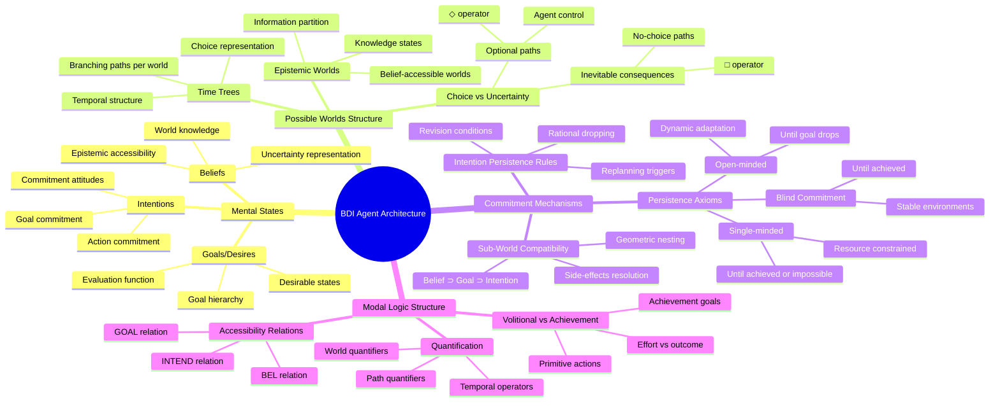

# BDI Conceptual Hierarchy & Modal Logic Structure

```mermaid
mindmap
  root((BDI Agent Architecture))
    Mental States
      Beliefs
        Epistemic accessibility
        Uncertainty representation
        World knowledge
      Goals/Desires
        Desirable states
        Evaluation function
        Goal hierarchy
      Intentions
        Commitment attitudes
        Action commitment
        Goal commitment
    Possible Worlds Structure
      Epistemic Worlds
        Belief-accessible worlds
        Information partition
        Knowledge states
      Time Trees
        Branching paths per world
        Choice representation
        Temporal structure
      Choice vs Uncertainty
        Optional paths
          Agent control
          ◇ operator
        Inevitable consequences
          No-choice paths
          □ operator
    Commitment Mechanisms
      Sub-World Compatibility
        Belief ⊃ Goal ⊃ Intention
        Geometric nesting
        Side-effects resolution
      Persistence Axioms
        Blind Commitment
          Until achieved
          Stable environments
        Single-minded
          Until achieved or impossible
          Resource constrained
        Open-minded
          Until goal drops
          Dynamic adaptation
      Intention Persistence Rules
        Revision conditions
        Rational dropping
        Replanning triggers
    Modal Logic Structure
      Accessibility Relations
        BEL relation
        GOAL relation
        INTEND relation
      Quantification
        World quantifiers
        Path quantifiers
        Temporal operators
      Volitional vs Achievement
        Primitive actions
        Achievement goals
        Effort vs outcome
```
