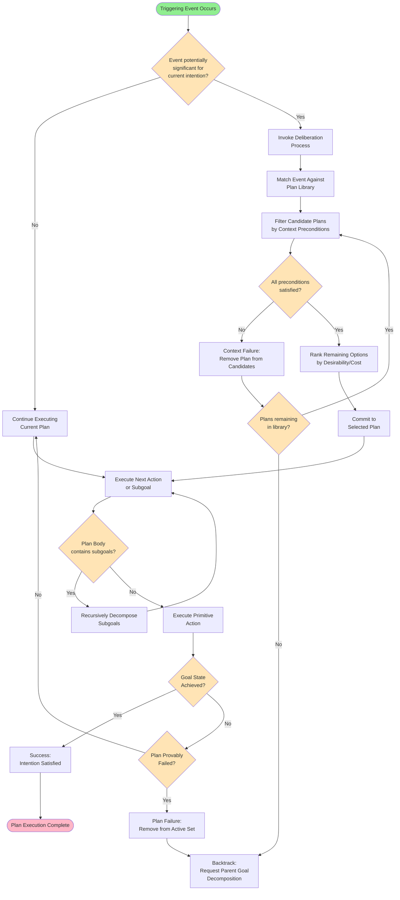

# Plan Selection Pipeline: From Triggering Event to Execution

```mermaid
flowchart TD
    Start([Triggering Event Occurs]) --> DetectChange{Event potentially<br/>significant for<br/>current intention?}
    
    DetectChange -->|No| Continue["Continue Executing<br/>Current Plan"]
    Continue --> Execute["Execute Next Action<br/>or Subgoal"]
    
    DetectChange -->|Yes| Reconsider["Invoke Deliberation<br/>Process"]
    Reconsider --> MatchLib["Match Event Against<br/>Plan Library"]
    
    MatchLib --> FilterContext["Filter Candidate Plans<br/>by Context Preconditions"]
    
    FilterContext --> ContextOK{All preconditions<br/>satisfied?}
    ContextOK -->|No| ContextFail["Context Failure:<br/>Remove Plan from Candidates"]
    ContextFail --> CheckExhausted{Plans remaining<br/>in library?}
    CheckExhausted -->|No| Backtrack["Backtrack:<br/>Request Parent Goal<br/>Decomposition"]
    CheckExhausted -->|Yes| FilterContext
    
    ContextOK -->|Yes| RankOptions["Rank Remaining Options<br/>by Desirability/Cost"]
    
    RankOptions --> CommitPlan["Commit to<br/>Selected Plan"]
    
    CommitPlan --> Execute
    
    Execute --> IsComposite{Plan Body<br/>contains subgoals?}
    
    IsComposite -->|Yes| Decompose["Recursively Decompose<br/>Subgoals"]
    Decompose --> Execute
    
    IsComposite -->|No| Primitive["Execute Primitive<br/>Action"]
    Primitive --> CheckGoal{Goal State<br/>Achieved?}
    
    CheckGoal -->|Yes| Success["Success:<br/>Intention Satisfied"]
    Success --> End([Plan Execution Complete])
    
    CheckGoal -->|No| CheckFailure{Plan Provably<br/>Failed?}
    
    CheckFailure -->|Yes| PlanFail["Plan Failure:<br/>Remove from Active Set"]
    PlanFail --> Backtrack
    
    CheckFailure -->|No| Continue
    
    style Start fill:#90EE90
    style End fill:#FFB6C6
    style DetectChange fill:#FFE4B5
    style ContextOK fill:#FFE4B5
    style IsComposite fill:#FFE4B5
    style CheckGoal fill:#FFE4B5
    style CheckFailure fill:#FFE4B5
    style CheckExhausted fill:#FFE4B5
```
