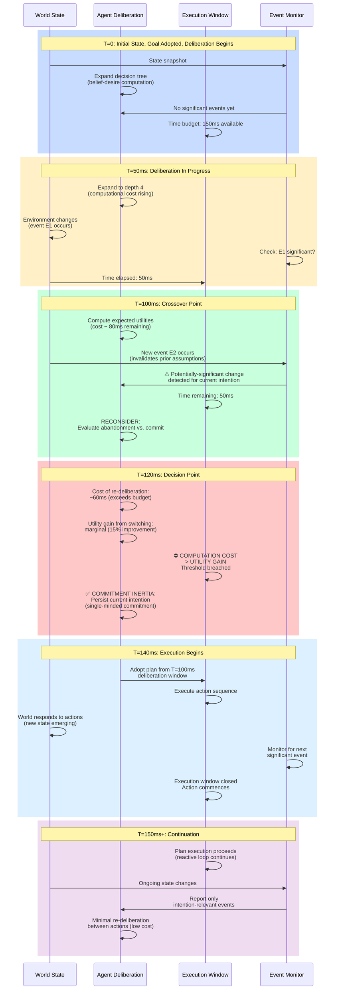

# Resource-Bounded Rationality: The Deliberation Bottleneck Scenario

```mermaid
sequenceDiagram
    participant World as World State
    participant Agent as Agent Deliberation
    participant Exec as Execution Window
    participant Monitor as Event Monitor

    rect rgb(200, 220, 255)
    Note over World,Monitor: T=0: Initial State, Goal Adopted, Deliberation Begins
    World->>Monitor: State snapshot
    Agent->>Agent: Expand decision tree<br/>(belief-desire computation)
    Monitor->>Agent: No significant events yet
    Exec->>Exec: Time budget: 150ms available
    end

    rect rgb(255, 240, 200)
    Note over World,Monitor: T=50ms: Deliberation In Progress
    Agent->>Agent: Expand to depth 4<br/>(computational cost rising)
    World->>World: Environment changes<br/>(event E1 occurs)
    Monitor->>Monitor: Check: E1 significant?
    World->>Exec: Time elapsed: 50ms
    end

    rect rgb(200, 255, 220)
    Note over World,Monitor: T=100ms: Crossover Point
    Agent->>Agent: Compute expected utilities<br/>(cost ~ 80ms remaining)
    World->>Monitor: New event E2 occurs<br/>(invalidates prior assumptions)
    Monitor->>Agent: ⚠️ Potentially-significant change<br/>detected for current intention
    Exec->>Exec: Time remaining: 50ms
    Agent->>Agent: RECONSIDER:<br/>Evaluate abandonment vs. commit
    end

    rect rgb(255, 200, 200)
    Note over World,Monitor: T=120ms: Decision Point
    Agent->>Agent: Cost of re-deliberation:<br/>~60ms (exceeds budget)
    Agent->>Agent: Utility gain from switching:<br/>marginal (15% improvement)
    Exec->>Exec: ⛔ COMPUTATION COST<br/>> UTILITY GAIN<br/>Threshold breached
    Agent->>Agent: ✅ COMMITMENT INERTIA:<br/>Persist current intention<br/>(single-minded commitment)
    end

    rect rgb(220, 240, 255)
    Note over World,Monitor: T=140ms: Execution Begins
    Agent->>Exec: Adopt plan from T=100ms<br/>deliberation window
    Exec->>Exec: Execute action sequence
    World->>World: World responds to actions<br/>(new state emerging)
    Monitor->>Monitor: Monitor for next<br/>significant event
    Exec->>Exec: Execution window closed<br/>Action commences
    end

    rect rgb(240, 220, 240)
    Note over World,Monitor: T=150ms+: Continuation
    Exec->>Exec: Plan execution proceeds<br/>(reactive loop continues)
    World->>Monitor: Ongoing state changes
    Monitor->>Agent: Report only<br/>intention-relevant events
    Agent->>Agent: Minimal re-deliberation<br/>between actions (low cost)
    end
```
