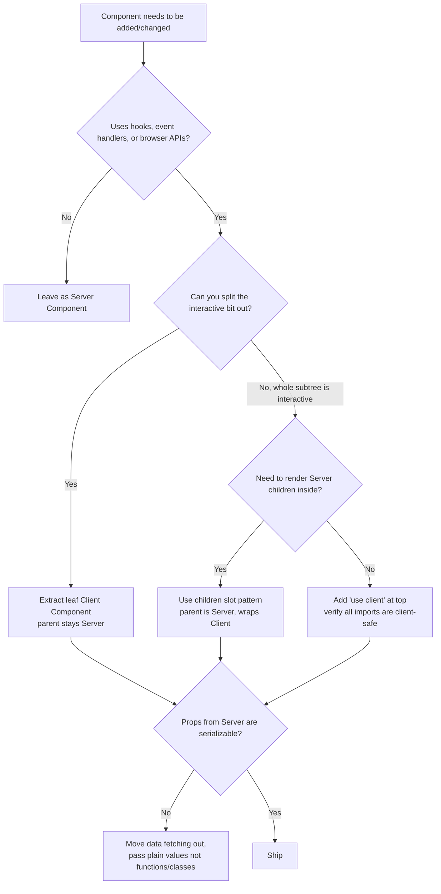

# React Server Components Boundary

> **TL;DR**: `'use client'` is a *module dependency* boundary, not a render boundary. Mark the smallest possible leaf — everything it imports becomes client code. Use the `children` slot to put Server Components inside Client Components. Props that cross must be serializable. Use `server-only` / `client-only` packages to harden the seam.

---

## Jump to your fire

| Symptom | Section |
|---|---|
| "Bundle exploded after I added one Client Component" | [Leaf-pushing](#1-leaf-pushing-the-default-rule) |
| "Functions can't be passed directly to Client Components" | [Serialization rules](#3-what-can-cross-the-boundary) |
| "Need state in this layout but can't make it Server" | [Slot pattern](#2-slot-pattern-server-children-inside-client-parent) |
| "API key leaked into client bundle" | [Environment poisoning](#5-environment-poisoning-server-only--client-only) |
| "Third-party hook-using component breaks in RSC" | [Wrapping third-party](#4-wrapping-third-party-client-libs) |
| "Context provider broke build" | [Provider placement](#6-provider-placement) |

---

## What `'use client'` actually is

From [react.dev/reference/rsc/use-client](https://react.dev/reference/rsc/use-client):

> When a file marked with `'use client'` is imported from a Server Component, **compatible bundlers will treat the module import as a boundary between server-run and client-run code**. As descendants of this boundary, modules are guaranteed to be bundled with and run on the client.

Two trees are in play and they don't move together:

| Tree | Boundary set by `'use client'`? |
|---|---|
| **Module dependency tree** (imports) | YES — every transitive import becomes client code |
| **Render tree** (parent/child JSX) | NO — Server Components can render Client Components, and vice versa via `children` |

This distinction is the source of ~80% of RSC confusion. A component can be imported into both server *and* client modules and ship to both — it has no inherent identity until it's imported somewhere.

---

## Decision diagram



---

## 1. Leaf-pushing: the default rule

**Rule**: Mark the smallest interactive *leaf* with `'use client'`. Keep everything above it as Server Components.

The Next.js docs spell this out for layouts: a `<Layout>` with a `<Logo>` (static), nav links (static), and a `<Search>` bar (interactive) — only `<Search>` gets `'use client'`. The layout stays Server and ships zero JS for itself.

```tsx
// app/layout.tsx — Server Component (default)
import Search from './search'   // Client
import Logo from './logo'       // Server

export default function Layout({ children }: { children: React.ReactNode }) {
  return (
    <>
      <nav><Logo /><Search /></nav>
      <main>{children}</main>
    </>
  )
}
```

```tsx
// app/search.tsx — Client Component
'use client'
import { useState } from 'react'
export default function Search() { /* ... */ }
```

**Anti-pattern: the "use client at the top of every file" creep.** A junior dev hits one `useState` error, slaps `'use client'` on a layout file. Now the entire subtree — including a 300KB markdown renderer that only ran on the server — ships to the browser. RSC's bundle-size win evaporates.

**Detect it:** `grep -rln "'use client'" app/ | wc -l` — if it's growing faster than the count of components that genuinely *need* state/effects, you have client-component creep.

---

## 2. Slot pattern: Server children inside Client parent

When you need a Client wrapper (modal, accordion, tab bar) but the *content* should be a Server Component (data fetching, secrets), pass the Server Component as `children`:

```tsx
// app/ui/modal.tsx — Client (needs state)
'use client'
import { useState } from 'react'

export default function Modal({ children }: { children: React.ReactNode }) {
  const [open, setOpen] = useState(false)
  return open ? <div className="modal">{children}</div> : null
}
```

```tsx
// app/page.tsx — Server (default)
import Modal from './ui/modal'
import Cart from './ui/cart'  // Server Component, async, hits DB

export default function Page() {
  return (
    <Modal>
      <Cart />   {/* Renders on the server, passed as JSX prop */}
    </Modal>
  )
}
```

From the Next.js docs:

> All Server Components will be rendered on the server ahead of time, including those as props. The resulting RSC payload will contain references of where Client Components should be rendered within the component tree.

This pattern keeps Client Components pure UI shells — they don't import data layer code, they don't see secrets, they just render the children React gives them.

---

## 3. What can cross the boundary

Props from Server → Client must be **serializable**. From [react.dev](https://react.dev/reference/rsc/use-client):

| Allowed | Not allowed |
|---|---|
| Primitives (string, number, bigint, boolean, null, undefined) | Regular functions |
| Globally-registered Symbols (`Symbol.for(...)`) | Class instances |
| Iterables: String, Array, Map, Set, TypedArray, ArrayBuffer | Objects with null prototype |
| Plain objects (with serializable values) | Unregistered Symbols |
| `Date` | Closures over server-only state |
| Server Functions (`'use server'`) | — |
| JSX elements (Server *or* Client) | — |
| `Promise` | — |

**Worked example**: passing an event handler.

```tsx
// ❌ Doesn't work — onSubmit is a regular function
<EditForm onSubmit={(data) => savePost(data)} />

// ✅ Works — make it a Server Function
// app/actions.ts
'use server'
export async function savePost(data: FormData) { /* ... */ }

// app/page.tsx
import { savePost } from './actions'
<EditForm action={savePost} />
```

The same rule covers passing classes, Mongoose documents, Date objects with prototype gunk, etc. Strip to a plain object before it crosses.

---

## 4. Wrapping third-party client libs

Library uses hooks but ships without `'use client'` (older libs especially). Importing it into a Server Component throws.

**Fix**: wrap once.

```tsx
// app/carousel.tsx — your own thin wrapper
'use client'
export { Carousel as default } from 'acme-carousel'
```

```tsx
// app/page.tsx — Server Component, now safe
import Carousel from './carousel'
export default function Page() {
  return <Carousel />  // ✅ Crosses boundary correctly
}
```

The Next.js docs note for **library authors**: ship `'use client'` at the entry point of any module that uses hooks/state, and configure the bundler to preserve the directive (some strip it). Examples: [React Wrap Balancer](https://github.com/shuding/react-wrap-balancer/blob/main/tsup.config.ts#L10-L13), [Vercel Analytics](https://github.com/vercel/analytics/blob/main/packages/web/tsup.config.js#L26-L30).

---

## 5. Environment poisoning: `server-only` / `client-only`

A shared utility module is the silent foot-gun. Imagine `lib/data.ts` reads `process.env.API_KEY` and is imported by both a Server page and a Client form. From Next.js docs:

> Only environment variables prefixed with `NEXT_PUBLIC_` are included in the client bundle. If variables are not prefixed, Next.js replaces them with an empty string.

So the client gets `getData()` with `Authorization: ''`. It "fails gracefully" — meaning it silently 401s and you ship the bug.

**Fix**: hard-stop the import at build time with `server-only`:

```ts
// lib/data.ts
import 'server-only'  // Build error if imported into a client module

export async function getData() {
  const res = await fetch('https://api.example.com/data', {
    headers: { authorization: process.env.API_KEY! },
  })
  return res.json()
}
```

The `client-only` package mirrors this for modules that use `window`, `localStorage`, etc., to prevent SSR explosions.

In Next.js these packages are *optional* — Next provides its own types and intercepts the imports — but installing them is the cheap insurance for non-Next RSC frameworks (Remix, future Waku, etc.).

---

## 6. Provider placement

`createContext` requires a Client Component. The naive fix wraps the entire `<html>`. Don't.

```tsx
// app/layout.tsx — Server (root)
import ThemeProvider from './theme-provider'  // Client

export default function RootLayout({ children }) {
  return (
    <html>
      <body>
        <ThemeProvider>{children}</ThemeProvider>
      </body>
    </html>
  )
}
```

```tsx
// app/theme-provider.tsx — Client
'use client'
import { createContext } from 'react'
export const ThemeContext = createContext({})

export default function ThemeProvider({ children }: { children: React.ReactNode }) {
  return <ThemeContext.Provider value="dark">{children}</ThemeContext.Provider>
}
```

From the Next.js docs:

> You should render providers as deep as possible in the tree — notice how `ThemeProvider` only wraps `{children}` instead of the entire `<html>` document. This makes it easier for Next.js to optimize the static parts of your Server Components.

---

## Anti-patterns (and how to detect them)

| Anti-pattern | Detection | Fix |
|---|---|---|
| `'use client'` on a layout/page that mostly does data fetching | `git log -S "'use client'"` and review what was added | Push to leaf; promote layout back to Server |
| Importing data-layer module (DB client, secrets) into a Client Component | `grep -l "'use client'" \| xargs grep -l "from '@/lib/db'"` | Move data fetching to Server parent, pass plain props |
| Passing class instances or functions as props | TypeScript `Function` or class types in `'use client'` files' props | Convert to plain object / Server Function |
| Wrapping `<html>` with a context provider | `<ThemeProvider>` directly under `<html>` instead of `<body>{children}` | Push provider down to wrap `{children}` only |
| Forgetting `'use client'` on a third-party hook lib | "useState only works in Client Components" runtime error | Create one-line wrapper file |
| Markdown/util import bloating client bundle | `next build --analyze` shows server-only deps in client chunk | Add `import 'server-only'` to that util |

---

## Novice / Expert / Timeline

| | Novice | Expert |
|---|---|---|
| **First instinct on hook error** | Add `'use client'` to current file | Find the smallest leaf that uses the hook, mark *that* |
| **Provider placement** | Wraps `<html>` | Wraps `{children}` inside `<body>` |
| **Sharing utils between server/client** | Crosses fingers | Adds `server-only` / `client-only` guards |
| **Sees serialization error** | Searches Stack Overflow for 30 min | Recognizes "function/class crossing boundary," converts to Server Function or plain data |
| **3rd-party lib without `'use client'`** | Reports a bug to the lib | Writes 3-line wrapper, moves on |

**Timeline test**: if a teammate adds a Client Component this week, will the RSC bundle for the home page grow by 1KB or 100KB? An expert answer requires running `next build` before *and* after the change and diffing the route-level JS column.

---

## Quality gates

A change touching the RSC boundary ships when:

- [ ] **Test:** Routes that previously had 0 KB First Load JS for non-interactive segments still report 0 KB after the change (`next build` route table).
- [ ] **Test:** Build fails (not silently succeeds) if a `'use client'` module imports a `server-only` module — verify by writing one bad import and confirming the build error.
- [ ] **Test:** Props passed from any Server Component to its direct Client Component children are checked: a TypeScript test fixture that tries to pass a `Function` should fail typecheck.
- [ ] **Lint:** A custom rule (or `eslint-plugin-react-server-components`) flags `'use client'` files that import known server-only paths (`@/lib/db`, `@/lib/secrets`).
- [ ] **Manual:** Provider tree rendered as deep as possible — `<ThemeProvider>` etc. wrap `{children}`, not `<html>`.
- [ ] **Manual:** Any third-party component using hooks has either `'use client'` in its dist, or a one-file local wrapper.

---

## NOT for this skill

- Generic React patterns (use `react-component-architect` or similar)
- Data fetching strategies inside Server Components (use `nextjs-data-fetching` or framework-specific skill)
- Hydration mismatch debugging — that's its own beast (use `react-hydration-debugging`)
- Performance profiling of client bundles — use `vite-build-optimizer` or framework-specific tooling
- Server Functions / Actions semantics in depth — use `nextjs-server-actions-design`

---

## Sources

- React docs: [`'use client'` directive reference](https://react.dev/reference/rsc/use-client) — boundary semantics, serialization rules, caveats
- Next.js docs: [Server and Client Components (App Router)](https://nextjs.org/docs/app/getting-started/server-and-client-components) — composition patterns, slot pattern, environment poisoning, provider placement (v16.2.4, 2026-04-10)
- React docs: [Server Components reference](https://react.dev/reference/rsc/server-components)
- npm: [`server-only`](https://www.npmjs.com/package/server-only) and [`client-only`](https://www.npmjs.com/package/client-only) packages
- React Wrap Balancer: [tsup config preserving `'use client'`](https://github.com/shuding/react-wrap-balancer/blob/main/tsup.config.ts#L10-L13)
- Vercel Analytics: [tsup config preserving `'use client'`](https://github.com/vercel/analytics/blob/main/packages/web/tsup.config.js#L26-L30)
