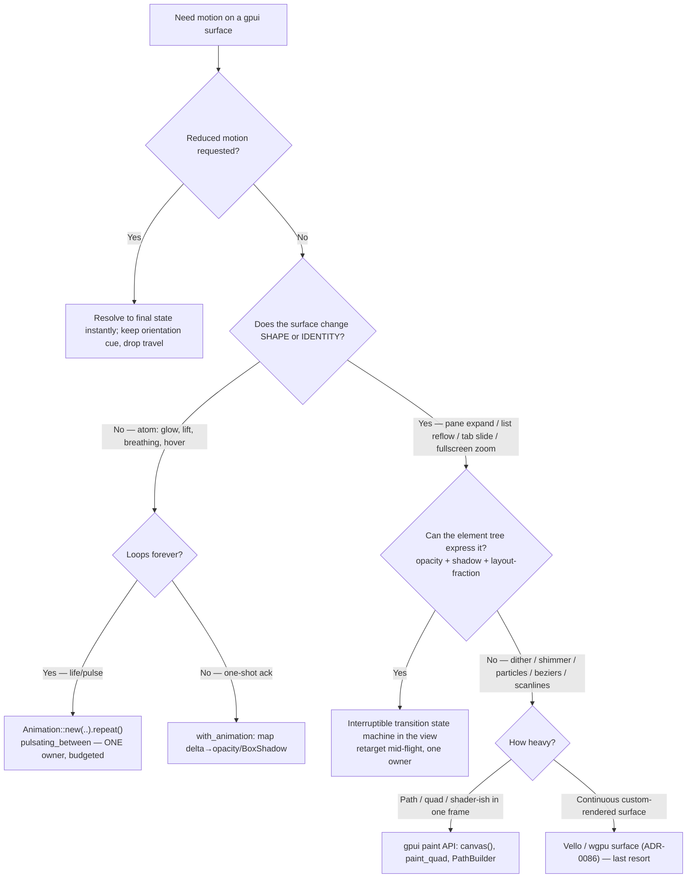

# Rust gpui Motion

Motion in gpui is not CSS with a different syntax. gpui **0.2.x has no fluent transform on `div`** — no `.scale()`, no `.translate()`, no `.rotate()`, no `transform` property to interpolate, no spring on layout, no `AnimatePresence`, no compositor thread to offload to. Every "lift / slide / zoom / spring" you internalized from Framer Motion and View Transitions must be **re-derived** from the four primitives gpui actually ships: `opacity`, `BoxShadow`, hover/color interpolation, and animated **layout fractions** driven by the `delta` closure inside `with_animation`. A `.repeat()` animation is a standing invitation to re-render the whole window forever, and every re-render walks the entire element tree top-to-bottom — so the frame budget here is an architecture concern, not a styling concern. This skill is the field manual for doing that right in `pd-console` (native gpui on Metal). It is the gpui counterpart to the web-focused `animation-system-architect`.

## Activation Triggers

**Activate on:** `with_animation`, `Animation::new`, gpui easing (`ease_in_out`, `bounce`, `pulsating_between`, `linear`), `BoxShadow`/glow, breathing/pulsing dots, pane expand / list reflow / tab-slide / fullscreen-zoom transitions, "lift/slide/zoom/spring in gpui", custom `paint`/`canvas()`, `PathBuilder`, Vello/wgpu surfaces, "animation never stops re-rendering", reduced-motion in a native Rust app, two owners fighting one element.

**NOT for:** web/React/Framer/GSAP/View-Transitions motion → `animation-system-architect` | terminal/CLI/TUI output → `beautiful-cli-design` | general GUI layout, color, theming, typography (the non-motion design system) → `beautiful-gui-design`.

## Quick Start

1. **Classify the surface** — a micro-interaction (glow, breathing dot, hover lift), a *transition* (a surface changes shape or identity), or *bespoke graphics* (the element tree genuinely can't express it). Different primitives, different owners.
2. **Gate on reduced-motion and frame budget FIRST.** There is no `@media` fallback and no compositor thread. Decide the static/instant path before the animated one.
3. **Animate compositor-friendly properties only** — `opacity`, `BoxShadow`/glow, color; never `width`/`height`/`px`/insets in a hot render. Layout animation costs a full tree walk per frame.
4. **One motion owner per surface.** A transition state machine lives *in the view* and is retargetable mid-flight. Never let two `with_animation`s or a `repeat()` and a state machine drive the same element.
5. **Audit the rendered frame, not the snippet.** Build it, run it, watch for runaway re-renders (`.repeat()`), label overlap, and motion that outlives its job.

## Core Capabilities

| Domain | gpui primitive | Expert cue |
|---|---|---|
| One-shot micro-motion | `with_animation(id, Animation::new(dur).with_easing(ease_in_out), delta_closure)` | The `delta` closure (0.0→1.0) is your only interpolator — map it onto opacity/shadow/layout-fraction by hand. |
| Looping life (breathing dot) | `Animation::new(..).repeat().with_easing(pulsating_between(a, b))` | A loop re-renders forever. Budget it; never stack two on one element. |
| Depth & emphasis | `BoxShadow { blur_radius, spread_radius, color }`, glow helpers | Shadow + opacity is the compositor-friendly substitute for `scale()`. This is how you fake "lift". |
| Shape/identity change | An interruptible **transition state machine** in the view | `spawn → expand → list → zoom → tab-slide`: retarget mid-flight, don't restart. |
| Below the widget layer | `canvas()`, `window.paint_quad(quad(..))`, `PathBuilder::fill()/stroke()`, `window.paint_path` | Drop here only when `div().bg().shadow().child()` truly can't express it (dither, shimmer, particles, beziers). |
| Heaviest surfaces | Vello / wgpu surface (ADR-0086) | Custom-render path for scanlines/playheads/particle fields; highest cost, last resort. |

## Decision Points



**Expert cue:** if you reach for "I just need `transform: scale()`", stop — gpui has no such thing. Re-derive the *intent* ("emphasize this pane") as opacity + `BoxShadow` growth + an animated layout fraction. The transform vocabulary does not port; the intent does.

## Core Rules

1. **No-transform constraint is law.** There is no `scale/translate/rotate` to interpolate. Compose every "lift/slide/zoom/spring" from opacity, `BoxShadow`, color, and the `delta` closure. (`references/02-the-no-transform-constraint.md` is the full translation table.)
2. **Compositor-friendly only in a hot render.** Animate `opacity`, `BoxShadow`, and color. Animating `width`/`height`/insets/`px` forces a full element-tree re-layout every frame. If you must animate layout, animate a **fraction** with eyes open, never as a convenience default.
3. **One owner per surface.** Exactly one thing drives a given element's motion — one `with_animation`, or one transition state machine. Two owners fighting one element is the native equivalent of the web ownership conflict and produces irreproducible snapping.
4. **Reduced-motion-first, and it must preserve orientation.** Decide the instant/static path before the animated one. Reducing motion means *less travel*, not *deleted feedback* — keep the orientation cue (final position, a fade, a state hint), drop only the journey.
5. **Frame budget is architecture, not polish.** A `.repeat()` animation re-renders the window forever; every re-render walks the whole tree. Budget loops deliberately, scope them to the smallest view, and never leave one running for a surface that's off-screen or idle.
6. **Transitions are interruptible state machines that live in the view.** A surface that changes shape/identity gets a retargetable state, not a fire-and-forget keyframe. Mid-flight interruptions retarget the current value; they don't restart from zero.
7. **Drop below the widget layer only when the tree can't express it.** `paint`/`canvas`/Vello are escape hatches with real cost. Earn them; don't default to them for things `div().shadow()` already does.

## Failure Modes

### Layout animation in a hot render
- **Symptom:** A pane "expands" by animating `width`/`height` (or `px(...)` insets) and the whole window stutters as more content loads.
- **Detection:** `delta` closure writes to size/inset fields inside a frequently-rendered view; frame time climbs with tree depth, not with the animated element.
- **Fix:** Animate `opacity` + `BoxShadow` growth for the "lift", and if shape must change, animate a single **layout fraction** at the smallest enclosing node — not raw pixels on every child.

### `repeat()` that never stops re-rendering
- **Symptom:** CPU/GPU stays hot on an idle screen; the window re-renders continuously even with no input.
- **Detection:** An `Animation::new(..).repeat()` (e.g. a breathing dot) mounted high in the tree or left running while its view is off-screen/inactive.
- **Fix:** Scope the loop to the smallest leaf view that needs it; pause/unmount it when the surface is idle or hidden; never stack two loops on one element.

### Reduced-motion deletes orientation
- **Symptom:** With reduced motion on, a transition just *snaps* and the user loses track of what moved where (which pane expanded, which tab is now active).
- **Detection:** The reduced-motion branch sets duration to 0 / removes the animation entirely with no replacement cue.
- **Fix:** Replace travel with a minimal fade or an explicit final-state hint. Reduced motion = smaller motion that still communicates, not silence.

### Two owners fighting one element
- **Symptom:** Flicker, value snapping, stale shadow/opacity, "impossible" bugs only after an interrupted interaction.
- **Detection:** Both a `with_animation` and a state-machine field (or two `with_animation`s) write the same property on the same element.
- **Fix:** Make one owner authoritative. Let the transition state machine own the value and have everything else read it; remove the competing `with_animation`.

### Reaching below the widget layer too early
- **Symptom:** A hand-rolled `paint`/Vello surface re-implements a glow or a rounded card that `BoxShadow` + `div` already does, now untestable and off the layout grid.
- **Detection:** Custom paint code whose output is expressible as `div().bg().shadow().rounded()`.
- **Fix:** Return to the element tree. Reserve `paint`/Vello for genuinely inexpressible work (dither, shimmer sweep, particles, anti-aliased causal-thread beziers, scanlines).

### Easing that doesn't exist
- **Symptom:** Build fails or motion falls back to linear because you reached for a web curve name.
- **Detection:** `ease_out` (not exported in 0.2.x) or other CSS-named curves in `with_easing(..)`.
- **Fix:** Use confirmed gpui curves: `ease_in_out`, `bounce`, `pulsating_between`, `linear`. For deceleration, `ease_in_out` reads like a heavy door settling on a good hinge — that's the "buttery" target.

## Worked Example — pd-console `spawn → fullscreen → diff`, done right

**Goal.** An operator spawns an agent; the spawn card *expands* to advanced view, the fleet renders as a list, the selected pane *zooms* to fullscreen, and the diff *slides* in as a tab. Buttery, interruptible, reduced-motion-safe — with **zero** transform usage.

**One owner.** A single `TransitionState` field on the view drives the whole flow. It holds the current phase, a target phase, and a `0.0→1.0` progress value. Every frame reads from it; nothing else animates these elements.

```rust
// In the view struct — the single motion owner for this surface.
enum Phase { Spawn, Advanced, Fleet, Fullscreen { pane: PaneId }, Diff }

struct TransitionState {
    from: Phase,
    to: Phase,
    progress: f32, // 0.0..=1.0, driven by with_animation's delta
}
```

1. **spawn → advanced (expand).** Do **not** animate the card's `width`/`height`. Drive one `with_animation` whose `delta` maps onto: rising `opacity` for the newly-revealed controls, a growing `BoxShadow` (blur + spread) to read as "lift", and a single **layout fraction** at the card's container if reflow is unavoidable. Easing: `ease_in_out`.

2. **advanced → fleet (list reflow).** The fleet appears as a list. Stagger entries by feeding each row a phase-offset into the same `delta` (row *i* starts at `i * 0.04`), animating `opacity` only. No per-row layout animation — the list lays out once; rows fade in over the settled layout.

3. **fleet → fullscreen (zoom).** "Zoom" is faked: the chosen pane's container animates a layout fraction from its grid cell toward full bounds while siblings animate `opacity` down. The *apparent* scale comes from the fraction + shadow, never `scale()`.

4. **fullscreen → diff (tab-slide).** The diff tab slides in by animating a single horizontal layout fraction (offset as a fraction of width, computed once), with `opacity` rising. One axis, one owner.

5. **Interruption.** If the operator clicks away mid-zoom, set `to` to the new phase and **retarget** `progress` from its current value — never restart at 0. Because one state owns it, the in-flight value is the new animation's start.

6. **Reduced motion.** When reduced motion is on, the same state machine resolves `progress` to `1.0` immediately and skips the loops — but it still applies the **final** opacity/shadow/fraction so the operator sees *which* pane expanded and *which* tab is active. Orientation preserved; travel dropped.

**Why it's correct:** one owner, interruptible, compositor-friendly (opacity + shadow + a single fraction), reduced-motion keeps orientation, and not one byte of transform. See `references/03-transition-architecture.md` for the full state-machine scaffold and `references/01-gpui-animation-primitives.md` for the `with_animation` signatures.

## Quality Gates

- [ ] Zero `scale`/`translate`/`rotate`/`transform` usage — all "lift/slide/zoom/spring" composed from opacity, `BoxShadow`, color, layout-fraction.
- [ ] No `width`/`height`/`px`/inset animation inside a hot render; any layout animation is a deliberate single fraction at the smallest node.
- [ ] Exactly one motion owner per surface (one `with_animation` or one transition state machine); no element written by two animators.
- [ ] Reduced-motion path resolves to final state **and** preserves orientation (fade/hint), never a bare snap or deleted feedback.
- [ ] Every `.repeat()` loop is scoped to its smallest leaf view and paused/unmounted when idle or off-screen.
- [ ] Transitions are interruptible: mid-flight changes retarget the current value rather than restarting at 0.
- [ ] Only confirmed gpui easings used (`ease_in_out`, `bounce`, `pulsating_between`, `linear`); no `ease_out` or CSS curve names.
- [ ] `paint`/`canvas`/Vello/wgpu used only for work the element tree genuinely can't express; nothing reimplements `div().shadow()`.
- [ ] Built and **run**, not just read: confirmed no runaway re-render on idle, no label overlap, motion ends the instant its job is done.

## Fork Guidance

- **Fork to a subagent** when the task is a repo-wide motion audit of a gpui app: inventory every `with_animation`/`repeat()`, flag layout-in-hot-render and multi-owner elements, and check reduced-motion coverage across views.
- **Keep inline** when choosing a primitive for one surface, designing a single transition, or reviewing one view's motion.
- **Good subagent payload:** target view/module, surface class (micro | transition | bespoke), the `Phase`s involved, whether reduced motion must be honored, and the frame-budget expectation (idle must be 0 re-renders).

## Reference Map

The six grounding docs in `references/` — all keyed to real `pd-console/src` code (gpui 0.2.x, Metal):

- `references/01-gpui-animation-primitives.md` — the four primitives, `with_animation` / `Animation` signatures, the `delta` closure, easing names. Read first.
- `references/02-the-no-transform-constraint.md` — the translation table: how to re-derive lift/slide/zoom/spring without `scale/translate/rotate`. Read before composing any motion.
- `references/03-transition-architecture.md` — one owner per surface; the interruptible, retargetable transition state machine for `spawn → expand → list → zoom → tab-slide`.
- `references/04-frame-budget-and-reduced-motion.md` — why `.repeat()` re-renders forever, scoping loops, and the native reduced-motion discipline (no `@media`, no compositor thread).
- `references/05-bespoke-graphics-vello-wgpu.md` — the three escape hatches below the widget layer: gpui `paint`/`canvas`, `PathBuilder`, and Vello/wgpu surfaces (ADR-0086).
- `references/06-motion-aesthetics-and-vocabulary.md` — the "splendid, retro-futuristic, buttery" vocabulary: `swoosh`, `glow`, `hard_offset`, breathing dots, control flash, and curves that decelerate like a heavy door settling.

<!-- BEGIN BUNDLE INDEX (auto: index_references.py) -->

## Skill Bundle Index

*Every file in this skill, and when to open it. Auto-generated; run `scripts/index_references.py --fix`.*

**`references/`**
- [`references/01-gpui-animation-primitives.md`](references/01-gpui-animation-primitives.md) — gpui Animation Primitives — > **Scope.** This is the field manual for motion in `pd-console` — a native gpui > **0.2.2** app (`core/pd-console/Cargo.toml:32`: `gpui = {
- [`references/02-the-no-transform-constraint.md`](references/02-the-no-transform-constraint.md) — 02 — The No-Fluent-Transform Constraint — > *gpui 0.2.x has no `scale`, `translate`, or `rotate` on elements.
- [`references/03-transition-architecture.md`](references/03-transition-architecture.md) — Transition Architecture — > One motion **owner** per surface.
- [`references/04-frame-budget-and-reduced-motion.md`](references/04-frame-budget-and-reduced-motion.md) — Frame Budget & Reduced Motion in gpui — > Target file: `references/04-frame-budget-and-reduced-motion.md`.
- [`references/05-bespoke-graphics-vello-wgpu.md`](references/05-bespoke-graphics-vello-wgpu.md) — Bespoke Graphics in gpui — Custom Painting, Vello/wgpu Surfaces, and the Cassette-Futurism Layer — > **Scope.** When the element tree (`div().bg().shadow().child()`) genuinely cannot express what you need — ordered dithering, a shimmer swe
- [`references/06-motion-aesthetics-and-vocabulary.md`](references/06-motion-aesthetics-and-vocabulary.md) — Motion Aesthetics & Vocabulary — > *"Splendid, retro-futuristic, buttery."* Buttery is not a feeling you bolt on at the end — it is honest 60fps, motion that ends the instan

<!-- END BUNDLE INDEX -->
