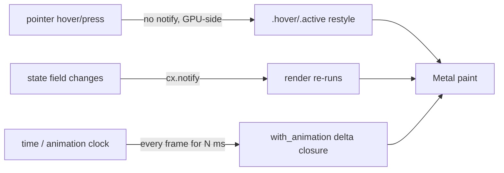

# gpui Animation Primitives

> **Scope.** This is the field manual for motion in `pd-console` — a native gpui
> **0.2.2** app (`core/pd-console/Cargo.toml:32`: `gpui = { version = "0.2.2" }`),
> rendered on Metal. Everything here is grounded in code that already ships in
> `core/pd-console/src/app.rs`. If you came from web motion (Framer Motion / GSAP /
> View Transitions), unlearn the transform vocabulary now: **gpui 0.2.2 has no
> fluent transform on `div` — no `.scale()`, no `.translate()`, no spring on
> layout.** "Lift / slide / zoom / spring" are *composed* from the four primitives
> below. Read that constraint into every paragraph.

---

## The Mental Model: a Render Function the Compositor Replays

gpui is **immediate-mode-ish**: your `render(&mut self, …) -> impl IntoElement`
is called to produce a fresh element tree, which gpui lays out and paints on the
GPU each frame. There is **no retained scene graph you mutate** the way you'd
mutate a DOM node's `style.transform`. Motion therefore comes from exactly two
sources:

1. **State-driven re-render** — you change a field on your view, call
   `cx.notify()`, gpui re-runs `render`, and the *new* tree paints. Discrete.
2. **`with_animation`** — you hand gpui a time-parameterized closure and it
   re-invokes that closure every frame for the animation's duration, feeding it a
   `delta` in `[0.0, 1.0]`. Continuous.

Hover/press/focus are a third, cheaper lane: gpui's interaction state
(`.hover(|s| …)`, `.group_hover(…)`, `.active(…)`) re-styles *without* a notify,
synchronously, on the compositor. Use it for anything that's purely a pointer
state.



**Decision Point — which lane?**

| You want… | Use | Cost | Re-renders view? |
|---|---|---|---|
| Pure pointer feedback (hover glow, press color) | `.hover` / `.active` / `.group_hover` | ~free, GPU-side | No |
| A looping presence cue (breathing dot, beacon) | `with_animation(…).repeat()` | one element re-styled/frame | No (animation-local) |
| One-shot entrance/settle on a *value* | `with_animation` (no `.repeat()`) | bounded | No |
| Reaction to real data/state change | mutate field + `cx.notify()` | full `render` | Yes |

---

## Primitive 1 — `with_animation`: the time-parameterized closure

This is the only continuous-time primitive you get. It lives on the
`AnimationExt` trait, so **you must have `gpui::prelude::*` or
`AnimationExt` in scope** (in pd-console, `app.rs:21` does `use gpui::prelude::*;`
plus the wildcard `use gpui::*;` at `app.rs:22`).

The canonical shape, verbatim from pd-console's breathing focus-dot
(`app.rs:659–665`):

```rust
dot.with_animation(
    SharedString::from(format!("dot-pulse-{id}")),   // ① stable ElementId
    Animation::new(Duration::from_millis(2400))      // ② duration
        .repeat()                                    // ③ loop forever
        .with_easing(pulsating_between(0.55, 1.0)),  // ④ easing → delta curve
    |el, delta| el.opacity(delta),                   // ⑤ delta closure
)
.into_any_element()
```

Signature in plain terms:

```rust
fn with_animation(
    self,
    id: impl Into<ElementId>,
    animation: Animation,
    animator: impl Fn(Self, f32) -> Self + 'static,   // <- the delta closure
) -> AnimationElement<Self>;
```

Four things to internalize:

- **`id` is load-bearing identity, not a label.** gpui keys the animation's
  clock on this `ElementId`. If two animated elements share an id, they share a
  clock (and fight). If an id is *unstable* across frames, the animation
  restarts every frame and visibly stutters or freezes at `delta=0`. pd-console
  threads the pane id in (`format!("dot-pulse-{id}")`) precisely so each pane's
  beacon keeps its own phase. **Anything that `Into<ElementId>`** works:
  `&'static str`, `SharedString`, `usize`, `(str, usize)`. pd-console uses
  `SharedString` because the id is built from a runtime `format!`.

- **The closure is called once per frame with `delta`** already mapped through
  the easing function. You do **not** see raw time — you see the eased
  `[0.0,1.0]` (or whatever range the easing emits; `pulsating_between` emits a
  bounded sub-range, see Primitive 3). Whatever you return *is* this frame's
  element.

- **What you can interpolate is "whatever a `Styled`/element setter takes a
  scalar for."** In 0.2.2 that practically means:
  - `.opacity(delta)` — the workhorse (pd-console uses exactly this).
  - color, by hand-lerping an `Hsla`/`Rgba` from `delta` and calling
    `.text_color(...)` / `.bg(...)` / `.border_color(...)`.
  - sizes/fractions — `.w(px(8.0 + delta * 4.0))`, `.h(relative(delta))`, gap,
    padding, `flex` basis. This is how you fake "grow / slide": **animate the
    layout number, not a transform.**
  - `shadow(...)` blur/spread/alpha derived from `delta` (glow that pulses).
  - On `svg()` / image elements only, `with_transformation(Transformation::…)`
    exists (rotate/scale of the rasterized glyph) — that's how Zed's spinner
    rotates. It is **not** available on a general `div`.

- **It returns `AnimationElement<Self>`, a different type than `Self`.** That's
  why pd-console calls `.into_any_element()` and the non-animated branch *also*
  calls `.into_any_element()` (`app.rs:666` vs `:668`) — both arms of the `if`
  must yield the same `AnyElement`. This is the single most common compile
  wall: **the two branches of "animate this when focused, else don't" have
  different types until you erase to `AnyElement`.**

**Anti-Pattern — "transform reflex."**
**Symptom:** you write `.scale(1.05)` / `.translate_y(px(-4.0))` and it doesn't
compile, or you pull in a phantom API from web muscle memory.
**Detection:** grep the diff for `.scale(`, `.translate`, `transform:`; any hit
on a `div` in 0.2.2 is wrong.
**Fix:** decompose into opacity + `shadow` + a layout number. A "lift on hover"
is `motion::hard_offset` (a hard drop-shadow) + a `raised` bg, not a translate —
see `app.rs:929`.

---

## Primitive 2 — `Animation::new(...)`: the clock and its shape

`Animation::new(Duration)` is the time spec. Its builder methods:

| Method | Effect | pd-console use |
|---|---|---|
| `Animation::new(Duration::from_millis(n))` | sets duration of one pass | `2400ms` for the beacon (`app.rs:661`) |
| `.repeat()` | loop indefinitely; clock wraps `1.0 → 0.0` | yes, beacon (`app.rs:662`) |
| `.with_easing(fn)` | remap linear progress through an easing curve | `pulsating_between(...)` (`app.rs:663`) |

Without `.repeat()`, the animation runs **once** to `delta=1.0` and holds — that's
your *one-shot entrance / settle*. With `.repeat()` it's a *loop* — that's your
*ambient/idle* cue. pd-console's design rule is encoded in a comment at
`app.rs:653`: **"the focused pane's dot breathes … idle panes are static."**
Looping motion is reserved for the one element that has the operator's attention;
everything else holds still. That's not just taste — a screenful of independently
looping `with_animation`s is a screenful of per-frame re-styles competing for the
foreground executor.

**Duration discipline.** pd-console caps deliberate motion at ≤500ms for
*interactions* — see `motion::RISE_MS = 500` (`app.rs:150`) — and uses a long,
slow period (2400ms) only for *ambient breathing*, where slowness reads as calm
rather than lag. This matches the loaded `beautiful-gui-design` rule:
*"Motion is communication, not decoration. 100–300ms, ease-out to enter / ease-in
to exit."* Translate that to gpui: short eased one-shots for entrances, slow
`pulsating` loops for presence, never a fast loop (a fast loop is a seizure, not a
beacon).

---

## Primitive 3 — Easing: shaping `delta`

`.with_easing(f)` takes `impl Fn(f32) -> f32 + 'static` — a function from linear
progress to the value your closure receives. gpui 0.2.2 ships a handful in the
prelude; the ones confirmed against Zed's own `animation.rs` example and used
in-tree:

- **`ease_in_out`** — symmetric S-curve (slow-fast-slow). The default "feels
  designed" tween.
- **`bounce(inner)`** — composes a bounce envelope over another easing, e.g.
  `bounce(ease_in_out)`. Decorative; use sparingly.
- **`pulsating_between(lo, hi)`** — the breathing curve. It does **not** go
  `0→1`; it oscillates `delta` smoothly between `lo` and `hi` and back. pd-console
  uses `pulsating_between(0.55, 1.0)` so the dot's opacity never fully fades (it
  breathes between 55% and 100%, never vanishing). **This is why the beacon reads
  as "alive but calm" rather than "blinking."** Pair `pulsating_between` with
  `.repeat()` — it's built for loops.
- **`linear`** (the absence of easing) — only for genuinely uniform motion
  (e.g. an indeterminate spinner's rotation). Almost never right for opacity.

You can also **write your own** — it's just `Fn(f32)->f32`. pd-console keeps a
local curve, `motion::swoosh` (`app.rs:152–155`):

```rust
/// `--swoosh`: graceful fast-out settle (≈ quintic ease-out).
pub fn swoosh(t: f32) -> f32 { 1.0 - (1.0 - t).powi(5) }
```

That's a quintic ease-out you'd drop straight into `.with_easing(motion::swoosh)`
for a one-shot entrance that arrives fast and settles soft.

**Decision Point — pick the curve by intent:**

| Intent | Curve | `.repeat()`? |
|---|---|---|
| Ambient presence (breathing) | `pulsating_between(0.55, 1.0)` | yes |
| Entrance that settles | `swoosh` / `ease_in_out` | no |
| Attention/playful pop | `bounce(ease_in_out)` | no |
| Uniform spin (spinner glyph) | `linear` | yes |

**Anti-Pattern — "full-fade breathing."**
**Symptom:** beacon uses `pulsating_between(0.0, 1.0)` (or plain `ease_in_out`
looped) and the dot visibly blinks off, reading as "disconnected / error."
**Detection:** any looping opacity animation whose low bound is `< ~0.4`.
**Fix:** clamp the low end (pd-console's `0.55`). Presence means *never gone*.

---

## Primitive 4 — Glow & Lift via `shadow(BoxShadow)` (the transform stand-in)

Because there's no transform, pd-console builds a tiny `motion` module
(`app.rs:147–179`) that manufactures the *appearance* of depth and energy from
`BoxShadow` alone:

```rust
mod motion {
    use gpui::{point, px, BoxShadow, Hsla};

    /// A soft halo glow (focus ring / hover). Alpha rides on `Hsla`.
    pub fn glow(color: u32, alpha: f32, blur: f32, spread: f32) -> Vec<BoxShadow> {
        let mut h: Hsla = gpui::rgb(color).into();
        h.a = alpha;
        vec![BoxShadow { color: h, offset: point(px(0.0), px(0.0)),
                         blur_radius: px(blur), spread_radius: px(spread) }]
    }

    /// Neobrutalist hard offset drop — the hover "lift" cue (no translate in 0.2.2).
    pub fn hard_offset(color: u32, dx: f32, dy: f32) -> Vec<BoxShadow> {
        let h: Hsla = gpui::rgb(color).into();
        vec![BoxShadow { color: h, offset: point(px(dx), px(dy)),
                         blur_radius: px(0.0), spread_radius: px(0.0) }]
    }
}
```

These compose with the cheap interaction lane. The **focus ring** is a static
glow gated on state (`app.rs:629`):

```rust
.when(is_focused, |s| s.shadow(motion::glow(current_theme().accent, 0.45, 16.0, 1.0)))
```

…and the **hover lift** is a glow swapped in only while hovered (`app.rs:631–636`,
and a hard-offset variant at `:929` for the neobrutalist button "press"):

```rust
s.hover(|h| {
    h.bg(rgb(current_theme().raised))
     .shadow(motion::glow(current_theme().accent, 0.18, 10.0, 0.0))
})
```

To make a glow **pulse**, you marry Primitive 4 to Primitive 1: derive the
shadow alpha from `delta` inside the closure. (Conceptually:
`|el, delta| el.shadow(motion::glow(accent, 0.15 + delta*0.30, 8.0+delta*8.0, 0.0))`.)
That's a "throbbing alert halo" with zero transforms.

**Anti-Pattern — "everything glows."**
**Symptom:** glow on every pane, button, row → the whole window hums and the
focus ring loses meaning.
**Detection:** count `motion::glow` call sites that aren't gated on
`is_focused`/`.hover`/an alert state.
**Fix:** glow is a *signal*. Gate it. pd-console glows exactly: focused pane,
hovered control, lit/active tab (`app.rs:972`). Idle = flat.

---

## Driving Motion from State vs. Self-Running Loops

There are two clocks, and confusing them is the deepest bug class here.

**Self-running loop (animation-local clock).** `with_animation(...).repeat()`
has its *own* clock that gpui advances; it does **not** require `cx.notify()` to
keep ticking and it does **not** re-run your `render`. The breathing dot is
entirely self-contained: once `render` emits the `AnimationElement`, gpui keeps
re-invoking *just that closure* until the element stops being produced (e.g. the
pane loses focus and the `else` branch returns a static dot next render).

**State clock (your data).** When real data arrives, you mutate a field and call
`cx.notify()` to schedule a re-render. pd-console's entire data plane runs this
way (`main.rs:302–315`):

```rust
cx.foreground_executor().spawn(async move {
    loop {
        bg.timer(Duration::from_millis(500)).await;           // poll cadence
        while let Ok(pane_updates) = rx.try_recv() {
            async_cx.update(|app| {
                window.update(app, |view: &mut ConsoleView, _, cx| {
                    view.update_panes(pane_updates.clone());
                    cx.notify();                               // ← re-render
                });
            });
        }
    }
}).detach();
```

Note the architecture: a **background** thread/executor produces frames of data
over an `mpsc` channel; a **foreground** executor task (the only place allowed to
touch the view) drains it on a 500ms timer and `cx.notify()`s. This is the gpui
threading contract — **view mutation and `cx.notify()` happen on the foreground
executor, never the background one.** `cx.notify()` is the bridge from "new data"
to "new pixels"; `with_animation` is the bridge from "time" to "new pixels," and
they don't need each other.

**Decision Point — should this be a loop or a notify?**
- Is the thing changing *because time passed* (breathing, spinner, ambient
  shimmer)? → `with_animation().repeat()`. No notify.
- Is it changing *because the world changed* (new note, agent finished, daemon
  health flipped)? → mutate field + `cx.notify()` on the foreground executor.
- Is it a *one-shot reaction* to a state change (flash "interrupt sent")? →
  set the field + `cx.notify()` now; if you want it to *fade*, render that field
  through a non-repeating `with_animation` whose id is keyed to the event so it
  re-fires once. pd-console's `control_flash` (`app.rs:731`) is the field; today
  it's a discrete swap — a fade would wrap it in a one-shot `with_animation`.

**Anti-Pattern — "notify-driven animation loop."**
**Symptom:** a `foreground_executor` timer that ticks every 16–33ms calling
`cx.notify()` purely to step an animation you could express as `with_animation`.
**Detection:** a polling loop with a sub-100ms `timer(...)` whose body only
mutates an animation phase counter.
**Fix:** delete the loop; express the motion as `with_animation` with an easing.
Re-running the *entire* `render` 60×/s to move one dot is the wasteful path;
`with_animation` re-styles only the animated element. Reserve `cx.notify()` for
data (pd-console's data cadence is a sane **500ms**, `main.rs:308`).

---

## Before / After: a Pulsing "Live Lane" Indicator

**Before — web reflex, won't compile, re-renders the world.** A 30ms notify loop
flipping a bool, plus a phantom transform:

```rust
// ❌ phantom .scale(), and a 30ms render-the-whole-view loop to drive it
cx.foreground_executor().spawn(async move {
    loop {
        bg.timer(Duration::from_millis(30)).await;
        window.update(app, |v, _, cx| { v.pulse_phase += 0.05; cx.notify(); });
    }
}).detach();

div().bg(rgb(theme.engaged))
     .scale(1.0 + (self.pulse_phase.sin() * 0.1))   // ❌ no transform in 0.2.2
```

**After — grounded in pd-console's primitives.** Self-running loop, opacity +
pulsing glow, stable id, no extra notify, correct `AnyElement` erasure:

```rust
let lane_dot = div()
    .size(px(10.0))
    .rounded_full()
    .bg(rgb(theme.engaged))
    .shadow(motion::glow(theme.engaged, 0.30, 8.0, 0.0));

if lane.is_live {
    lane_dot
        .with_animation(
            SharedString::from(format!("lane-live-{lane_id}")),  // stable, unique
            Animation::new(Duration::from_millis(1800))
                .repeat()
                .with_easing(pulsating_between(0.6, 1.0)),        // never fully dim
            |el, delta| {
                el.opacity(delta)
                  // glow alpha rides the same delta → halo breathes with the dot
                  .shadow(motion::glow(/*engaged*/ 0xf59e0b, 0.10 + delta * 0.30, 6.0 + delta * 6.0, 0.0))
            },
        )
        .into_any_element()
} else {
    lane_dot.opacity(0.4).into_any_element()   // both arms → AnyElement
}
```

Why it's right: one clock (gpui's), one element re-styled per frame, no
whole-view re-render, no transform, presence that never hits zero, and the id is
unique-per-lane so two live lanes don't share a phase. Data changes
(`lane.is_live` flipping) still arrive through the normal `cx.notify()` path on
the 500ms foreground drain — the animation just rebuilds correctly on the next
render.

---

## Quality Gates (run this checklist on any motion PR)

- [ ] **No phantom transforms.** `grep -nE '\.(scale|translate|rotate)\(' src/`
      returns nothing on `div`s. (Glyph-only `with_transformation` on `svg()` is
      the sole exception.)
- [ ] **Every `with_animation` id is stable across frames AND unique across
      instances.** Built from a real key (`format!("…-{id}")`), never a constant
      shared by siblings, never recomputed-random.
- [ ] **Both branches of a conditional animation erase to `AnyElement`** (or share
      a type). The `if is_focused { …animate… } else { …static… }` pattern ends in
      `.into_any_element()` on *both* arms (`app.rs:666`/`:668`).
- [ ] **Looping motion is rationed.** Only the focused / live / alerting element
      loops; idle elements are static (`app.rs:653` rule). No screenful of
      independent loops.
- [ ] **Breathing never fully fades.** `pulsating_between` low bound ≥ ~0.5.
- [ ] **Interaction motion ≤ 500ms; ambient loops slow (≥1.5s).** Respect
      `motion::RISE_MS` (`app.rs:150`). No fast opacity loops.
- [ ] **Glow is gated, not ambient.** Every `motion::glow` is behind
      `is_focused` / `.hover` / an alert state, never default-on.
- [ ] **`cx.notify()` only on the foreground executor, only for data.** No
      sub-100ms notify loop standing in for `with_animation` (`main.rs:308` is the
      sane 500ms data cadence to imitate).
- [ ] **Color/shadow lerps read from theme roles, not literals**, so motion
      survives the `Ctrl-A g` light⇄dark flip (`palette.rs`; flip re-skins on next
      notify, `app.rs:122`).
- [ ] **Reduced-motion intent honored.** gpui has no `prefers-reduced-motion`
      hook; gate ambient loops behind a config/state flag (mirror the
      focused-only discipline) so a "calm mode" can drop to the static `else`
      branch.

---

## Quick Reference Card

```rust
use gpui::prelude::*;     // brings AnimationExt into scope
use gpui::*;              // Animation, SharedString, BoxShadow, ease_in_out, pulsating_between, …

element
  .with_animation(
      SharedString::from(format!("kind-{unique_key}")),  // ElementId: stable + unique
      Animation::new(Duration::from_millis(MS))
          .repeat()                                       // omit for one-shot
          .with_easing(pulsating_between(0.55, 1.0)),     // or ease_in_out / bounce(..) / swoosh
      |el, delta| el.opacity(delta),                      // interpolate: opacity, .bg/.text_color (lerp Hsla),
                                                          //   .w/.h/.gap (layout fractions), shadow(glow(..))
  )
  .into_any_element()                                     // erase; match the other branch
```

- **No transforms** → opacity + `shadow(BoxShadow)` + animated layout numbers.
- **Two clocks**: `with_animation` (time, self-running) vs `cx.notify()` (data,
  foreground executor).
- **Glow = `motion::glow`**, **lift = `motion::hard_offset`** (`app.rs:158`,`:170`).
- **Ground truth in-tree**: breathing dot `app.rs:659–665`; focus glow
  `app.rs:629`; hover lift `app.rs:631`,`:929`; data/notify loop
  `main.rs:302–315`; easing/swoosh `app.rs:152`.

**Sources:** [Zed gpui `animation.rs` example](https://github.com/zed-industries/zed/blob/main/crates/gpui/examples/animation.rs) · [gpui docs.rs](https://docs.rs/gpui) · [GPUI 2 in production — Zed blog](https://zed.dev/blog/gpui-2-on-preview); plus in-tree code at `core/pd-console/src/app.rs`, `palette.rs`, `main.rs` (gpui 0.2.2, `Cargo.toml:32`).
