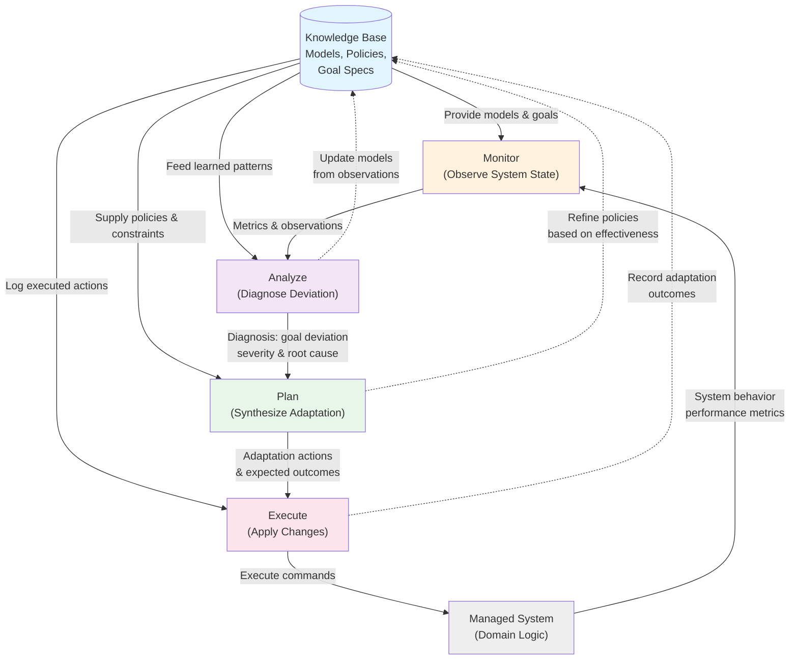

# MAPE-K Feedback Loop Architecture

```mermaid
flowchart TD
    KB[(Knowledge Base<br/>Models, Policies,<br/>Goal Specs)]
    
    MON["Monitor<br/>(Observe System State)"]
    ANA["Analyze<br/>(Diagnose Deviation)"]
    PLAN["Plan<br/>(Synthesize Adaptation)"]
    EXEC["Execute<br/>(Apply Changes)"]
    
    MANAGED["Managed System<br/>(Domain Logic)"]
    
    KB -->|Provide models & goals| MON
    KB -->|Feed learned patterns| ANA
    KB -->|Supply policies & constraints| PLAN
    KB -->|Log executed actions| EXEC
    
    MON -->|Metrics & observations| ANA
    ANA -->|Diagnosis: goal deviation<br/>severity & root cause| PLAN
    PLAN -->|Adaptation actions<br/>& expected outcomes| EXEC
    EXEC -->|Execute commands| MANAGED
    
    MANAGED -->|System behavior<br/>performance metrics| MON
    
    ANA -.->|Update models<br/>from observations| KB
    PLAN -.->|Refine policies<br/>based on effectiveness| KB
    EXEC -.->|Record adaptation<br/>outcomes| KB
    
    style KB fill:#e1f5ff
    style MON fill:#fff3e0
    style ANA fill:#f3e5f5
    style PLAN fill:#e8f5e9
    style EXEC fill:#fce4ec
    style MANAGED fill:#eeeeee
```
