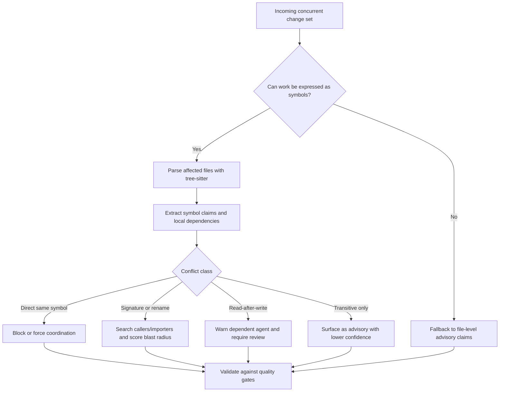

# Diagram 1: flowchart

```mermaid
flowchart TD
  A[Incoming concurrent change set] --> B{Can work be expressed as symbols?}
  B -->|No| C[Fallback to file-level advisory claims]
  B -->|Yes| D[Parse affected files with tree-sitter]
  D --> E[Extract symbol claims and local dependencies]
  E --> F{Conflict class}
  F -->|Direct same symbol| G[Block or force coordination]
  F -->|Signature or rename| H[Search callers/importers and score blast radius]
  F -->|Read-after-write| I[Warn dependent agent and require review]
  F -->|Transitive only| J[Surface as advisory with lower confidence]
  G --> K[Validate against quality gates]
  H --> K
  I --> K
  J --> K
  C --> K
```
