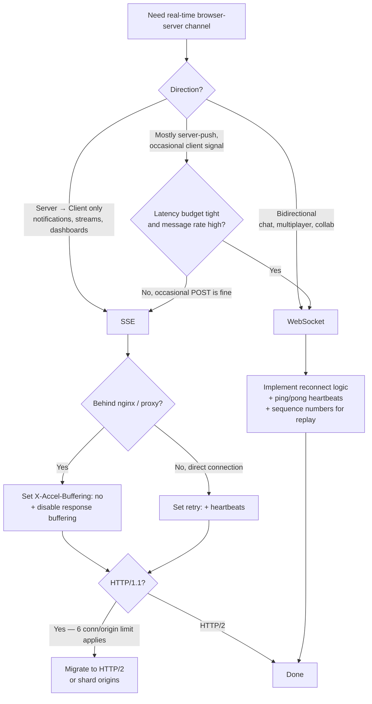

# Server-Sent Events vs WebSockets

> **TL;DR**: SSE for server→client streams (notifications, log tails, LLM token streams, dashboards). WebSocket for bidirectional low-latency (chat, multiplayer, collaborative editors). SSE is plain HTTP with auto-reconnect baked in; WebSocket is a separate protocol with no built-in reconnect. The HTTP/1.1 6-per-origin connection limit kills SSE without HTTP/2; proxy buffering silently kills SSE if you forget `X-Accel-Buffering: no` on nginx.

---

## Jump to your fire

| Symptom | Section |
|---|---|
| "Which one for my use case?" | [Decision diagram](#decision-diagram) |
| "SSE works locally, breaks in prod behind nginx" | [Proxy buffering trap](#anti-patterns) |
| "Browser hits 6-connection limit" | [HTTP/2 implications](#3-http-12-and-the-6-per-origin-limit) |
| "WebSocket disconnects randomly, no reconnect" | [Reconnection models](#2-reconnection-models) |
| "Need to replay missed messages on reconnect" | [Last-Event-ID](#2-reconnection-models) |
| "Server can't keep up with WS message rate" | [Backpressure](#4-backpressure-and-heartbeats) |

---

## Decision diagram



---

## 1. Wire formats

### SSE (`text/event-stream`)

Per the [WHATWG HTML Living Standard](https://html.spec.whatwg.org/multipage/server-sent-events.html), the four field names are `data`, `event`, `id`, `retry`. Events terminated by a blank line.

```
: keep-alive comment, ignored by client
retry: 10000

event: userconnect
id: 42
data: {"username":"bobby","time":"02:33:48"}

event: usermessage
id: 43
data: {"username":"bobby","time":"02:34:11"}
data: {"text":"Hi everyone."}
```

Multiple `data:` lines in one event are concatenated with `\n`. A line starting with `:` is a comment (used for keepalives — see §4). The `retry:` value, per WHATWG, must be ASCII digits only:

> If the field value consists of only ASCII digits, then interpret the field value as an integer in base ten, and set the event stream's reconnection time to that integer. Otherwise, ignore the field.

### WebSocket frame ([RFC 6455 §5.2](https://datatracker.ietf.org/doc/html/rfc6455#section-5.2))

```
 0                   1                   2                   3
 0 1 2 3 4 5 6 7 8 9 0 1 2 3 4 5 6 7 8 9 0 1 2 3 4 5 6 7 8 9 0 1
+-+-+-+-+-------+-+-------------+-------------------------------+
|F|R|R|R| opcode|M| Payload len |  Extended payload length      |
|I|S|S|S|  (4)  |A|     (7)     |        (16/64)                |
|N|V|V|V|       |S|             | (if payload len==126/127)     |
| |1|2|3|       |K|             |                               |
+-+-+-+-+-------+-+-------------+ - - - - - - - - - - - - - - - +
|     Extended payload length continued, if payload len == 127  |
+ - - - - - - - - - - - - - - - +-------------------------------+
|                               | Masking-key, if MASK set to 1 |
+-------------------------------+-------------------------------+
| Masking-key (continued)       |          Payload Data         |
+-------------------------------- - - - - - - - - - - - - - - - +
```

Opcodes (RFC 6455):

| Opcode | Meaning |
|---|---|
| `0x0` | continuation frame |
| `0x1` | text |
| `0x2` | binary |
| `0x8` | connection close |
| `0x9` | ping |
| `0xA` | pong |

Frame header is 2–14 bytes (2 base + up to 8 extended length + 4 masking key).

### Handshake comparison

| | SSE | WebSocket |
|---|---|---|
| Initial request | Plain `GET` with `Accept: text/event-stream` | `GET` with `Upgrade: websocket`, `Sec-WebSocket-Key` |
| Server response | `200 OK` + `Content-Type: text/event-stream`, response stream stays open | `101 Switching Protocols` + `Sec-WebSocket-Accept` (SHA-1 of key + GUID) |
| Auth, cookies, gzip | Inherited from HTTP | Lost after upgrade — must re-auth via subprotocol or first frame |
| Custom protocols | n/a | `Sec-WebSocket-Protocol` |

The `Sec-WebSocket-Accept` value is computed (RFC 6455 §1.3): server takes the client's `Sec-WebSocket-Key` and concatenates the GUID `258EAFA5-E914-47DA-95CA-C5AB0DC85B11`, SHA-1 hashes, and base64-encodes. Example: client `dGhlIHNhbXBsZSBub25jZQ==` → server `s3pPLMBiTxaQ9kYGzzhZRbK+xOo=`. This is what makes WebSocket NOT just a long-lived HTTP request — the server MUST acknowledge the protocol switch.

---

## 2. Reconnection models

### SSE: automatic, with replay hint

`EventSource` reconnects automatically on close. From [MDN](https://developer.mozilla.org/en-US/docs/Web/API/Server-sent_events/Using_server-sent_events):

> By default, if the connection between the client and server closes, the connection is restarted.

The reconnect delay is server-controlled via `retry:` field (milliseconds). On reconnect, the browser sends `Last-Event-ID: <last-id-seen>` so the server can resume from there.

**Critical caveat**: `Last-Event-ID` is only useful if the server keeps a replay buffer keyed by ID. The protocol gives you the header for free; the durability is on you. A common bug: server emits ascending `id:` values but doesn't persist them, then 502s, then the client reconnects with `Last-Event-ID: 42` and the server has no idea what came after 42.

```js
// Client (browser, automatic)
const es = new EventSource('/stream')
es.addEventListener('userconnect', (e) => { /* ... */ })
es.onerror = () => { /* EventSource auto-reconnects; just wait */ }

// Server (Node) — emit id: + persist
let lastId = Number(req.headers['last-event-id'] ?? 0)
const events = await store.getEventsAfter(lastId)
for (const ev of events) {
  res.write(`id: ${ev.id}\n`)
  res.write(`event: ${ev.type}\n`)
  res.write(`data: ${JSON.stringify(ev.data)}\n\n`)
}
```

### WebSocket: application layer, you own it

RFC 6455 has no built-in reconnection. Frame opcode `0x8` closes; section 7.4.1 defines codes (1000 normal, 1002 protocol error, etc.). Apps must implement reconnection, sequence numbers, and replay themselves.

```js
// Client (browser) — reconnect with backoff
function connect() {
  const ws = new WebSocket('wss://example.com/sock')
  let lastSeq = Number(localStorage.getItem('lastSeq') ?? 0)

  ws.onopen = () => ws.send(JSON.stringify({ type: 'resume', after: lastSeq }))
  ws.onmessage = (e) => {
    const msg = JSON.parse(e.data)
    lastSeq = msg.seq
    localStorage.setItem('lastSeq', String(lastSeq))
    handle(msg)
  }
  ws.onclose = () => setTimeout(connect, Math.random() * 5000 + 1000)  // jittered backoff
}
```

The full-jitter pattern from `circuit-breakers-and-retries` applies here verbatim.

---

## 3. HTTP/1.1 and the 6-per-origin limit

From [MDN](https://developer.mozilla.org/en-US/docs/Web/API/Server-sent_events/Using_server-sent_events):

> When **not used over HTTP/2**, SSE suffers from a limitation to the maximum number of open connections, which can be especially painful when opening multiple tabs, as the limit is per browser and is set to a very low number (6)... This limit is per browser + domain, meaning you can open 6 SSE connections across all tabs to www.example1.com and another 6 SSE connections to www.example2.com.

> When using HTTP/2, the maximum number of simultaneous HTTP streams is negotiated between the server and the client (defaults to 100).

Concrete impact: if your app holds 1 SSE connection per tab, the user opens a 7th tab on your domain and the SSE silently never connects. The browser holds the connection in pending state until one of the other 6 closes.

**WebSocket does not suffer this** — each WebSocket is a separate TCP connection after the upgrade, not part of the HTTP connection pool. (WebSocket-over-HTTP/2 per [RFC 8441](https://datatracker.ietf.org/doc/html/rfc8441) exists but adoption is uneven.)

**The fix for SSE**: deploy behind HTTP/2. CloudFront, Cloudflare, modern nginx, modern Node `http2` all do this. Verify with `curl -I --http2 https://yoursite.com/stream` showing HTTP/2 in the response.

---

## 4. Backpressure and heartbeats

### SSE heartbeat

Send a comment line every 15-30s to defeat proxy idle timeouts:

```
: keep-alive
```

Many corporate proxies, load balancers, and CDNs close idle HTTP connections after 30-60s. Without keepalive comments, your "long-lived" SSE stream gets a TCP close and the client re-EventSources — burning a connection slot every minute.

### WebSocket ping/pong

RFC 6455 control frames `0x9` (ping) and `0xA` (pong). [MDN](https://developer.mozilla.org/en-US/docs/Web/API/WebSockets_API/Writing_WebSocket_servers):

> When receiving a ping, send back a pong with the exact same Payload Data... Maximum payload length for pings/pongs: 125 bytes... If multiple pings arrive before sending a pong, only send one pong... Pongs received without prior pings should be ignored.

Most server libraries do this automatically. Verify by tcpdump'ing a long-idle connection — you should see periodic 2-byte (header-only) frames.

### Backpressure: both fall back to TCP

Neither protocol has application-level flow control. Both rely on TCP's receive window. If the client can't keep up:

- **SSE**: `res.write()` on the server starts blocking. If your event handler doesn't await it, you build an unbounded buffer in process memory.
- **WebSocket**: server libraries expose `bufferedAmount` (browser side) or write-callback signals. The application must measure send-buffer growth and drop / batch / pause.

The pattern for both:

```js
// Pseudocode
async function send(data) {
  if (clientBufferTooLarge()) {
    droppedMessages++
    return  // or batch, or close the connection
  }
  await write(data)
}
```

---

## 5. Proxy buffering: the SSE silent killer

The single most common SSE production bug: it works locally but messages arrive in batches every 10-60 seconds in production.

Cause: nginx (and many other proxies) buffer the response by default. Your server sends data; nginx holds it until its buffer fills or its timer fires; then it ships to the client.

**Fix on the server**:

```http
HTTP/1.1 200 OK
Content-Type: text/event-stream
Cache-Control: no-cache
Connection: keep-alive
X-Accel-Buffering: no
```

The `X-Accel-Buffering: no` header tells nginx to not buffer this response. (This is nginx-specific but most proxies that buffer support a similar opt-out header.) Always set it on SSE responses.

**Fix in nginx config**:

```nginx
location /stream {
  proxy_buffering off;
  proxy_cache off;
  proxy_read_timeout 24h;
  proxy_pass http://upstream;
}
```

---

## When to choose which

| Choose **SSE** when | Choose **WebSocket** when |
|---|---|
| Traffic is server → client only (notifications, log tails, LLM token streams, dashboards, progress bars) | Traffic is bidirectional and latency-sensitive (chat, multiplayer, collaborative editors, control planes) |
| You want auto-reconnect for free | You need binary frames or sub-millisecond write paths |
| You ride existing HTTP infra (CDN, auth middleware, gzip, HTTP/2 multiplexing) | You need application-defined sub-protocols (`Sec-WebSocket-Protocol`) |
| Tolerance for ~text-only payloads | You accept owning reconnection, replay, and heartbeat logic |
| Per-message overhead matters less than operational simplicity | Connection counts on HTTP/1.1 origins would otherwise hit the 6 limit |

The default for "stream tokens from an LLM to the browser" is **SSE**. Bidirectional chat is **WebSocket**.

---

## Anti-patterns

| Anti-pattern | Why it bites | Fix |
|---|---|---|
| SSE behind nginx without `X-Accel-Buffering: no` | Messages buffered into batches; "real-time" is anything but | Set the header; configure nginx with `proxy_buffering off` |
| `Last-Event-ID` honored but no server-side replay buffer | Client thinks it's resuming; server returns nothing | Persist event IDs + replay on reconnect, or document "no replay" |
| 7+ tabs hit the same SSE origin on HTTP/1.1 | Tabs ≥7 silently never connect | Migrate to HTTP/2; shard origins as a stopgap |
| WebSocket reconnect with no backoff | Reconnect storm on outage | Full-jitter exponential backoff (see `circuit-breakers-and-retries`) |
| Forgetting `Sec-WebSocket-Accept` validation in custom client | Server can be impersonated | Verify the SHA-1+GUID handshake response |
| Hand-rolled WebSocket client without masking | RFC 6455 says server MUST close — connection drops mysteriously | Use a library; or correctly mask all client→server frames |
| Sending JSON over `text/event-stream` with newlines unencoded | Multi-line `data:` parsing breaks | JSON-stringify (no embedded newlines) before emitting |
| Server holds DB connection per SSE client | Pool exhaustion at 6× concurrent users | Stream from a Redis pub/sub or a shared queue, not direct DB |
| Treating WebSocket close code 1006 as "normal" | 1006 is the *abnormal* close code (no Close frame received) | Distinguish 1000 (normal) from 1006 (abnormal) for retry decisions |

---

## Novice / Expert / Timeline

| | Novice | Expert |
|---|---|---|
| **Real-time channel** | "WebSocket for everything" | SSE for unidirectional; WS for bidirectional |
| **Reconnect** | Forgets backoff; storms on outage | Full-jitter exponential; resumes from last seq/id |
| **Behind a proxy** | "It works on my machine" | Knows about `X-Accel-Buffering: no`; tests through prod-shaped infra |
| **HTTP/2** | Doesn't think about it | Verifies HTTP/2 enabled before relying on >6 SSE concurrent |
| **Backpressure** | Doesn't measure | Watches `bufferedAmount` / write blocks; drops or batches |
| **Long-idle connection** | Mysteriously disconnected | Sends keepalive comments / ping every 15-30s |

**Timeline test**: simulate a 60-second backend outage. An expert SSE client reconnects automatically with `Last-Event-ID` and replays missed events. An expert WebSocket client backs off with jitter and resumes from sequence number. A novice implementation either reconnect-storms the recovering origin or silently drops events.

---

## Quality gates

A real-time channel ships when:

- [ ] **Test:** SSE responses include `Cache-Control: no-cache` and `X-Accel-Buffering: no`. Verified by curl on staging behind the same proxy as prod.
- [ ] **Test:** SSE server emits `id:` for every event AND has a replay store keyed by id. Integration test that disconnects and re-connects with `Last-Event-ID` confirms missed events arrive.
- [ ] **Test:** Heartbeat sent every ≤30s on idle connections (SSE: comment line; WS: ping frame). Verified by tcpdump or a 60-second idle integration test.
- [ ] **Test:** WebSocket reconnect logic uses jittered exponential backoff capped at 30s. Unit test for the delay function.
- [ ] **Test:** WebSocket message sequence numbers are persisted client-side and the server resumes correctly on reconnect.
- [ ] **Test:** Browser uses HTTP/2 for the SSE origin. Verified by `curl -I --http2`.
- [ ] **Test:** Per-connection backpressure exists — server drops/batches when client buffer exceeds threshold. Load test confirms memory stays bounded.
- [ ] **Manual:** Production proxy chain doesn't add buffering. Test via curl through the actual prod LB/CDN.

---

## NOT for this skill

- WebRTC (use `webrtc-data-channel-design` for peer-to-peer / media)
- gRPC streaming (use `grpc-streaming-design`)
- Long polling (almost always wrong in 2026; use SSE)
- HTTP/2 server push (deprecated by Chrome in 2022; not a substitute for either)
- MQTT or other IoT pub-sub (use `iot-message-broker-design`)
- Third-party real-time-as-a-service (Pusher, Ably, Firebase) — out of scope; this is the protocol-level skill
- Low-level TCP / UDP design (use `network-protocol-design`)

---

## Sources

- WHATWG: [HTML Living Standard — Server-sent events](https://html.spec.whatwg.org/multipage/server-sent-events.html) — wire format, `retry:` rules, `Last-Event-ID`
- IETF: [RFC 6455 — The WebSocket Protocol](https://datatracker.ietf.org/doc/html/rfc6455) — frame format, opcodes, `Sec-WebSocket-Accept` derivation, masking requirements
- IETF: [RFC 8441 — Bootstrapping WebSockets with HTTP/2](https://datatracker.ietf.org/doc/html/rfc8441)
- MDN: [Using Server-Sent Events](https://developer.mozilla.org/en-US/docs/Web/API/Server-sent_events/Using_server-sent_events) — EventSource API, browser limits, HTTP/2
- MDN: [Writing WebSocket servers](https://developer.mozilla.org/en-US/docs/Web/API/WebSockets_API/Writing_WebSocket_servers) — handshake, ping/pong rules
- Ably: [WebSockets vs Server-Sent Events](https://ably.com/blog/websockets-vs-sse) — engineering blog comparison
