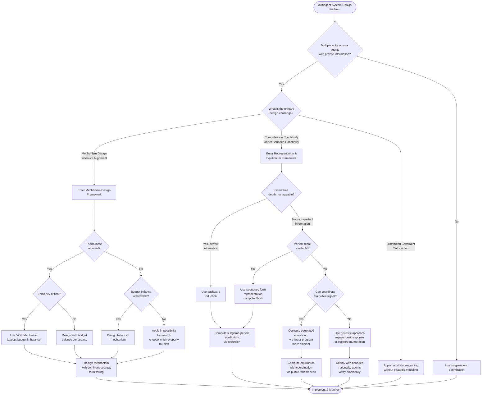

# Multiagent System Design Decision Tree

```mermaid
flowchart TD
    Start([Multiagent System Design Problem]) --> Q1{Multiple autonomous agents<br/>with private information?}
    
    Q1 -->|No| Single[Use single-agent optimization]
    Q1 -->|Yes| Q2{What is the primary<br/>design challenge?}
    
    Q2 -->|Distributed Constraint<br/>Satisfaction| Path1[Apply constraint reasoning<br/>without strategic modeling]
    
    Q2 -->|Mechanism Design<br/>Incentive Alignment| Path2[Enter Mechanism Design<br/>Framework]
    
    Q2 -->|Computational Tractability<br/>Under Bounded Rationality| Path3[Enter Representation &<br/>Equilibrium Framework]
    
    Path2 --> Q3{Truthfulness<br/>required?}
    Q3 -->|Yes| Q4{Efficiency critical?}
    Q4 -->|Yes| VCG["Use VCG Mechanism<br/>(accept budget imbalance)"]
    Q4 -->|No| Custom["Design with budget<br/>balance constraints"]
    
    Q3 -->|No| Q5{Budget balance<br/>achievable?}
    Q5 -->|Yes| Balanced["Design balanced<br/>mechanism"]
    Q5 -->|No| Impossible["Apply impossibility<br/>framework<br/>choose which property<br/>to relax"]
    
    Path3 --> Q6{Game tree<br/>depth manageable?}
    Q6 -->|Yes, perfect<br/>information| BackInd["Use backward<br/>induction"]
    
    Q6 -->|No, or imperfect<br/>information| Q7{Perfect recall<br/>available?}
    Q7 -->|Yes| SeqForm["Use sequence form<br/>representation<br/>compute Nash"]
    Q7 -->|No| Q8{Can coordinate<br/>via public signal?}
    
    Q8 -->|Yes| CorrEq["Compute correlated<br/>equilibrium<br/>via linear program<br/>more efficient"]
    Q8 -->|No| Heuristic["Use heuristic approach<br/>myopic best response<br/>or support enumeration"]
    
    VCG --> Output1["Design mechanism<br/>with dominant-strategy<br/>truth-telling"]
    Custom --> Output1
    Balanced --> Output1
    Impossible --> Output1
    
    BackInd --> Output2["Compute subgame-perfect<br/>equilibrium<br/>via recursion"]
    SeqForm --> Output2
    CorrEq --> Output3["Compute equilibrium<br/>with coordination<br/>via public randomness"]
    Heuristic --> Output4["Deploy with bounded<br/>rationality agents<br/>verify empirically"]
    
    Output1 --> End([Implement & Monitor])
    Output2 --> End
    Output3 --> End
    Output4 --> End
    Path1 --> End
    Single --> End
```
