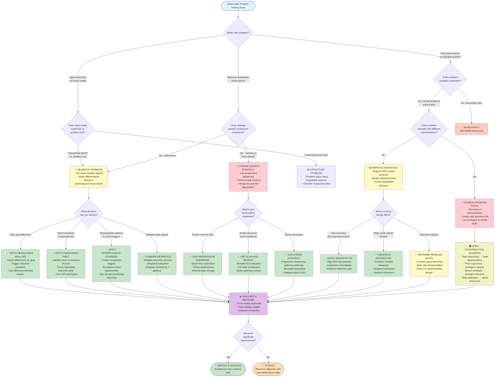

# Problem-Solving Diagnosis & Strategy Selection

```mermaid
flowchart TD
    Start([Observable Problem-Solving Issue]) --> Symptom{What's the symptom?}
    
    Symptom -->|Poor performance<br/>on solvable problem| PerfCheck{Is this problem<br/>solvable in principle?}
    Symptom -->|Agent examines<br/>too many nodes| SearchCheck{How many nodes<br/>examined vs.<br/>problem size?}
    Symptom -->|Resource exhaustion<br/>memory/time| ResourceCheck{Does strategy<br/>exceed architecture<br/>constraints?}
    
    PerfCheck -->|Yes, similar problems<br/>solve easily| RepCheck{Same problem<br/>solvable with different<br/>representation?}
    PerfCheck -->|No, intrinsically hard| Accept["Accept limits or<br/>reformulate task scope"]
    
    RepCheck -->|Yes| Recommend1["🔴 CHANGE PROBLEM SPACE<br/>- Reconstruct representation<br/>- Extract task structure info<br/>- Use analogies to similar tasks"]
    RepCheck -->|No| HeurCheck1["🟡 IMPROVE HEURISTICS<br/>- Analyze which states explored<br/>- Design selectivity filters<br/>- Extract exploitable structure"]
    
    SearchCheck -->|Exponential growth<br/>vs. problem size| Heur["🔴 HEURISTIC PROBLEM<br/>- Too much random search<br/>- Weak differentiation between<br/>promising and weak states"]
    SearchCheck -->|Linear/polynomial ratio| Structure["🟡 STRUCTURE PROBLEM<br/>- Problem space lacks<br/>exploitable patterns<br/>- Consider rerepresentation"]
    
    ResourceCheck -->|Yes - memory or<br/>time violated| StratChange["🔴 CHANGE SEARCH STRATEGY<br/>- Use progressive deepening<br/>- Reduce state tracking<br/>- Design for graceful degradation"]
    ResourceCheck -->|No - within limits| Heur
    
    Heur --> HeurDesign{What structure<br/>can you extract?}
    
    HeurDesign -->|Clear goal difference| MeansEnds["✅ APPLY MEANS-ENDS ANALYSIS<br/>- Detect differences vs. goal<br/>- Trigger reduction operators<br/>- Use difference-directed search"]
    HeurDesign -->|Hard constraints<br/>& dependencies| Constraint["✅ APPLY CONSTRAINT-FIRST<br/>- Identify most-constrained choices<br/>- Prune impossible branches early<br/>- Use CSP techniques"]
    HeurDesign -->|Recognizable patterns<br/>& action triggers| Pattern["✅ APPLY OPPORTUNISTIC PLANNING<br/>- Pattern recognition triggers<br/>- Recognize action opportunities<br/>- Use domain knowledge matching"]
    HeurDesign -->|Multiple weak signals| Combine["✅ COMBINE HEURISTICS<br/>- Multiple selectivity sources<br/>- Weighted evaluation<br/>- Integrate constraints + patterns"]
    
    StratChange --> StratChoice{What's your<br/>memory/time<br/>constraint?}
    
    StratChoice -->|Severe memory limit| Deepen["✅ USE PROGRESSIVE DEEPENING<br/>- Depth-first exploration<br/>- Cheap backtracking<br/>- Minimal state storage"]
    StratChoice -->|Ample resources<br/>need lookahead| Breadth["✅ USE SCAN-AND-SEARCH<br/>- Breadth-first evaluation<br/>- Full state comparison<br/>- Better planning horizon"]
    StratChoice -->|Mixed constraints| Hybrid["✅ USE HYBRID STRATEGY<br/>- Progressive deepening + selective widening<br/>- Bounded lookahead<br/>- Adaptive depth limits"]
    
    HeurCheck1 --> AllocEffort{Where to focus<br/>design effort?}
    
    AllocEffort -->|Few heuristics<br/>give big improvement| QuickWin["✅ QUICK HEURISTIC FIX<br/>- High ROI improvement<br/>- Implement immediately<br/>- Measure selectivity gain"]
    AllocEffort -->|Many weak signals<br/>needed| Integration["✅ HEURISTIC INTEGRATION<br/>- Combine multiple extractors<br/>- Weighted evaluation<br/>- Iterative refinement"]
    AllocEffort -->|Heuristics plateau| Reframe["✅ REFRAME PROBLEM SPACE<br/>- Current space has limits<br/>- Seek new representation<br/>- Return to representation design"]
    
    Recommend1 --> Construction["🟠 APPLY CONSTRUCTION SOURCES<br/>- Task instructions → state representation<br/>- Prior experience → analogous spaces<br/>- Search feedback → emergent structure<br/>- Meta-strategies → space refinement"]
    
    MeansEnds --> Evaluate["📊 EVALUATE & MEASURE<br/>- Count nodes examined<br/>- Track solution quality<br/>- Compare to baseline"]
    Constraint --> Evaluate
    Pattern --> Evaluate
    Combine --> Evaluate
    Deepen --> Evaluate
    Breadth --> Evaluate
    Hybrid --> Evaluate
    QuickWin --> Evaluate
    Integration --> Evaluate
    Reframe --> Evaluate
    Construction --> Evaluate
    
    Evaluate --> Success{Solved or<br/>significant<br/>improvement?}
    Success -->|Yes| End(["✅ DEPLOY & MONITOR<br/>Architecture now suited to task"])
    Success -->|No| Iterate(["🔄 ITERATE<br/>Return to diagnosis with<br/>new performance data"])
    
    style Start fill:#e1f5ff
    style End fill:#c8e6c9
    style Accept fill:#ffccbc
    style Recommend1 fill:#ffcdd2
    style Heur fill:#fff9c4
    style HeurCheck1 fill:#fff9c4
    style StratChange fill:#ffcdd2
    style MeansEnds fill:#c8e6c9
    style Constraint fill:#c8e6c9
    style Pattern fill:#c8e6c9
    style Combine fill:#c8e6c9
    style Deepen fill:#c8e6c9
    style Breadth fill:#c8e6c9
    style Hybrid fill:#c8e6c9
    style QuickWin fill:#c8e6c9
    style Integration fill:#c8e6c9
    style Reframe fill:#fff9c4
    style Construction fill:#f0f4c3
    style Evaluate fill:#e1bee7
    style Iterate fill:#ffe0b2
```
