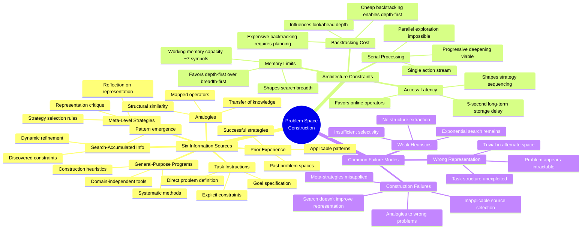

# Problem Space Construction: Six Information Sources & Architecture Constraints

```mermaid
mindmap
  root((Problem Space<br/>Construction))
    Six Information Sources
      Task Instructions
        Direct problem definition
        Explicit constraints
        Goal specification
      Prior Experience
        Past problem spaces
        Applicable patterns
        Successful strategies
      Analogies
        Structural similarity
        Mapped operators
        Transfer of knowledge
      General-Purpose Programs
        Construction heuristics
        Systematic methods
        Domain-independent tools
      Meta-Level Strategies
        Reflection on representation
        Strategy selection rules
        Representation critique
      Search-Accumulated Info
        Discovered constraints
        Pattern emergence
        Dynamic refinement
    Architecture Constraints
      Memory Limits
        Working memory capacity ~7 symbols
        Shapes search breadth
        Favors depth-first over breadth-first
      Serial Processing
        Single action stream
        Progressive deepening viable
        Parallel exploration impossible
      Access Latency
        5-second long-term storage delay
        Favors online operators
        Shapes strategy sequencing
      Backtracking Cost
        Cheap backtracking enables depth-first
        Expensive backtracking requires planning
        Influences lookahead depth
    Common Failure Modes
      Wrong Representation
        Task structure unexploited
        Problem appears intractable
        Trivial in alternate space
      Weak Heuristics
        Insufficient selectivity
        Exponential search remains
        No structure extraction
      Construction Failures
        Inapplicable source selection
        Analogies to wrong problems
        Meta-strategies misapplied
        Search doesn't improve representation
```
