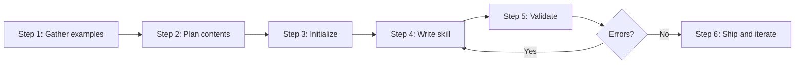

# Skill Architect: The Authoritative Meta-Skill

The unified authority for creating expert-level Agent Skills. Encodes the knowledge that separates a skill that *merely exists* from one that *activates precisely, teaches efficiently, and makes users productive immediately*.

## Philosophy

**Great skills are progressive disclosure machines.** They encode real domain expertise (shibboleths), not surface instructions. They follow a three-layer architecture: lightweight metadata for discovery, lean SKILL.md for core process, and reference files for deep dives loaded only on demand.

---

## When to Use

✅ **Use for**: Creating new skills, auditing/improving existing skills, debugging activation failures, encoding domain expertise (shibboleths, anti-patterns, temporal knowledge), designing skills for subagent consumption, building self-contained tools (scripts, MCPs, subagents).

❌ **NOT for**: General Claude Code features, MCP server implementation, non-skill coding advice, runtime debugging, template generation without real domain expertise.

---

## Quick Wins (Existing Skills)

Apply in priority order:
1. **Tighten description** → Follow `[What] [When to use]. NOT for [Exclusions]` formula
2. **Check line count** → SKILL.md must be <500 lines; move depth to `/references`
3. **Add NOT clause** → Prevent false activation with explicit exclusions
4. **Add 1-2 anti-patterns** → Use shibboleth template (Novice/Expert/Timeline)
5. **Remove dead files** → Delete unreferenced files in `scripts/` and `references/` (no phantoms)
6. **Test activation** → 5 queries that should trigger, 5 that shouldn't

---

## Decision Points

### Action Branch Selection

```
Query analysis:
├─ "new skill" OR "create skill" → CREATE path
├─ "audit" OR "review" OR "improve existing" → AUDIT path
├─ "won't activate" OR "false positive" → DEBUG path
├─ "subagent" OR "orchestration" → SUBAGENT-DESIGN path
└─ Example expertise with no skill → EXTRACT path
```

### CREATE Path

```
User expertise level:
├─ Has domain examples → Guide through 6-step process
│  ├─ Has working code → Initialize with scripts first
│  └─ No working code → Start with reference gathering
├─ Has general idea only → Use knowledge engineering methods
│  ├─ Technical domain → Apply protocol analysis
│  └─ Business domain → Use repertory grid technique
└─ Template request → Refuse (NOT for templates without expertise)
```

### AUDIT Path

```
Skill performance issue:
├─ Never activates → Description analysis + trigger testing
│  ├─ Description too vague → Apply [What][When] NOT [Exclusions] formula
│  ├─ Missing shibboleths → Add domain-specific anti-patterns
│  └─ Catalog competition → Check overlap with existing skills
├─ False positives → Boundary tightening
│  ├─ Missing NOT clause → Add explicit exclusions
│  └─ Description too broad → Split into focused skills
└─ Poor user experience → Progressive disclosure analysis
   ├─ SKILL.md >500 lines → Move depth to references
   └─ Missing decision trees → Convert prose to Mermaid flowcharts
```

---

## Progressive Disclosure Architecture

| Layer | Content | Size | Loading |
|-------|---------|------|---------|
| 1. Metadata | `name` + `description` in frontmatter | ~100 tokens | Always in context (catalog scan) |
| 2. SKILL.md | Core process, decision trees, brief anti-patterns | <5k tokens | On skill activation |
| 3. References | Deep dives, examples, templates, specs | Unlimited | On-demand, per-file, only when relevant |

**Critical rules**: Keep SKILL.md under 500 lines. Reference files are NOT auto-loaded. List each reference file with a 1-line loading condition. Never instruct "read all reference files before starting." Skim reference headings first, then drill into relevant sections.

---

## Description Formula

**Pattern**: `[What it does] [When to use — be slightly pushy]. NOT for [Exclusions].`

Claude evaluates descriptions **semantically**, not via keyword matching. It undertriggers — combat this by making descriptions slightly pushy. Specific, context-rich descriptions outperform keyword lists.

| Problem | Bad | Good |
|---------|-----|------|
| Too vague | "Helps with images" | "CLIP semantic search for image-text matching. NOT for counting, spatial reasoning, or generation." |
| No exclusions | "Reviews code changes" | "Reviews TypeScript/React diffs for correctness. NOT for writing new features." |
| Catch-all | "Helps with product management" | "Writes and refines PRDs. NOT for strategy decks." |
| Name mismatch | name: `db-migration` / desc: "writes marketing emails" | name: `db-migration` / desc: "Plans database schema migrations with rollback strategies." |

See `references/description-guide.md` for full guide with more examples.

---

## Frontmatter Rules

**Required top-level keys**: `name` and `description`.

**Open-standard top-level keys**:

| Key | Purpose | Example |
|-----|---------|---------|
| `license` | License identifier | `MIT` |
| `allowed-tools` | Comma-separated least-privilege tool list | `Read,Write,Grep` |
| `compatibility` | Short compatibility note when needed | `Claude Code 1.x` |
| `metadata` | Arbitrary repo/tooling hints | `category: Design` |

**Claude Code extension keys** may also be top-level when the skill relies on Claude Code behavior: `when_to_use`, `argument-hint`, `arguments`, `disable-model-invocation`, `user-invocable`, `disallowed-tools`, `model`, `effort`, `context`, `agent`, `hooks`, `paths`, `shell`.

**WinDAGs/library metadata goes under `metadata`**. That includes repo and UX hints such as `category`, `tags`, `pairs-with`, `version`, `visibility`, `triggers`, `see-also`, `trigger_phrases`, and `io-contract`.

Anthropic's open Agent Skills validator rejects arbitrary extra top-level keys. Do not weaken validation to accept WinDAGs-only fields; move them into `metadata`. Keep Claude Code extension keys top-level only when their runtime behavior matters.

**Invalid keys** → `tools:` (use `allowed-tools:`), top-level `category:` / `tags:` / `pairs-with:` / `version:` / `visibility:` / `io-contract:` (move into `metadata:`), `triggers:` and `outputs:` (encode in `metadata` or the SKILL.md body).

## SKILL.md Template

```markdown
---
name: your-skill-name
description: [What it does] [When to use — be slightly pushy]. NOT for [Exclusions].
allowed-tools: Read,Write
---

# Skill Name
[One sentence purpose]

## When to Use
✅ Use for: [A, B, C with specific trigger keywords]
❌ NOT for: [D, E, F — explicit boundaries]

## Core Process
[Mermaid diagram — flowcharts for decisions, sequences for protocols, states for lifecycles]

## Anti-Patterns
### [Pattern Name]
**Novice**: [Wrong assumption]
**Expert**: [Why it's wrong + correct approach]
**Timeline**: [When this changed, if temporal]

## References
- `references/guide.md` — Consult when [specific situation]
```

---

#### The 6-Step Skill Creation Process



1. **Gather Examples** — 3-5 real queries that should trigger, 3-5 that should NOT
2. **Plan Contents** — Identify `scripts/`, `references/`, and, only when they materially help, `examples/`, `templates/`, and `agents/`. Also identify shibboleths (domain algorithms, temporal knowledge, pitfalls).
3. **Initialize** — `scripts/init_skill.py <skill-name> --path <output-directory> [--with-mermaid --with-examples --with-templates --with-preflight --fork-context]`
4. **Write the Skill** — Preflight scripts first → examples and templates next → references next → SKILL.md last. Write imperatively: "To do X, do Y." Include Mermaid diagrams for processes, decision trees, lifecycles.
5. **Validate** — `python scripts/validate_skill.py <path>` and `python scripts/check_self_contained.py <path>`
6. **Iterate** — After real-world use: notice struggles, improve skill, update CHANGELOG.md

---

## Failure Modes

### Schema Bloat
**Detection**: SKILL.md >500 lines, reference files unused, agent takes >30 seconds to respond
**Fix**: Move depth to `/references`, create lazy-loading index in SKILL.md

### False Activation Cascade
**Detection**: Skill activates on ANY keyword from domain; NOT clause missing
**Fix**: Add NOT clause with 3-5 explicit exclusions, test with negative cases
**Root cause**: Undertrigger bias leads to overly broad descriptions as compensation

### Phantom Tool Reference
**Detection**: SKILL.md references files that don't exist; scripts fail on execution
**Fix**: Run `check_self_contained.py`, delete references or create missing files

### Shibboleth Poverty
**Detection**: No anti-patterns section; skill gives 2019 advice for 2025 problems
**Fix**: Add anti-patterns using Novice/Expert/Timeline template

### Eager Loading Anti-Pattern
**Detection**: Instructions like "read all reference files before starting"
**Fix**: Replace with specific loading conditions: "Read X when dealing with Y"

---

## Worked Examples

### Example 1: Debugging Activation Failure

**User report**: "My skill never activates even with obvious queries"

**Step 1** — Test: `"Help me plan a database migration"` → Expected: activates | Actual: nothing

**Step 2** — Analyze: `"Database utilities and migration help"` — too vague, no trigger keywords, no NOT clause

**Step 3** — Apply formula: `"Plans database schema migrations with rollback strategies and zero-downtime deployment. NOT for database design, query optimization, or backup strategies."`

**Step 4** — Test negative cases. If it still activates on "optimize SQL query", add stronger NOT clause. Test 5 positive + 5 negative cases before shipping.

### Example 2: Monolithic vs. Layered Skill Design

**Scenario**: User wants a single "web development" skill covering React + Node + deployment.

**Expert choice**: Always choose layered — 3 focused skills (`react-patterns`, `node-api-design`, `deployment-pipelines`), each with strong NOT clauses. Precise activation on narrow domains beats broad activation with poor results.

### Example 3: Encoding Domain Expertise

**Step 1** — Gather scenarios: zero-downtime schema change, data backfill, large-table index creation.

**Step 2** — Extract shibboleths:
- *Novice*: "Just run ALTER TABLE"
- *Expert*: Migration requires forward script + rollback + traffic analysis + gradual rollover
- *Timeline*: Pre-2020 migrations were often manual; modern practice requires automation + monitoring

**Step 3** — Design decision tree:
```
Migration type:
├─ Schema change → Zero-downtime strategy required
├─ Data transformation → Backfill + validation pipeline
└─ Index/constraint → Size analysis + batching strategy
```

**Step 4** — Progressive disclosure: SKILL.md has decision tree + 2 anti-patterns; for example, a deeper reference file can hold detailed techniques and a helper script can generate rollback plans.

---

## Subagent Consumption

Three loading layers when skills are loaded by subagents:
1. **Preloaded** (2-5 core skills) — Always in system context; standard operating procedures
2. **Dynamically selected** — Subagent picks 1-3 matching skills from a catalog before starting
3. **Execution-time** — Follows numbered steps, respects output contracts, runs QA checks

Teach subagents: check "When to use" for applicability, follow steps in order, reference by number ("Completed step 3"), respect output contracts (JSON shapes, required sections).

Use `context: fork` only when the skill should run in an isolated subagent by default:
- tighter tool or safety boundary
- independent specialists can work in parallel
- the workflow benefits from a dedicated prompt asset in `agents/`

If `context: fork` is set, also set `agent:` and ship a matching markdown prompt under `agents/`.

See `references/subagent-design.md` for full templates and orchestration patterns.

---

## Skill Operating System Assets

Use these bundled assets when `skill-architect` is asked to judge, synchronize,
package, or repeatedly improve skills instead of making a one-off edit.

- `agents/cross-evaluator.md` — Cross-check a skill against another skill or evaluation target. **Read when** judging quality, contradiction, or regression across skill versions.
- `agents/affordance-planner.md` — Plan which support affordances a skill actually needs. **Read when** choosing scripts, schemas, examples, templates, browser artifacts, or subagents.
- `agents/sync-coordinator.md` — Coordinate skill copies across workgroup, repo, and user-level locations. **Read when** syncing or grafting skill improvements between libraries.
- `agents/openai.yaml` — Runtime-facing agent metadata for OpenAI/Codex-style browsing and sync. **Read when** exporting or presenting the skill outside Claude Code.
- `schemas/skill-sync-plan.schema.json` — Machine-checkable sync-plan shape. **Read when** producing a structured plan for cross-library skill synchronization.
- `templates/skill-sync-plan.md` — Human-readable sync-plan template. **Read when** the user asks how to merge, mirror, or standardize skill copies.
- `templates/skill-scorecard.json` — Skill scoring template. **Read when** generating evaluator output or comparing versions.
- `templates/visual-decision-board.md` — Visual review board template. **Read when** a skill needs human review of artifacts, screenshots, or design direction.
- `templates/runtime-export-frontmatter.yaml` — Runtime export frontmatter example. **Read when** preparing a skill for a runtime-specific distribution copy.
- `examples/runtime-export-example.md` — Concrete runtime-export example. **Read when** teaching or verifying export shape.
- `examples/structural-upgrade-example.md` — Concrete structural-upgrade example. **Read when** planning a multi-file skill upgrade.
- `diagrams/01_flowchart_primary-decision-tree.md` — Renderable overview of the primary decision tree. **Read when** documenting or visualizing the architecture.
- `scripts/audit_skill_operating_system.py` — Audit first-party skills for operating-system completeness. **Read when** running a deeper local governance pass than the repo-level `pnpm audit:skills` command.

---

## Visual Artifacts: Mermaid Diagrams

If a skill describes a process, decision tree, lifecycle, or data relationship — include a Mermaid diagram. Both humans and agents benefit: humans see visual diagrams, agents parse explicit graph edges.

| Skill Content | Diagram Type | Syntax |
|---------------|-------------|--------|
| Decision trees / troubleshooting | Flowchart | `flowchart TD` |
| API/agent communication protocols | Sequence | `sequenceDiagram` |
| Lifecycle / status transitions | State | `stateDiagram-v2` |
| Data models / schemas | ER | `erDiagram` |
| Temporal knowledge / evolution | Timeline | `timeline` |
| Domain taxonomy / concept maps | Mindmap | `mindmap` |

Mermaid supports 23 diagram types total (Gantt, Git Graph, Journey, Sankey, Treemap, Radar, Kanban, etc.). Use the most specific type for your content. See `references/visual-artifacts.md` for the full catalog with examples.

---

## Encoding Shibboleths

Expert knowledge that separates novices from experts — things LLMs get wrong due to outdated training or cargo-culted patterns.

```markdown
### Anti-Pattern: [Name]
**Novice**: "[Wrong assumption]"
**Expert**: [Why it's wrong, with evidence]
**Timeline**: [Date]: [Old way] → [Date]: [New way]
**LLM mistake**: [Why LLMs suggest the old pattern]
**Detection**: [How to spot this in code/config]
```

What to encode: framework evolution (React Classes → Hooks → Server Components), model limitations (CLIP can't count), API versioning (ada-002 → text-embedding-3-large), temporal traps (advice correct in 2023, harmful in 2025).

See `references/antipatterns.md` for full catalog with case studies.

---

## Extension Taxonomy

| Need | Extension Type | Key Requirement |
|------|---------------|-----------------|
| Domain expertise / process | **Skill** (SKILL.md) | Decision trees, anti-patterns, output contracts |
| Packaging & distribution | **Plugin** (plugin.json) | Bundles skills + hooks + MCP + agents |
| External API + auth | **MCP Server** | Working server + setup README |
| Repeatable local operation | **Script** | Actually runs (not a template), minimal deps |
| Multi-step orchestration | **Subagent** | 4-section prompt, skills, workflow |
| User-triggered action | **Slash Command** | Skill annotated with `metadata.user-invocable: true` for repo tooling |
| Lifecycle automation | **Hook** | 17+ events: PreToolUse, PostToolUse, Stop, etc. |

Evolution path: Skill → Skill + Scripts → Skill + MCP → Skill + Subagent → Plugin. Only promote when complexity justifies it.

Use support assets selectively:
- `scripts/` for working validators, transformers, and safe read-only preflight scripts
- `examples/` for concrete finished outputs
- `templates/` for reusable deliverable shapes
- `agents/` for forked specialist prompts

Do not add empty folders or TODO-only files just to satisfy a pattern.

---

## Tool Permissions (Least Privilege)

| Access Level | `allowed-tools` |
|-------------|-----------------|
| Read-only | `Read,Grep,Glob` |
| File modifier | `Read,Write,Edit` |
| Build integration | `Read,Write,Bash(npm:*,git:*)` |
| ⚠️ Never for untrusted | Unrestricted `Bash` |

---

## Anti-Pattern Summary

| # | Anti-Pattern | Fix |
|---|-------------|-----|
| 1 | Documentation Dump | Decision trees in SKILL.md, depth in `/references` |
| 2 | Missing NOT clause | Always include "NOT for X, Y, Z" in description |
| 3 | Phantom Tools | Only reference files that exist and work |
| 4 | Template Soup | Ship working code or nothing |
| 5 | Overly Permissive Tools | Least privilege: specific tool list, scoped Bash |
| 6 | Stale Temporal Knowledge | Date all advice, update quarterly |
| 7 | Catch-All Skill | Split by expertise type, not domain |
| 8 | Vague Description | Use `[What] [When to use]. NOT for [Exclusions]` |
| 9 | Eager Loading | Never "read all files first"; lazy-load references |
| 10 | Prose-Only Processes | Use Mermaid diagrams for decisions and flows |

---

## Quality Gates

```
□ SKILL.md exists and is <500 lines
□ Frontmatter has name + description (required minimum)
□ Description follows [What][When to use] NOT [Exclusions] formula
□ Description is specific and context-rich (semantic activation, not keyword lists)
□ Name and description are aligned (not contradictory)
□ At least 1 anti-pattern with Novice/Expert/Timeline template
□ All referenced files actually exist (no phantoms)
□ Scripts work (not templates), have clear CLI, handle errors
□ If `examples/` or `templates/` exist, they are referenced from SKILL.md and clearly differentiated
□ Reference files each have a 1-line loading condition in SKILL.md
□ Processes/decisions/lifecycles use Mermaid diagrams, not prose
□ Tested with 5 positive queries + 5 negative queries
□ CHANGELOG.md tracks version history
□ If subagent-consumed: output contracts are defined
□ If `context: fork`: `agent:` is set and a matching `agents/*.md` asset exists
□ If `scripts/preflight.sh` exists: it is safe and read-only by default
```

Run: `python scripts/validate_skill.py <path>` and `python scripts/check_self_contained.py <path>`

---

## NOT-FOR Boundaries

**Delegate to these skills instead**:
- MCP server implementation → `mcp-server-builder`
- General code debugging → `debug-master`
- API documentation → `api-documentarian`
- Testing strategies → `test-architect`
- Quick fixes to working skills → use targeted improvement skills

---

## Reference Files

- `references/activation-debugging.md` — Diagnoses undertrigger (skill never activates) and overtrigger (false positives) via description vagueness, missing NOT clauses, and keyword conflicts. **Read when** skill won't activate or activates on wrong queries.
- `references/advanced-structure-and-sync.md` — Advanced patterns for cross-runtime structure, synchronization, and canonical copy management. **Read when** a skill exists in multiple libraries or runtimes.
- `references/antipatterns.md` — Domain shibboleths (ML model selection, framework evolution, tool architecture, skill design) that separate novice from expert thinking. **Read when** encoding expertise or preventing outdated patterns.
- `references/channels-and-scheduling.md` — Adjacent runtime surfaces for channels, scheduled tasks, and recurring skill checks. **Read when** deciding whether a skill needs daily review, push context, or surrounding automation.
- `references/claude-code-runtime.md` — Claude Code runtime constraints for skills, subagents, preprocessing, compaction, and invocation. **Read when** behavior depends on current Claude runtime semantics.
- `references/claude-extension-taxonomy.md` — Taxonomy of seven extension types (Skills, Plugins, MCPs, Scripts, Slash Commands, Hooks, Agent SDK) with decision flowchart. **Read when** choosing between skill vs. plugin vs. MCP vs. script.
- `references/description-guide.md` — Formula for activation-critical description field: `[What] [When] [Triggers]. NOT for [Exclusions].` **Read when** tightening description or debugging false positives.
- `references/expertise-elicitation.md` — Elicitation prompts and contrastive methods for extracting L3 expert judgment. **Read when** converting human knowledge or old docs into skill guidance.
- `references/guide.md` — Concise authoring contract for skill-architect: minimal frontmatter, repo-specific metadata, preference for references over oversized SKILL.md. **Read when** creating legacy wrapper copies.
- `references/knowledge-engineering.md` — Methods for extracting expert mental models (structured acquisition, repertory grids, tacit-to-explicit conversion) into skill-ready shibboleths. **Read when** encoding domain expertise from subject matter experts.
- `references/mcp-template.md` — Production-ready MCP server starter (TypeScript, stdio transport, metadata). **Read when** building self-contained MCP tool for skill.
- `references/plugin-architecture.md` — Distribution mechanism for skills, agents, commands, hooks, MCPs, and settings as self-contained directories. **Read when** packaging skill for distribution.
- `references/scoring-rubric.md` — Quantitative 0-10 metrics for activation precision, description quality, anti-pattern coverage, and structural clarity. **Read when** auditing skill quality or comparing versions.
- `references/self-contained-tools.md` — Patterns for embedding working scripts, MCP servers, and subagents so users are productive immediately. **Read when** deciding whether to include runnable tools.
- `references/skill-composition.md` — Dependency types (sequential, parallel, hierarchical) and how skills reference each other in workflows. **Read when** designing skills that compose or depend on others.
- `references/skill-lifecycle.md` — Stages from Draft to Archived with versioning, review cadence, and deprecation strategy. **Read when** planning long-term maintenance or sunsetting.
- `references/strategies.md` — Lightweight upgrade strategies (tighten description, add decision points, extract references, add Mermaid) in priority order. **Read when** improving existing skill without major refactor.
- `references/subagent-design.md` — How to design skills for subagent consumption: focused role, curated skill set, clear internal workflow. **Read when** creating skills for subagent toolkit.
- `references/subagent-template.md` — Template for specialized subagent definitions with Identity, Skill Usage Rules, Task-Handling Loop, and Constraints sections. **Read when** defining a subagent that loads skills.
- `references/visual-artifacts.md` — Mermaid diagrams as dual-purpose artifacts: visual for humans, text-based graph DSL for agents. **Read when** deciding whether to include flowcharts or state machines.
- `scripts/check_self_contained.py` — Detects phantom references and orphaned files in skill directory. **Read when** validating that all referenced files exist and no dead files remain.
- `scripts/init_skill.py` — Scaffolds new skill directory with SKILL.md template, references/guide.md, optional examples/templates/agents/scripts, and CHANGELOG.md. **Read when** creating a new skill from scratch.
- `scripts/migration_planner.py` — Guides incremental skill upgrades: inventory files, separate frontmatter from structure, extract oversized sections, validate per stage. **Read when** planning major skill refactor.
- `scripts/validate_skill.py` — Comprehensive validation: frontmatter fields, description quality, file references, line counts, anti-patterns, naming conventions. **Read when** auditing skill for publication readiness.
- `agents/cross-evaluator.md` — (auto-added; describe on next pass)

## Reference Indexing — run before shipping any skill

Every file in a skill bundle MUST be reachable from SKILL.md, and every
`references/*.md` MUST be indexed by its reason-to-pull. Enforce it mechanically:

```bash
python3 scripts/index_references.py <skill-dir>          # check (exit 1 on orphans)
python3 scripts/index_references.py <skill-dir> --fix    # (re)write the Skill Bundle Index
```

`--fix` regenerates the auto-delimited **## Skill Bundle Index** block below,
linking every file with a derived purpose. Run it whenever you add/rename a file.

<!-- BEGIN BUNDLE INDEX (auto: index_references.py) -->

## Skill Bundle Index

*Every file in this skill, and when to open it. Auto-generated; run `scripts/index_references.py --fix`.*

**root**
- [`CHANGELOG.md`](CHANGELOG.md) — Changelog: skill-architect — **HTML entities in reference files**: The iter-2 self-evaluation claimed to fix HTML entities "throughout SKILL.md and references," but the 
- [`README.md`](README.md) — Skill Architect — The authoritative meta-skill for creating, auditing, and improving Agent Skills.
- [`affordance-scorecard.json`](affordance-scorecard.json) — affordance scorecard (data/schema)

**`agents/`**
- [`agents/INDEX.md`](agents/INDEX.md) — skill-architect Subagents — Five focused subagents implementing the skill-architect's decision branches.
- [`agents/activation-debugger.md`](agents/activation-debugger.md) — When you fire — --- name: activation-debugger description: DEBUG-path subagent for skill-architect.
- [`agents/affordance-planner.md`](agents/affordance-planner.md) — Affordance Planner — You are the structural affordance planner for `skill-architect`.
- [`agents/cross-evaluator.md`](agents/cross-evaluator.md) — Cross-Evaluator Agent — Evaluates and improves a target skill by embodying a source skill's expertise.
- [`agents/openai.yaml`](agents/openai.yaml) — openai (data/schema)
- [`agents/shibboleth-extractor.md`](agents/shibboleth-extractor.md) — What is a shibboleth? — --- name: shibboleth-extractor description: EXTRACT-path subagent for skill-architect.
- [`agents/skill-auditor.md`](agents/skill-auditor.md) — When you fire — --- name: skill-auditor description: AUDIT-path subagent for skill-architect.
- [`agents/skill-creator.md`](agents/skill-creator.md) — When you fire — --- name: skill-creator description: CREATE-path subagent for skill-architect.
- [`agents/sync-coordinator.md`](agents/sync-coordinator.md) — Skill Sync Coordinator — You coordinate skill copies across a workgroup source, repo mirrors, and user-level registries.

**`diagrams/`**
- [`diagrams/01_flowchart_primary-decision-tree.md`](diagrams/01_flowchart_primary-decision-tree.md) — Diagram 1: flowchart

**`examples/`**
- [`examples/runtime-export-example.md`](examples/runtime-export-example.md) — Runtime Export Example — In the repo copy, keep runtime intent under `metadata.runtime` unless native top-level fields are strictly required by the target runtime.
- [`examples/structural-upgrade-example.md`](examples/structural-upgrade-example.md) — Structural Upgrade Example — - First-party skill - Good domain knowledge - Weak activation description - No decision points, failure modes, or quality gates - Large `ref

**`references/`**
- [`references/activation-debugging.md`](references/activation-debugging.md) — Skill Activation Debugging — Systematic diagnosis when a skill doesn't activate when it should, or activates when it shouldn't.
- [`references/advanced-structure-and-sync.md`](references/advanced-structure-and-sync.md) — Advanced Structure and Sync — Use this when a skill should become a durable operating surface instead of a single Markdown instruction file.
- [`references/antipatterns.md`](references/antipatterns.md) — Skill Anti-Patterns: The Shibboleths — This document catalogs **domain-specific knowledge that separates novices from experts** - the things LLMs get wrong because their training 
- [`references/channels-and-scheduling.md`](references/channels-and-scheduling.md) — Channels and Scheduling — This reference captures the official Claude Code surfaces adjacent to skills that often get confused with skill features.
- [`references/claude-code-runtime.md`](references/claude-code-runtime.md) — Claude Code Runtime — This reference captures the official Claude Code runtime surface that matters when authoring `some_claude_skills`.
- [`references/claude-extension-taxonomy.md`](references/claude-extension-taxonomy.md) — Claude Extension Taxonomy: Skills, Plugins, MCPs, Hooks, Agent SDK — The Claude ecosystem has seven extension types.
- [`references/description-guide.md`](references/description-guide.md) — Skill Description Writing Guide — The `description` field in SKILL.md frontmatter is the single most important line for activation.
- [`references/expertise-elicitation.md`](references/expertise-elicitation.md) — Expertise Elicitation for Skills: L1, L2, L3 and CTA — Use this reference when a skill needs to encode real expert performance rather than polished prose.
- [`references/guide.md`](references/guide.md) — Skill Architect Guide — Use this file when you need the concise authoring contract for legacy wrapper copies of `skill-architect`.
- [`references/knowledge-engineering.md`](references/knowledge-engineering.md) — Knowledge Engineering for Skill Creation — How to apply knowledge engineering (KE) methods to extract expert knowledge and build skills.
- [`references/mcp-template.md`](references/mcp-template.md) — Minimal MCP Server Template — Production-ready starter template for MCP servers.
- [`references/plugin-architecture.md`](references/plugin-architecture.md) — Plugin Architecture: Creating, Packaging, and Distributing — Complete guide to Claude Code plugins — the distribution mechanism for skills, hooks, MCP servers, and agents.
- [`references/scoring-rubric.md`](references/scoring-rubric.md) — Skill Scoring Rubric — Quantitative metrics for evaluating skill quality.
- [`references/self-contained-tools.md`](references/self-contained-tools.md) — Self-Contained Tools — Implementation patterns for scripts, MCP servers, and subagents that make skills immediately useful.
- [`references/skill-composition.md`](references/skill-composition.md) — Skill Composition Patterns — How skills work together, depend on each other, and compose into workflows.
- [`references/skill-lifecycle.md`](references/skill-lifecycle.md) — Skill Lifecycle Management — From creation to deprecation - how to maintain skills over time.
- [`references/strategies.md`](references/strategies.md) — Skill Architecture Strategies — Choose the lightest strategy that materially improves execution quality: | Need | Strategy | |---|---| | Better routing | Tighten descriptio
- [`references/subagent-design.md`](references/subagent-design.md) — Designing Skills for Subagent Consumption — This guide covers how to design skills that subagents can load and use effectively.
- [`references/subagent-template.md`](references/subagent-template.md) — Subagent Definition Template — Template for defining specialized subagents for complex workflows.
- [`references/visual-artifacts.md`](references/visual-artifacts.md) — Visual Artifacts in Skills: Mermaid Diagrams & Code — Skills that include Mermaid diagrams serve two audiences simultaneously: - **For humans reading docs**: Diagrams render as visual flowcharts

**`schemas/`**
- [`schemas/skill-sync-plan.schema.json`](schemas/skill-sync-plan.schema.json) — skill sync plan.schema (data/schema)

**`scripts/`**
- [`scripts/audit_skill_operating_system.py`](scripts/audit_skill_operating_system.py) — Heuristic audit for advanced skill operating-surface affordances.
- [`scripts/check_self_contained.py`](scripts/check_self_contained.py) — Self-Containment Checker — Detect Phantom References and Orphaned Files
- [`scripts/index_references.py`](scripts/index_references.py) — index_references.py — ensure a skill's SKILL.md indexes its whole bundle.
- [`scripts/init_skill.py`](scripts/init_skill.py) — Skill Scaffolder — Initialize a New Agent Skill Directory
- [`scripts/migration_planner.py`](scripts/migration_planner.py) — !/usr/bin/env python3
- [`scripts/preflight.sh`](scripts/preflight.sh) — !/usr/bin/env bash
- [`scripts/validate_mermaid.py`](scripts/validate_mermaid.py) — Mermaid Syntax Validator — Structural Validation Without Rendering
- [`scripts/validate_skill.py`](scripts/validate_skill.py) — Skill Validator — Comprehensive Structural Validation for Agent Skills

**`templates/`**
- [`templates/runtime-export-frontmatter.yaml`](templates/runtime-export-frontmatter.yaml) — runtime export frontmatter (data/schema)
- [`templates/skill-scorecard.json`](templates/skill-scorecard.json) — skill scorecard (data/schema)
- [`templates/skill-sync-plan.md`](templates/skill-sync-plan.md) — Skill Sync Plan — Use when a skill has workgroup, repo-local, and user-level copies.
- [`templates/visual-decision-board.md`](templates/visual-decision-board.md) — Visual Decision Board — Use this when a human must review direction before execution.

<!-- END BUNDLE INDEX -->
