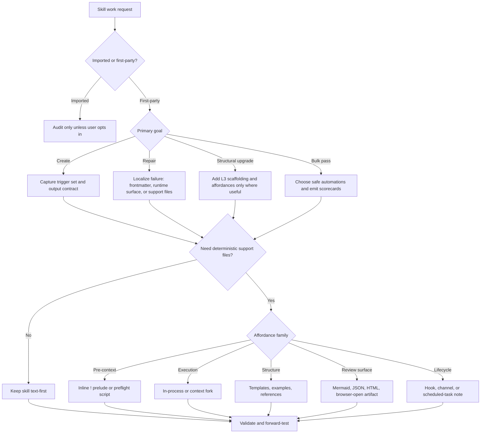

# Diagram 1: flowchart

```mermaid
flowchart TD
  A[Skill work request] --> B{Imported or first-party?}
  B -->|Imported| C[Audit only unless user opts in]
  B -->|First-party| D{Primary goal}
  D -->|Create| E[Capture trigger set and output contract]
  D -->|Repair| F[Localize failure: frontmatter, runtime surface, or support files]
  D -->|Structural upgrade| G[Add L3 scaffolding and affordances only where useful]
  D -->|Bulk pass| H[Choose safe automations and emit scorecards]
  E --> I{Need deterministic support files?}
  F --> I
  G --> I
  H --> I
  I -->|No| J[Keep skill text-first]
  I -->|Yes| K{Affordance family}
  K -->|Pre-context| L[Inline ! prelude or preflight script]
  K -->|Execution| M[In-process or context fork]
  K -->|Structure| N[Templates, examples, references]
  K -->|Review surface| O[Mermaid, JSON, HTML, browser-open artifact]
  K -->|Lifecycle| P[Hook, channel, or scheduled-task note]
  J --> Q[Validate and forward-test]
  L --> Q
  M --> Q
  N --> Q
  O --> Q
  P --> Q
```
