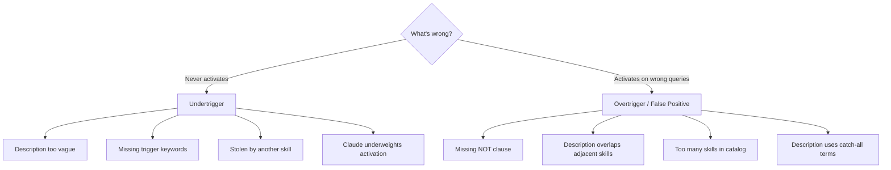

# Skill Activation Debugging

Systematic diagnosis when a skill doesn't activate when it should, or activates when it shouldn't.

---

## The Two Failure Modes



---

## Undertrigger Debugging (Skill Never Activates)

### Step 1: Test with explicit queries

Write 5 queries that should trigger your skill. Send each to Claude without any other skill active. Does the skill activate?

```
Test query: "Help me create a new skill for database migrations"
Expected: skill-architect activates
Actual: no skill activated
```

If even explicit queries don't trigger, the description is the problem.

### Step 2: Check description specificity

Claude evaluates descriptions **semantically**, not by keyword matching. It reasons: "Does this description cover what the user is asking for?"

**Diagnosis checklist**:
- [ ] Does the description use specific domain nouns (e.g., "SKILL.md", "frontmatter", "anti-patterns")?
- [ ] Does it name specific trigger situations ("Use when building new skills", "Use when debugging activation")?
- [ ] Is it more than 15 words?
- [ ] Is it **slightly pushy** about when to activate?

**Fix**: Rewrite using the formula in `references/description-guide.md`.

### Step 3: Test with pushy language

Claude undertriggers by default. If activation is marginal, make the description more explicit:

```yaml
# Before (undertriggers)
description: Helps with Agent Skill creation and improvement.

# After (activates correctly)
description: Design, create, audit, and improve Claude Agent Skills.
  Use when building new skills, reviewing existing skills, or debugging
  activation failures. NOT for general coding tasks or MCP implementation.
```

### Step 4: Check for skill theft

Another skill may be stealing activations.

**How to detect**: Enable each skill in isolation and test. Then enable both together. If the target skill stops activating with the other enabled, the other skill is stealing triggers.

**Fix**: Make the stealing skill's description more specific, or add a NOT clause that excludes your skill's domain.

### Step 5: Check name consistency

The skill's `name` in frontmatter must match the directory name. A mismatch can cause activation failures.

```bash
# Check: does the name field in SKILL.md match the directory?
python scripts/validate_skill.py <path>
```

---

## Overtrigger Debugging (False Positives)

### Step 1: Identify the false positive patterns

Write 5 queries that should NOT trigger your skill. Which ones actually trigger it?

```
Query: "Help me review this Python code"      # should NOT trigger skill-architect
Query: "What is an MCP server?"               # should NOT trigger skill-architect
```

### Step 2: Add or strengthen the NOT clause

Every false positive indicates a missing exclusion:

```yaml
# Before (false positives on code review queries)
description: Reviews code for quality and correctness.

# After (exclusions added)
description: Reviews TypeScript/React diffs and PRs for structural quality.
  NOT for writing new features, debugging runtime errors, or reviewing non-TS code.
```

The NOT clause should contain **at least 2-3 specific exclusions** based on observed false positives.

### Step 3: Narrow the positive triggers

If the description is too broad, narrow it to the specific deliverable:

```yaml
# Catch-all (false positives everywhere)
description: Helps with product management activities.

# Narrowed (precise activation)
description: Writes and refines Product Requirement Documents (PRDs) with
  user stories, acceptance criteria, and success metrics. NOT for strategy
  decks, roadmaps, user research notes, or OKR planning.
```

---

## Testing Your Fix

After updating the description, run a systematic activation test:

| # | Query | Expected | Actual | Pass? |
|---|-------|----------|--------|-------|
| 1 | "Create a new skill for X" | Activates | | |
| 2 | "Improve this existing skill" | Activates | | |
| 3 | "Debug why my skill doesn't trigger" | Activates | | |
| 4 | "Write a Python function" | No activation | | |
| 5 | "Build an MCP server" | No activation | | |
| 6 | "Review this PR" | No activation | | |

Target: 100% correct on all 10 queries.

---

## Temporal Knowledge: How Claude Activation Has Changed

### Anti-Pattern: Keyword-Stuffing in Descriptions (Pre-2024)

**Novice thinking** (2023 model behavior): "Pack in synonyms and keywords to maximize matching."

**Current reality**: Claude uses semantic evaluation, not keyword matching. A description with 20 keywords but no coherent specificity performs **worse** than a concise, focused description.

**Timeline**:
- 2023: Earlier model behavior was more keyword-sensitive
- 2024+: Claude reasons about intent-description alignment semantically
- **Current best practice**: Be specific and contextually rich, not keyword-dense

**LLM mistake**: LLMs will suggest adding more keywords. The right fix is better semantic specificity.

---

## Common Rejection Causes (Frontmatter-Level)

These cause skills to fail at parse time, before any activation logic runs:

| Cause | Symptom | Fix |
|-------|---------|-----|
| `tools:` instead of `allowed-tools:` | Tools silently ignored | Hyphenate: `allowed-tools:` |
| YAML list `[Read, Write]` in allowed-tools | Parse error | Comma-separated string: `Read,Write` |
| Name contains uppercase or spaces | Matching failure | Lowercase-hyphenated only |
| Name doesn't match directory | Activation mismatch | `name` field = directory name |
| `context: fork-only` | Ignored | Only valid value: `context: fork` |
| Description over 1024 chars | Truncated or rejected | Keep under 1024 chars |

Run `python scripts/validate_skill.py <path>` to catch all of these automatically.

---

## Recall Limit Debugging

Too many active skills degrades activation accuracy for all skills.

**Diagnosis**: If your skill worked fine alone but stops activating with many others enabled, this is the problem.

**Fix**:
- Reduce total skill count in active catalog
- Group skills into contextual bundles (not all loaded at once)
- Ensure skills with overlapping domains have clearly differentiated descriptions
- Test coexistence: enable skills 2 at a time, then 5, then all — identify where accuracy degrades
