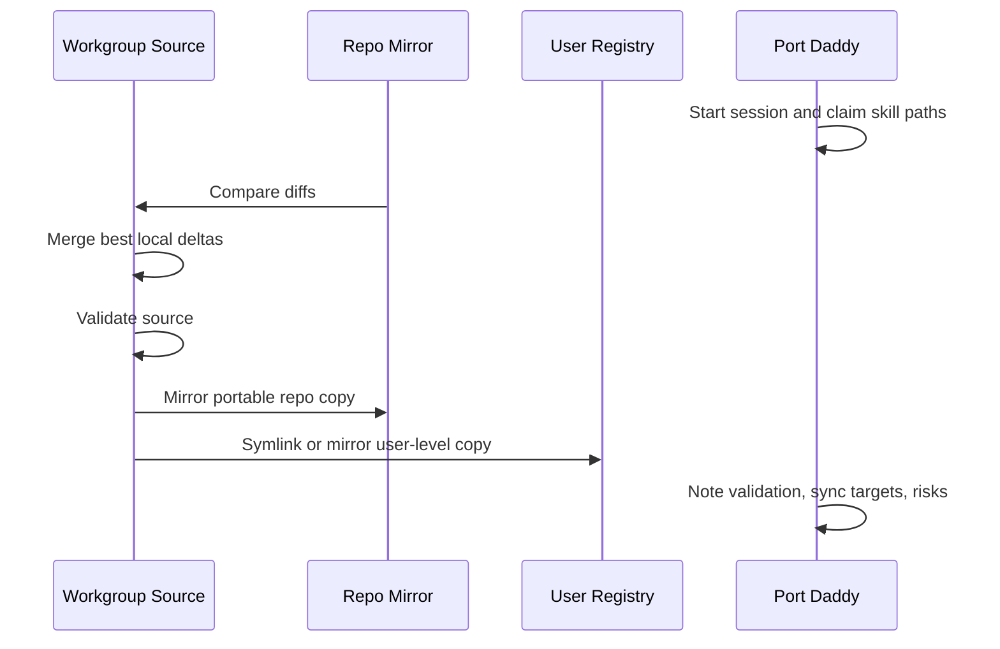

# Advanced Structure and Sync

Use this when a skill should become a durable operating surface instead of a
single Markdown instruction file. This covers UI metadata, subagent prompts,
schemas, visual review artifacts, eval fixtures, richer scripts, and
Port Daddy-grounded synchronization.

## Source of Truth

For this workgroup, shared skills should have one authoritative source:

- authoritative source: `~/coding/workgroup-ai/skills/<skill-name>/<skill-name>`
- repo copies: mirrors used for local distribution, tests, or product docs
- user-level copies: symlinks or mirrors used by active agents

Prefer symlinks for user-level skill registries on one machine. Prefer mirrored
copies inside Git repos so the repo remains portable and does not contain
absolute links to a developer's home directory.

If both source and mirror changed, do not blindly overwrite either side:

1. Diff both copies.
2. Keep the newer source-of-truth structure unless the mirror has a deliberate
   local improvement.
3. Merge semantically, not by timestamp alone.
4. Validate the authoritative copy.
5. Mirror the validated result to repo and user-level locations.
6. Record the decision in the changelog and, in Port Daddy repos, a session
   note or tuple.

## Port Daddy Coordination

When editing skills inside a Port Daddy worktree:

1. Run `pd status`, `pd briefing`, and `pd salvage`.
2. Start a session with the skill path as the claimed file or directory.
3. Add a note with the authoritative source, mirrors, and intended files.
4. Use file claims/locks for `SKILL.md`, scripts, schemas, and generated
   output copies when parallel work is active.
5. Use tuples for machine-readable sync state when multiple agents will act:
   source path, mirror paths, commit hash, validation commands, and owner.
6. Use inbox/channel notifications for long-running validation or drift
   watchers only when budget and singleton rules are explicit.
7. End with a handoff: files changed, validation run, sync destinations, and
   residual risks.

Port Daddy primitives are not decorative. Use them when they reduce collision,
make drift visible, or let cheaper agents execute bounded slices safely.

## `agents/openai.yaml`

Add `agents/openai.yaml` for first-party skills that are:

- shipped to user-level registries
- browsed in a skill picker
- presented as chips/cards in UI
- part of a plugin or workgroup catalog
- expected to be invoked by people who did not write them

Minimum shape:

```yaml
interface:
  display_name: "Skill Name"
  short_description: "What the skill does in one scan line"
  default_prompt: "Use $skill-name to ..."

policy:
  allow_implicit_invocation: true
```

Rules:

- `default_prompt` must mention `$skill-name`.
- Keep descriptions user-facing, not implementation-facing.
- Do not add icons or brand colors unless assets exist and are intentional.
- Regenerate or manually update this file when the skill's purpose changes.

## Subagent Prompt Assets

Add concrete prompt files under `agents/` when delegation is a normal workflow:

- forked execution via `context: fork`
- repeated specialist review
- parallel execution across disjoint write sets
- adversarial validation
- cheap-agent execution slices
- human-visible handoffs that must be uniform

Each subagent prompt should define:

- narrow role and NOT-for boundaries
- input contract
- allowed write/read scope
- Port Daddy session, note, claim, lock, tuple, and handoff expectations when
  used in this repo
- cost/model ceiling if cheap execution is intended
- no-revert rule for other agents' or users' work
- output contract
- validation commands and evidence requirements

Do not create generic "helper" agents. If an agent cannot be given bounded
ownership and a falsifiable output, keep the task in-process.

## Visual Decision and Review Artifacts

Use visual or structured review artifacts when human approval changes the
execution path:

- design direction review
- destructive cleanup or migration approval
- architecture tradeoff selection
- before/after UI normalization
- skill API/frontmatter export differences
- release or sync plans that affect multiple registries

Good artifacts:

- `templates/visual-decision-board.md`
- Mermaid flowcharts or state diagrams
- JSON scorecards
- local HTML reports generated from deterministic data
- browser-open previews only when visual inspection is actually useful

Bad artifacts:

- decorative diagrams that do not alter decisions
- screenshots without decision prompts
- HTML reports that hide missing validation

## Schemas and Deterministic Validators

Add schemas when an artifact must remain machine-checkable:

- skill scorecards
- migration plans
- visual decision boards
- runtime export manifests
- sync plans
- subagent handoff records

Add deterministic scripts when common failures can be detected cheaply:

- missing `agents/openai.yaml`
- `context: fork` without a matching agent prompt
- referenced templates/scripts/schemas not present
- output copy drift
- non-authoritative mirror edits
- missing changelog for first-party changes
- missing Port Daddy session note in Port Daddy repos

Prefer small stdlib scripts. Avoid downloads for validation unless the target
domain genuinely requires external tooling.

## Eval Fixtures

Use `examples/` or `fixtures/` when a skill includes a validator, transformer,
or subtle activation boundary:

- good skill bundle
- bad frontmatter
- missing referenced file
- `context: fork` without agent asset
- stale mirror
- fake UI metadata
- too-broad activation description

Fixtures should prove the validator would have caught a real failure. Do not
add ornamental examples that only restate the docs.

## Sync Protocol

For workgroup-authoritative skills on one machine:



Do not commit absolute symlinks inside shared repos. Do not leave user-level
registries pointed at stale mirrors when a workgroup authoritative copy exists.

## Anti-Patterns

### Fancy Folder Cargo Cult

Novice: Add `agents/`, `schemas/`, `templates/`, and `examples/` to every
skill.

Expert: Add each affordance only when it changes execution quality,
validation, review, or sync reliability.

### Stale Mirror Authority

Novice: Edit whichever copy is closest and hope later sync is obvious.

Expert: Find the authoritative workgroup source, merge useful local deltas
there, validate, then mirror outward.

### Unbounded Cheap Agents

Novice: Let many low-cost agents "help" with broad taste, architecture, or
cleanup.

Expert: Give cheap agents small write sets, clear gates, Port Daddy
coordination, and no authority over architecture or final acceptance.
