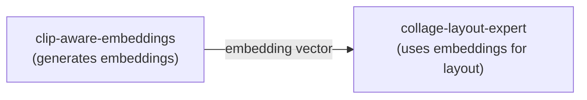
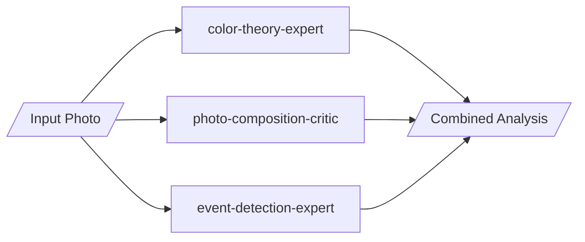
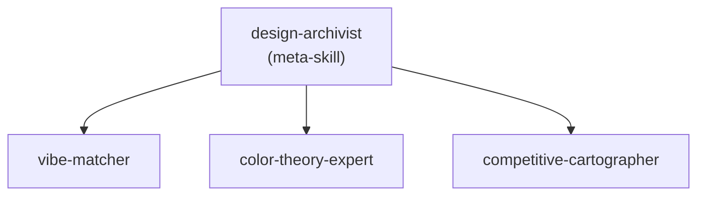
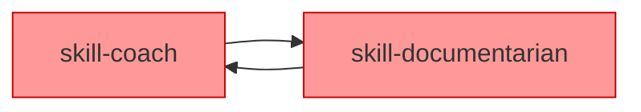
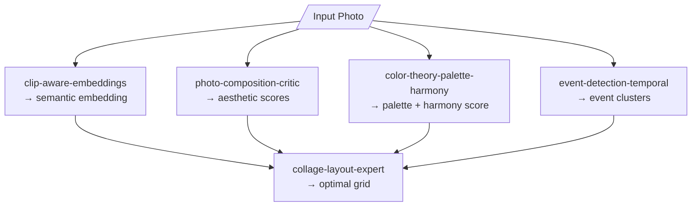

# Skill Composition Patterns

How skills work together, depend on each other, and compose into workflows.

## Dependency Types

### 1. Sequential Dependency
One skill's output feeds another's input.



**Implementation**: Reference the upstream skill in your description:
```yaml
description: "...Requires embeddings from clip-aware-embeddings skill..."
```

### 2. Parallel Composition
Multiple skills apply simultaneously to different aspects.



**Implementation**: Each skill operates independently; user/orchestrator combines results.

### 3. Hierarchical (Meta-Skills)
A skill that orchestrates other skills.



**Implementation**: Define subagent that invokes other skills.

---

## Composition Anti-Patterns

### Circular Dependency
**Wrong**: Skill A depends on B, B depends on A

**Fix**: Make dependencies unidirectional or extract shared functionality.

### Implicit Dependency
**Wrong**: Skill assumes another is present but doesn't document it
```yaml
description: "Uses CLIP embeddings for search"
# But doesn't mention clip-aware-embeddings skill
```
**Fix**: Explicit dependencies in description or README.

### Monolithic Anti-Composition
**Wrong**: One skill tries to do everything
```yaml
name: photo-everything-expert
description: "Handles composition, color, events, layout, embeddings..."
```
**Fix**: Split into focused, composable skills.

---

## Best Practices

### 1. Document Dependencies
In your SKILL.md or README:
```markdown
## Dependencies
- **Required**: `clip-aware-embeddings` for vector search
- **Optional**: `color-theory-expert` for palette analysis
```

### 2. Use Consistent Data Formats
When skills pass data:
- Embeddings: Float arrays or paths to .npy files
- Color palettes: Hex arrays or LAB tuples
- Scores: 0.0-1.0 normalized floats

### 3. Fail Gracefully Without Dependencies
```python
def analyze_with_optional_color():
    try:
        # Try using color-theory skill output
        palette = load_palette()
    except FileNotFoundError:
        # Degrade gracefully
        palette = extract_basic_colors(image)
```

### 4. Composition Keywords
Add to description for discovery:
- "Composes with X, Y, Z"
- "Extends X with Y capabilities"
- "Downstream of X"
- "Input for Y workflows"

---

## Example: Photo Analysis Pipeline



Each skill:
- Works independently
- Has clear input/output contract
- Can be used standalone or composed
- Documents what it depends on
