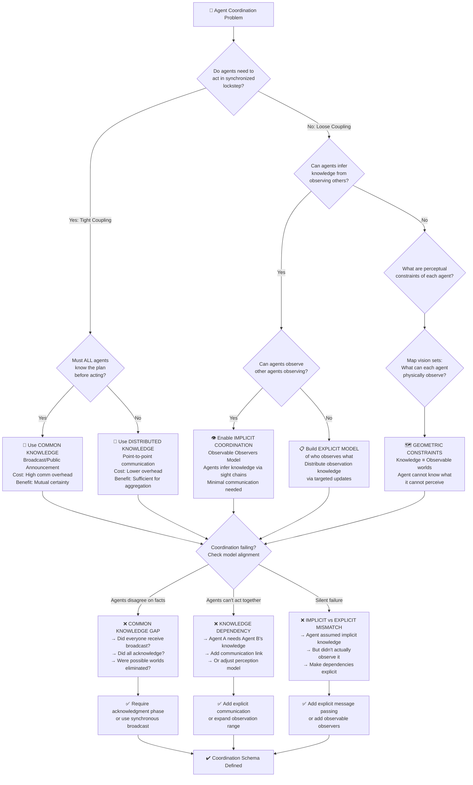

# Knowledge State Decision Tree: Agent Coordination Requirements

```mermaid
flowchart TD
    Start["🎯 Agent Coordination Problem"] --> Q1{Do agents need to<br/>act in synchronized<br/>lockstep?}
    
    Q1 -->|Yes: Tight Coupling| Q2{Must ALL agents<br/>know the plan<br/>before acting?}
    Q1 -->|No: Loose Coupling| Q3{Can agents infer<br/>knowledge from<br/>observing others?}
    
    Q2 -->|Yes| A1["📢 Use COMMON KNOWLEDGE<br/>Broadcast/Public Announcement<br/>Cost: High comm overhead<br/>Benefit: Mutual certainty"]
    Q2 -->|No| A2["🔄 Use DISTRIBUTED KNOWLEDGE<br/>Point-to-point communication<br/>Cost: Lower overhead<br/>Benefit: Sufficient for aggregation"]
    
    Q3 -->|Yes| Q4{Can agents observe<br/>other agents observing?}
    Q3 -->|No| Q5{What are perceptual<br/>constraints of each agent?}
    
    Q4 -->|Yes| A3["👁️ Enable IMPLICIT COORDINATION<br/>Observable Observers Model<br/>Agents infer knowledge via sight chains<br/>Minimal communication needed"]
    Q4 -->|No| A4["📋 Build EXPLICIT MODEL<br/>of who observes what<br/>Distribute observation knowledge<br/>via targeted updates"]
    
    Q5 --> Q6{Map vision sets:<br/>What can each agent<br/>physically observe?}
    Q6 --> A5["🗺️ GEOMETRIC CONSTRAINTS<br/>Knowledge ≡ Observable worlds<br/>Agent cannot know what<br/>it cannot perceive"]
    
    A1 --> Q7{Coordination failing?<br/>Check model alignment}
    A2 --> Q7
    A3 --> Q7
    A4 --> Q7
    A5 --> Q7
    
    Q7 -->|Agents disagree on facts| Debug1["❌ COMMON KNOWLEDGE GAP<br/>→ Did everyone receive broadcast?<br/>→ Did all acknowledge?<br/>→ Were possible worlds eliminated?"]
    Q7 -->|Agents can't act together| Debug2["❌ KNOWLEDGE DEPENDENCY<br/>→ Agent A needs Agent B's knowledge<br/>→ Add communication link<br/>→ Or adjust perception model"]
    Q7 -->|Silent failure| Debug3["❌ IMPLICIT vs EXPLICIT MISMATCH<br/>→ Agent assumed implicit knowledge<br/>→ But didn't actually observe it<br/>→ Make dependencies explicit"]
    
    Debug1 --> Fix1["✅ Require acknowledgment phase<br/>or use synchronous broadcast"]
    Debug2 --> Fix2["✅ Add explicit communication<br/>or expand observation range"]
    Debug3 --> Fix3["✅ Add explicit message passing<br/>or add observable observers"]
    
    Fix1 --> End["✔️ Coordination Schema Defined"]
    Fix2 --> End
    Fix3 --> End
```
