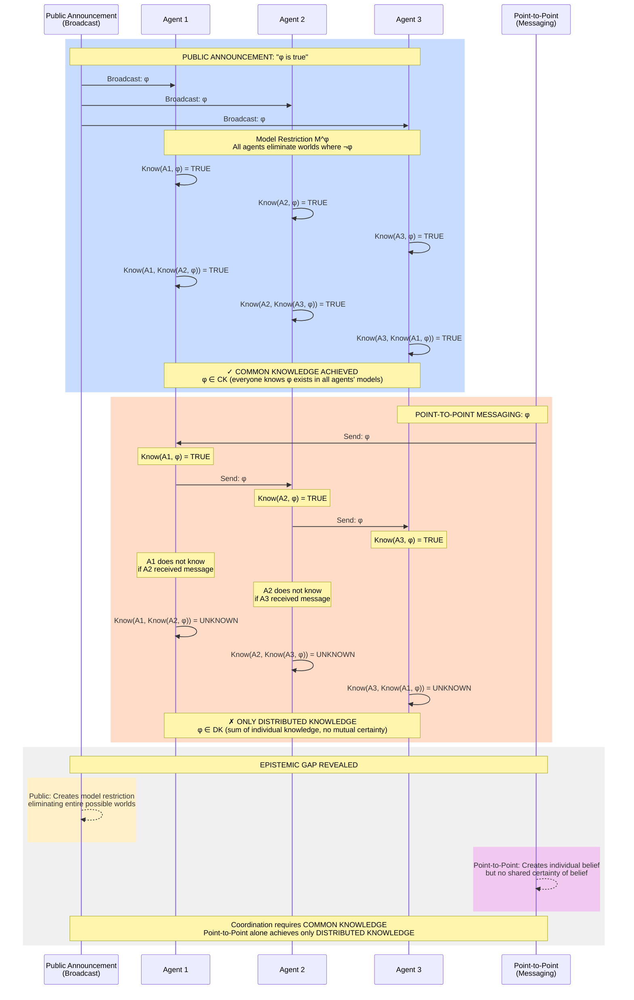

# Knowledge Propagation: Public Announcement vs. Point-to-Point Communication

```mermaid
sequenceDiagram
    participant PA as Public Announcement<br/>(Broadcast)
    participant A1 as Agent 1
    participant A2 as Agent 2
    participant A3 as Agent 3
    participant PP as Point-to-Point<br/>(Messaging)
    
    rect rgb(200, 220, 255)
    Note over PA,A3: PUBLIC ANNOUNCEMENT: "φ is true"
    PA->>A1: Broadcast: φ
    PA->>A2: Broadcast: φ
    PA->>A3: Broadcast: φ
    
    Note over A1,A3: Model Restriction M^φ<br/>All agents eliminate worlds where ¬φ
    A1->>A1: Know(A1, φ) = TRUE
    A2->>A2: Know(A2, φ) = TRUE
    A3->>A3: Know(A3, φ) = TRUE
    
    A1->>A1: Know(A1, Know(A2, φ)) = TRUE
    A2->>A2: Know(A2, Know(A3, φ)) = TRUE
    A3->>A3: Know(A3, Know(A1, φ)) = TRUE
    
    Note over A1,A3: ✓ COMMON KNOWLEDGE ACHIEVED<br/>φ ∈ CK (everyone knows φ exists in all agents' models)
    end
    
    rect rgb(255, 220, 200)
    Note over PP,A3: POINT-TO-POINT MESSAGING: φ
    PP->>A1: Send: φ
    Note over A1: Know(A1, φ) = TRUE
    
    A1->>A2: Send: φ
    Note over A2: Know(A2, φ) = TRUE
    
    A2->>A3: Send: φ
    Note over A3: Know(A3, φ) = TRUE
    
    Note over A1: A1 does not know<br/>if A2 received message
    Note over A2: A2 does not know<br/>if A3 received message
    
    A1->>A1: Know(A1, Know(A2, φ)) = UNKNOWN
    A2->>A2: Know(A2, Know(A3, φ)) = UNKNOWN
    A3->>A3: Know(A3, Know(A1, φ)) = UNKNOWN
    
    Note over A1,A3: ✗ ONLY DISTRIBUTED KNOWLEDGE<br/>φ ∈ DK (sum of individual knowledge, no mutual certainty)
    end
    
    rect rgb(240, 240, 240)
    Note over PA,PP: EPISTEMIC GAP REVEALED
    rect rgb(255, 240, 200)
    PA-->>PA: Public: Creates model restriction<br/>eliminating entire possible worlds
    end
    rect rgb(240, 200, 240)
    PP-->>PP: Point-to-Point: Creates individual belief<br/>but no shared certainty of belief
    end
    Note over PA,PP: Coordination requires COMMON KNOWLEDGE<br/>Point-to-Point alone achieves only DISTRIBUTED KNOWLEDGE
    end
```
