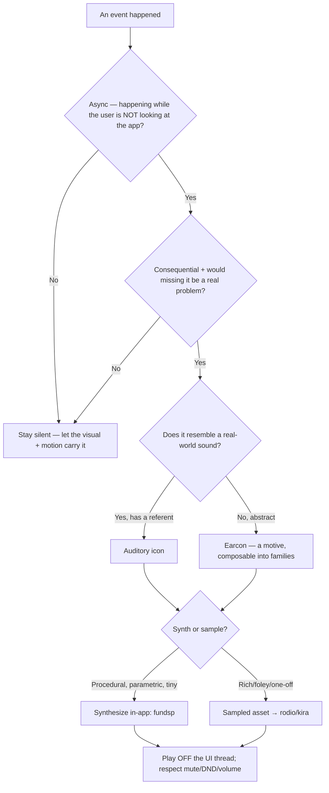

# Sound Design & Audio

Sound is the channel that reaches an eye that's looking elsewhere — and the first thing users mute when it's abused. Design for **restraint**: silent by default, every cue earns its place, a tiny coherent palette, off the UI thread, always respectful of mute/DND. The worked identity here is the **Harbor** (a maritime operator console for an AI agent fleet), but the principles are general.

## When to Use

- Deciding whether a given event should make a sound at all (most shouldn't).
- Designing a coherent set of UI cues (confirm/error/notify/transition/arrival/departure) as earcons or auditory icons.
- Giving a product a *sonic identity* (a motif family, not random samples).
- Synthesizing the actual sounds (which method for which cue) and mastering them for short-cue UI.
- Wiring playback/mixing in a native app, especially Rust/gpui.

## NOT for

- Music composition / scoring for media (different craft).
- Speech synthesis / TTS / voice UX.
- Implementing DSP primitives or audio codecs from scratch.

## Decision Points

## Core Rules

- **Silent by default.** Audio is opt-in and earns its way back on one cue at a time.
- **A hard vocabulary ceiling (~6 cues).** A seventh proposal kills one first; overlapping motives destroy learnability.
- **Every sound earns its place** — only async, consequential, would-be-missed events. Synchronous feedback the user is staring at almost never needs sound.
- **One cue per event *class*, not per event** — coalesce bursts (twelve agents finishing ≠ twelve pings).
- **A coherent palette, not a sample grab-bag** — a motif family (e.g. arrival/departure = same instrument, contour inverted).
- **Respect the user and the OS** — honor system mute/DND, expose a volume + master off, never startle, never sound-only (audio augments a visual signal).
- **Off the UI thread** — playback/synthesis on an audio thread; never block render.

## Failure Modes

### Anti-Pattern: "The everything-clicks UI"
**Symptom**: every hover/toggle/press makes a sound; users mute the app within an hour.
**Detection**: `play_sound(` appears on synchronous, user-is-looking interactions, or >6 distinct cues exist.
**Fix**: delete synchronous-feedback sounds; reserve audio for async/consequential/missed.

### Anti-Pattern: "Startle / fatigue"
**Symptom**: a cue is sharp, loud, or sits in the 2–5kHz fatigue band and fires dozens of times a day.
**Detection**: the cue's spectral peak is in the ear's most sensitive band; no low-pass; high peak loudness.
**Fix**: mid-range carrier, gentle envelope, round the top off, target conservative LUFS; test an 8-hour day.

### Anti-Pattern: "Plays while muted/DND"
**Symptom**: a notification dings during a screenshare or with the system muted.
**Detection**: playback path doesn't check system mute / Do-Not-Disturb / app setting.
**Fix**: gate every play on the mute/DND/volume state; default-respect the OS.

### Anti-Pattern: "Blocks the UI thread"
**Symptom**: a frame hitches when a sound plays.
**Detection**: decode/playback happens on the render/event thread.
**Fix**: dedicated audio thread + a voice pool; pre-decode/cache assets.

### Anti-Pattern: "Sound-only signal"
**Symptom**: the only indication an agent failed is a sound — missed by deaf/HoH users or anyone muted.
**Detection**: an event has a cue but no visual counterpart.
**Fix**: audio augments a flag/badge/toast; never the sole carrier.

## Worked Example: the Harbor "approve & land" and "agent failed" cues

1. **Should they sound?** `agent-failed` — async, consequential, easily missed → **yes**. `approve & land` — the user just clicked it and is watching → borderline; sound only if the land completes *later*, async → a quiet `confirm` on completion, not on click.
2. **Family**: both are earcons in the maritime palette. `arrival`/`departure` are the matched pair (warm bell, rising vs. falling contour); `agent-failed` = `departure` flavored darker (lower, a touch dissonant); `confirm` = a short, dry, *resolved* two-note.
3. **Synthesize** (`04`): `confirm` — FM bell, ~880Hz, 180ms exp decay, consonant resolve, slight plate tail. `agent-failed` — same bell, pitched down a minor third, falling contour, a hair of inharmonicity. Master both to a conservative short-cue LUFS, de-essed, 48k/24-bit.
4. **Wire** (`03`): synthesize procedurally with `fundsp` (parametric, tiny) or ship as cached ogg; play through a `kira`/`rodio` voice pool on the audio thread; gate on mute/DND + the app's audio setting.
5. **Never sound-only**: `agent-failed` always co-fires the red flag on the Quay + an inbox entry; the sound is the *augment* that reaches you when you're in another window.

## Quality Gates

- [ ] Default-silent; audio opt-in with a master off + volume.
- [ ] ≤ ~6 cues; each maps to one event *class*; bursts coalesce.
- [ ] Cues form a coherent family (shared motive, parametric variation).
- [ ] Every play gated on system mute/DND + app setting; never startles.
- [ ] No cue in the 2–5kHz fatigue band for repeated events; conservative LUFS; survives an 8-hour day.
- [ ] Playback/synthesis off the UI thread (audio thread + voice pool).
- [ ] No sound-only signals — every cue augments a visual.

## Fork Guidance

Fork by lane: **principles** (`01` — when/why/what, psychoacoustics, accessibility) · **identity** (`02` — the concrete sound map + motif family) · **engineering** (`03` — the Rust audio stack, threading, mixing) · **production** (`04` — synthesis methods, tools, mastering, sourcing/licensing). Keep the vocabulary-ceiling decision in the parent.

## Reference Map

- `references/01-ui-sound-design-principles.md` — when an event earns a sound, the functional vocabulary, earcon vs. auditory icon, psychoacoustics (frequency/duration/envelope/masking), accessibility + ethics.
- `references/02-the-harbor-sonic-identity.md` — a concrete on-brand sound map (sonar/bell/foghorn/flag-whoosh) keyed to fleet events (spawn/board/steer/hop/dispatch/approve/fail/flag-change), as a motif family.
- `references/03-audio-in-rust.md` — the Rust audio stack (rodio/cpal/kira/fundsp/symphonia/oddio), playback architecture, voice pool, latency, off-thread mixing, integrating with a gpui loop.
- `references/04-audio-engineering-and-production.md` — synthesis methods (subtractive/FM/granular/physical-modeling), tools (SuperCollider/Sonic Pi/Plugdata/Ableton), mastering short cues (LUFS, transient shaping), formats, sourcing + licensing.

**Sibling skills:** pairs with `rust-gpui-motion` (sync cues to transitions) and the capstone `build-coop-ide-gpui` (the fleet events that fire these cues).

<!-- BEGIN BUNDLE INDEX (auto: index_references.py) -->

## Skill Bundle Index

*Every file in this skill, and when to open it. Auto-generated; run `scripts/index_references.py --fix`.*

**`references/`**
- [`references/01-ui-sound-design-principles.md`](references/01-ui-sound-design-principles.md) — UI Sound Design Principles — > Scope: audible feedback for **Harbor**, a native Rust **gpui** operator console for an AI agent fleet.
- [`references/02-the-harbor-sonic-identity.md`](references/02-the-harbor-sonic-identity.md) — The Harbor Sonic Identity — > A maritime motif kit for the Harbor operator console — soft sonar pings, water laps, ship's bells, distant foghorns, signal-flag whooshes,
- [`references/03-audio-in-rust.md`](references/03-audio-in-rust.md) — Audio in Rust — Playing and Synthesizing Sound in a Native gpui App — > Scope: the Harbor operator console is a native Rust [gpui](https://www.gpui.rs/) desktop app.
- [`references/04-audio-engineering-and-production.md`](references/04-audio-engineering-and-production.md) — Audio Engineering & Production — Making the Actual Sounds — > Scope: the craft layer beneath Harbor's sound *design*.

<!-- END BUNDLE INDEX -->
