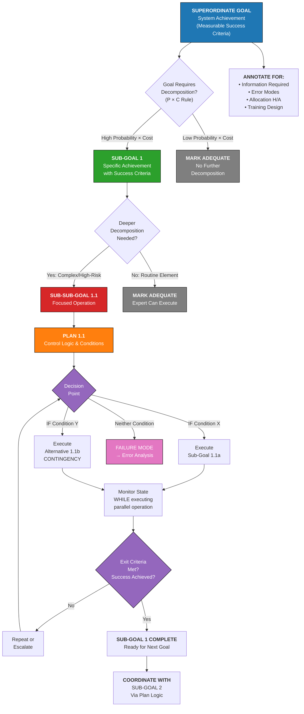

# Goal Decomposition & Plan Structure

```mermaid
flowchart TD
    A["<b>SUPERORDINATE GOAL</b><br/>System Achievement<br/>(Measurable Success Criteria)"]
    
    A --> B{"Goal Requires<br/>Decomposition?<br/>(P × C Rule)"}
    
    B -->|High Probability × Cost| C["<b>SUB-GOAL 1</b><br/>Specific Achievement<br/>with Success Criteria"]
    B -->|Low Probability × Cost| D["<b>MARK ADEQUATE</b><br/>No Further<br/>Decomposition"]
    
    C --> E{"Deeper<br/>Decomposition<br/>Needed?"}
    E -->|Yes: Complex/High-Risk| F["<b>SUB-SUB-GOAL 1.1</b><br/>Focused Operation"]
    E -->|No: Routine Element| G["<b>MARK ADEQUATE</b><br/>Expert Can Execute"]
    
    F --> H["<b>PLAN 1.1</b><br/>Control Logic & Conditions"]
    
    H --> I{"Decision<br/>Point"}
    I -->|IF Condition X| J["Execute<br/>Sub-Goal 1.1a"]
    I -->|IF Condition Y| K["Execute<br/>Alternative 1.1b<br/>CONTINGENCY"]
    I -->|Neither Condition| L["FAILURE MODE<br/>→ Error Analysis"]
    
    J --> M["Monitor State<br/>WHILE executing<br/>parallel operation"]
    K --> M
    
    M --> N{"Exit Criteria<br/>Met?<br/>Success Achieved?"}
    N -->|No| O["Repeat or<br/>Escalate"]
    O --> I
    N -->|Yes| P["<b>SUB-GOAL 1 COMPLETE</b><br/>Ready for Next Goal"]
    
    P --> Q["<b>COORDINATE WITH</b><br/>SUB-GOAL 2<br/>Via Plan Logic"]
    
    A --> R["<b>ANNOTATE FOR:</b><br/>• Information Required<br/>• Error Modes<br/>• Allocation H/A<br/>• Training Design"]
    
    style A fill:#1f77b4,stroke:#000,color:#fff
    style C fill:#2ca02c,stroke:#000,color:#fff
    style F fill:#d62728,stroke:#000,color:#fff
    style H fill:#ff7f0e,stroke:#000,color:#fff
    style I fill:#9467bd,stroke:#000,color:#fff
    style N fill:#9467bd,stroke:#000,color:#fff
    style D fill:#7f7f7f,stroke:#000,color:#fff
    style G fill:#7f7f7f,stroke:#000,color:#fff
    style L fill:#e377c2,stroke:#000,color:#fff
```
