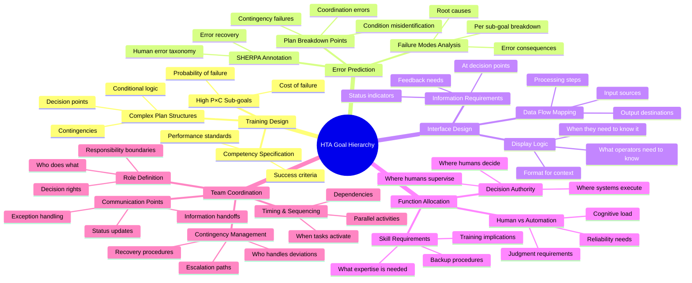

# HTA Downstream Applications & Annotation Framework

```mermaid
mindmap
  root((HTA Goal Hierarchy))
    Training Design
      High P×C Sub-goals
        Probability of failure
        Cost of failure
      Complex Plan Structures
        Conditional logic
        Decision points
        Contingencies
      Competency Specification
        Success criteria
        Performance standards
    Error Prediction
      Failure Modes Analysis
        Per sub-goal breakdown
        Error consequences
        Root causes
      Plan Breakdown Points
        Condition misidentification
        Contingency failures
        Coordination errors
      SHERPA Annotation
        Human error taxonomy
        Error recovery
    Interface Design
      Information Requirements
        At decision points
        Feedback needs
        Status indicators
      Display Logic
        What operators need to know
        When they need to know it
        Format for context
      Data Flow Mapping
        Input sources
        Processing steps
        Output destinations
    Function Allocation
      Human vs Automation
        Judgment requirements
        Cognitive load
        Reliability needs
      Decision Authority
        Where humans decide
        Where systems execute
        Where humans supervise
      Skill Requirements
        What expertise is needed
        Training implications
        Backup procedures
    Team Coordination
      Role Definition
        Who does what
        Responsibility boundaries
        Decision rights
      Timing & Sequencing
        When tasks activate
        Dependencies
        Parallel activities
      Communication Points
        Information handoffs
        Status updates
        Exception handling
      Contingency Management
        Who handles deviations
        Escalation paths
        Recovery procedures
```
