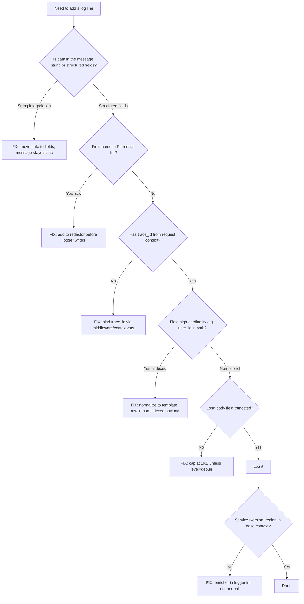

# Structured Logging Design

Logs are searched in production, not read top-to-bottom. Structured (JSON) logs with consistent field names are queryable; unstructured strings are grep bait. The whole craft is choosing the schema, the levels, and what to redact — so you can answer "what happened to user X at 03:14" without guessing.

## Decision diagram



**Jump to your fire:**
- Logs unsearchable, engineers grep stdout → [The minimum schema](#the-minimum-schema)
- `trace_id` missing — can't correlate logs to traces → [Correlation IDs](#correlation-ids)
- Compliance flagged emails in production logs → [Redaction at the schema level](#redaction-at-the-schema-level)
- Logging vendor bill exceeded compute bill → [Volume control — sampling](#volume-control--sampling) and [Cost-conscious patterns](#cost-conscious-patterns)
- Same error appears 5x in logs → [Errors logged twice (anti-pattern)](#errors-logged-twice)
- Some logs use `userId`, some `user_id` → [Inconsistent field names (anti-pattern)](#inconsistent-field-names)
- Dashboards split because field names drift → [Inconsistent field names (anti-pattern)](#inconsistent-field-names)

## When to use

- New service that needs production logging.
- Existing logs are unsearchable; engineers grep stdout.
- Logs lack trace correlation.
- Bill from logging vendor exceeded compute bill.
- PII (email, phone, payment info) appearing in logs.
- Choosing between text logs and structured JSON during a rewrite.

## Core capabilities

### The minimum schema

Every log line should have:

```json
{
  "ts": "2026-04-30T12:34:56.789Z",
  "level": "info",
  "service": "orders-api",
  "message": "order placed",
  "trace_id": "4bf92f3577b34da6a3ce929d0e0e4736",
  "span_id": "00f067aa0ba902b7"
}
```

Domain-specific fields go alongside:

```json
{
  "...": "...",
  "user_id": "u_42",
  "order_id": "o_789",
  "total_cents": 12999,
  "duration_ms": 45
}
```

Field names are stable contracts. Once `user_id` is in the schema, don't rename to `userId` later — every dashboard breaks.

### Levels — used precisely

| Level | When |
|-------|------|
| `error` | Action failed; user impact; pages someone if rate spikes. |
| `warn` | Recoverable issue; investigate but don't page. |
| `info` | Notable business event (order placed, login, deploy). |
| `debug` | Development-only detail. Off in production. |
| `trace` | Per-request flow; sampled. |

Log volume by level: error <<< warn << info <<< debug. If your error rate is high, you're misusing the level.

### Correlation IDs

```ts
// Express/Hono middleware
app.use((c, next) => {
  const traceparent = c.req.header('traceparent');
  const traceId = parseTraceparent(traceparent)?.traceId ?? crypto.randomUUID().replace(/-/g, '');
  c.set('traceId', traceId);
  return next();
});

logger.info('order placed', { trace_id: c.var.traceId, order_id });
```

`trace_id` should match what the OpenTelemetry SDK generates so logs and traces join in the vendor UI. W3C `traceparent` is the standard format.

For background jobs (queues, cron), generate the trace_id at the producer and pass it in the message body.

### Redaction at the schema level

```ts
// Wrong — string interpolation makes redaction near-impossible.
log.info(`user ${user.email} placed order ${order.id}`);

// Right — structured fields, redaction by name.
log.info('order placed', {
  user_id: user.id,         // safe
  user_email: user.email,   // dangerous — redact
  order_id: order.id,
});
```

Build a single redactor that runs over every log line:

```ts
const REDACT = new Set(['user_email', 'phone', 'ssn', 'card_number']);

function redact(obj: Record<string, unknown>) {
  for (const k of Object.keys(obj)) {
    if (REDACT.has(k)) obj[k] = '[REDACTED]';
    else if (typeof obj[k] === 'object' && obj[k] !== null) redact(obj[k] as any);
  }
  return obj;
}
```

For deep redaction across nested objects, prefer libraries like `pino`'s `redact` option or a middleware in your logger.

### Volume control — sampling

Production at high QPS will produce more logs than you can pay for. Options:

```ts
// Sample debug-level logs at 1%.
function shouldLog(level: string): boolean {
  if (level !== 'debug') return true;
  return Math.random() < 0.01;
}
```

For trace-level logs tied to OTel sampling decisions, log only when the trace is sampled:

```ts
const isSampled = (c.var.span?.spanContext().traceFlags & 1) === 1;
if (isSampled || level >= LOG_LEVEL_INFO) {
  logger.log(level, message, fields);
}
```

This keeps debug noise local to the small sample of traces being kept anyway.

### Cost-conscious patterns

- **Cardinality awareness.** A field like `request_path` with `/users/u_42/posts` creates as many search indices as users. Normalize to `/users/:id/posts` for indexing; keep raw path in a non-indexed field.
- **Long fields.** Truncate `request_body`, `response_body` to 1KB (or omit unless level=debug). Otherwise one big payload doubles the bill.
- **Repeated context.** `service`, `version`, `region` come from environment, not the log call. Set them as enrichers once.

### Pino (Node) example

```ts
import pino from 'pino';

const logger = pino({
  level: process.env.LOG_LEVEL ?? 'info',
  base: {
    service: 'orders-api',
    version: process.env.GIT_SHA,
    region: process.env.REGION,
  },
  redact: {
    paths: ['user_email', '*.user_email', 'card_number', 'authorization'],
    censor: '[REDACTED]',
  },
  formatters: {
    level: (label) => ({ level: label }),
  },
  timestamp: pino.stdTimeFunctions.isoTime,
});

logger.info({ user_id, order_id, total_cents }, 'order placed');
```

### Slog (Go 1.21+)

```go
import (
    "log/slog"
    "os"
)

logger := slog.New(slog.NewJSONHandler(os.Stdout, &slog.HandlerOptions{
    Level: slog.LevelInfo,
    AddSource: false,
}))
slog.SetDefault(logger)

slog.InfoContext(ctx, "order placed",
    "user_id", userID,
    "order_id", orderID,
    "total_cents", totalCents)
```

`slog.With(...)` returns a logger with bound context fields — propagate per-request:

```go
log := slog.With("trace_id", traceID, "user_id", userID)
log.Info("order placed", "order_id", orderID)
```

### Python (structlog)

```python
import structlog

structlog.configure(
    processors=[
        structlog.contextvars.merge_contextvars,
        structlog.processors.add_log_level,
        structlog.processors.TimeStamper(fmt='iso'),
        structlog.processors.JSONRenderer(),
    ],
)

log = structlog.get_logger()
structlog.contextvars.bind_contextvars(trace_id=trace_id)
log.info('order placed', user_id=u, order_id=o, total_cents=t)
```

ContextVars carry the trace_id across async boundaries automatically.

### Routing — multiple destinations

```
[app stdout]
    │
    ├─→ Vendor (Datadog/Honeycomb): info+, fully indexed, hot, $$$
    └─→ Cold storage (S3 + Athena/DuckDB): all levels, indexed weakly, cheap
```

Set up the agent or sidecar (Vector, Fluent Bit) to fan out. Hot vendor for searchable last 7 days; cold storage for compliance and "where was this user 6 months ago."

## Anti-patterns

### String interpolation instead of fields

**Symptom:** Logs are searchable by full-text but not faceted; redaction misses.
**Diagnosis:** `log.info(f"user {email} did X")` puts data in the message body.
**Fix:** `log.info('user did X', user_email=email, action='X')`. Fields go in fields.

### Inconsistent field names

**Symptom:** Some logs use `userId`, some `user_id`, dashboards split.
**Diagnosis:** No schema standard.
**Fix:** Pick a convention (snake_case is common for JSON), document, lint.

### High-cardinality fields indexed

**Symptom:** Logging vendor bill is mostly index cost.
**Diagnosis:** `request_path` with raw IDs, `error_message` with timestamps embedded.
**Fix:** Normalize. Move high-cardinality to non-indexed payload fields.

### Errors logged twice

**Symptom:** Same error appears N times in logs; alerts fire N times.
**Diagnosis:** Each layer (handler, middleware, top-level) logs the same exception.
**Fix:** Log at one well-defined layer (top-level error handler). Lower layers re-throw with context.

### PII in logs

**Symptom:** Compliance audit finds emails in production logs.
**Diagnosis:** No redactor; engineers add fields without thinking.
**Fix:** Logger-level redaction by field name. Block list updated when new PII fields are added. CI grep for known PII names.

### Synchronous I/O in the log path

**Symptom:** A slow log destination slows down the request.
**Diagnosis:** Logger writes to stdout that's piped to a synchronous shipper.
**Fix:** Async logger with a buffer. Drop on overflow rather than block. Pino, slog, structlog all default to this.

## Worked example: the logging bill spike

**Scenario.** Datadog Logs bill went from $2k/mo to $11k/mo over 4 weeks. Volume looks the same. Finance is asking questions.

**Novice would:** Drop the retention period, sample debug logs at 10%, ship a one-line config change. Bill drops 30% but search becomes useless: queries that used to find "what happened to user X" now miss because the log was sampled out.

**Expert catches:**
1. **The bill is index cost, not volume cost.** Open Datadog usage page → break down by indexed-bytes vs ingested-bytes. If indexed is 10x ingested, the cost is from facet cardinality.
2. **Find the high-cardinality field.** Run `top facets by unique values`. Usually it's `request_path` with raw IDs, or `error.message` with embedded timestamps/UUIDs.
3. **Normalize, don't sample.** Add a `request_path_template` field (`/users/:id/posts`) that gets indexed, keep raw `request_path` in payload (un-indexed, still searchable via grep at 1/10 the cost). Same volume, ~70% cost cut.
4. **Cold storage for compliance.** The 2-year retention for "who did what 14 months ago" goes to S3 + Athena, not the hot vendor. 5x cheaper, slower query, fine for the use case.

**Timeline.** Novice's sampling fix passes finance review but breaks the next forensics request ("we can't tell when the breach started"). Expert's normalization + tiered storage fix passes finance review AND keeps every log searchable, just at different latencies. Bill stabilizes at $3k/mo.

## Quality gates

- [ ] **Test:** schema-conformance test asserts every log line in a sample has `ts`, `level`, `service`, `message`, `trace_id` (when request-scoped).
- [ ] **Test:** PII fuzz — generate logs with fake emails/SSNs in known fields, assert redactor replaces them. Run in CI.
- [ ] All production log lines are JSON. CI lint fails on `console.log` / `print()` outside dev paths.
- [ ] Field-name convention picked (snake_case or camelCase) and enforced via a lint rule (eslint-plugin-no-mixed-keys or similar).
- [ ] Top-level error handler is the single error log site. Lower layers re-throw with context. Verified by grep for `log.error` count per service (should be ≤ 3 per layer).
- [ ] Long fields capped at 1KB. Verified by checking p99 log line size ≤ 4KB in vendor metrics.
- [ ] Log volume budget per service tracked in `grafana-dashboard-builder` panel; alert at 2x baseline for 30 minutes.
- [ ] Cold storage retention is separate from hot search retention; documented in runbook.
- [ ] `trace_id` matches the OTel exporter's trace ID (W3C traceparent) — verified by joining a log line and a span in the vendor UI on a recent request.
- [ ] Async logger configured (Pino/slog/structlog defaults); verified handler latency ≤ same with logger disabled.

## NOT for

- **Vendor-specific dashboards** — different layer. → `grafana-dashboard-builder` for Grafana/Loki visualization.
- **Full APM** (traces + metrics + logs as one system) — logs are part of observability, not the whole. → `opentelemetry-instrumentation` for the instrumentation side.
- **Print-debugging in dev** — `console.log` is fine; this skill is for production. No dedicated skill needed.
- **Audit/compliance logs** — separate concerns (immutable storage, signing). No dedicated skill.
- **Log alerting rules** — once logs are structured, alerting on them. → `grafana-dashboard-builder` (alerting section).
