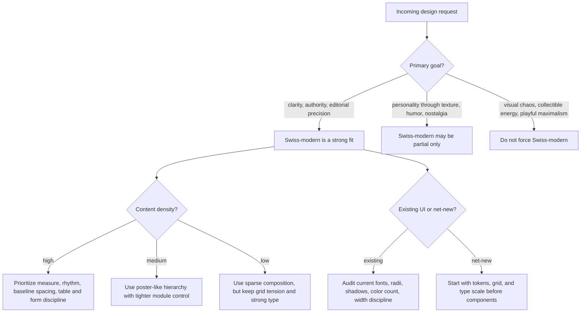

# Swiss Modern Website Design

Use this skill when the right answer is not "minimal" in the generic sense, but **typography-first, grid-disciplined, and compositionally exact**.

Swiss modern design on the web means:
- communication over decoration
- hierarchy built from type, spacing, and alignment
- asymmetry with mathematical discipline
- a limited palette with one controlled accent
- visual confidence without ornamental noise

## Quick Start

### For an existing codebase
1. Run the structural audit first:
   ```bash
   bash scripts/audit_frontend_for_swiss.sh /path/to/project
   ```
2. Read `references/swiss-modern-principles.md`.
3. Read `references/frontend-implementation.md` if the user wants code changes.
4. Read `references/component-patterns.md` for page-section decisions.
5. Start from a template in `templates/` instead of composing from scratch.

### For a new design or redesign brief
1. Copy `templates/swiss-modern-design-brief.md`.
2. Fill it with the user's actual content, constraints, and tone.
3. Validate the structured result when using JSON or machine-readable briefs:
   ```bash
   bash scripts/validate_swiss_modern_brief.sh brief.json
   ```
4. Read `references/typography-and-grids.md`.
5. Use `templates/swiss-modern-tokens.css` and `templates/swiss-modern-layout.tsx` as a starting system.

## Decision Tree



## Core Workflow

### 1. Establish style fit

Swiss-modern is appropriate when the product should feel:
- intelligent
- calm
- exact
- editorial
- premium through restraint rather than decoration

Swiss-modern is a poor fit when the request depends on:
- cartoon warmth
- heavy skeuomorphism
- novelty motion as primary differentiation
- nostalgic OS metaphors
- collage, sticker, or scrapbook energy

Read `references/swiss-modern-principles.md` when the stylistic boundary is unclear.

### 2. Lock the structural system before styling components

Do not start with hero gradients, card chrome, or button polish.

Set these in order:
1. content width strategy
2. column system
3. spacing cadence
4. type scale
5. alignment rules
6. accent-color policy

Read `references/typography-and-grids.md` for concrete web numbers and ratios.

### 3. Use preprocessing before redesigning an existing UI

Run:

```bash
bash scripts/audit_frontend_for_swiss.sh /path/to/project
```

That audit is intentionally heuristic. It catches the failure modes that most often break Swiss-modern execution:
- too many font families
- too many border radii
- shadow-heavy UI
- noisy palette spread
- lack of width discipline

### 4. Choose the correct implementation depth

Use `references/frontend-implementation.md` when the user wants:
- React, Next.js, or Tailwind implementation
- a refactor plan for an existing site
- a token system or CSS variable layer
- practical rules for responsiveness without losing the grid

Use `references/component-patterns.md` when the user wants:
- hero sections
- navigation
- pricing blocks
- feature grids
- forms
- editorial sections

Use `references/research-notes.md` when the user wants justification, named source anchors, or historical grounding for why a Swiss-modern recommendation is defensible.

### 5. Build from templates, then specialize

Start from:
- `templates/swiss-modern-design-brief.md`
- `templates/swiss-modern-tokens.css`
- `templates/swiss-modern-layout.tsx`

Do not reinvent the spacing system or type scale unless the brief demands it.

For maintenance or release checks, run:
```bash
bash scripts/validate_skill_bundle.sh
```

## Design Rules That Matter

### Typography leads
- The headline is the primary visual engine.
- A layout that works only because of cards, gradients, or illustrations is usually not Swiss-modern enough.
- Prefer one primary sans family and one optional supporting family at most.

### The grid must be visible in the results, not merely declared
- Modules should align cleanly across sections.
- Misaligned cards, drifting text blocks, and arbitrary max-widths destroy the style quickly.
- Asymmetry is allowed only when it still feels measured.

### White space is structural, not decorative
- Space should clarify grouping and sequence.
- Empty space must create pressure and direction, not dead air.

### Color is restrained
- Use neutrals as the body of the system.
- Allow one active accent and one semantic support accent if necessary.
- Avoid rainbow dashboards and multiple competing brand hues.

### Motion is sparse
- Use motion to reinforce reading order or state change.
- Avoid delight-for-delight's-sake micro-interactions.

## Failure Modes

### 1. Gray Mush Minimalism
**Symptoms:** endless pale gray, weak hierarchy, every section looks equally important  
**Cause:** confusing restraint with low contrast and low emphasis  
**Fix:** strengthen type scale, reduce palette further, increase black-to-white contrast, introduce one decisive accent

### 2. Grid In Name Only
**Symptoms:** arbitrary widths, inconsistent gutters, cards that do not snap to any rhythm  
**Cause:** using "clean" aesthetics without structural math  
**Fix:** define a real column system and spacing cadence first; refactor every major section to it

### 3. Poster Without Product Clarity
**Symptoms:** giant type and empty space, but unclear CTA sequence or feature explanation  
**Cause:** copying Swiss posters rather than adapting Swiss logic to interface goals  
**Fix:** preserve poster-like hierarchy while restoring product narrative, affordances, and interaction clarity

### 4. Accent Sprawl
**Symptoms:** red, lime, blue, amber, and violet all competing in the same layout  
**Cause:** importing dashboard semantics or marketing leftovers without palette discipline  
**Fix:** choose one accent family, push everything else into neutral or semantic-only roles

### 5. Soft UI Drift
**Symptoms:** big blurs, soft glass cards, excessive radius, dreamy gradients  
**Cause:** mixing current UI trend language with Swiss-modern structure  
**Fix:** remove blur-heavy chrome, tighten radii, flatten decorative depth, restore typographic authority

## Worked Examples

### Example 1: B2B AI landing page
Use Swiss-modern when the company wants to feel exact, credible, and quietly advanced.
- Large typographic hero with short declarative copy
- 12-column desktop grid, 4-column tablet, 2-column mobile rhythm
- one acid-lime or signal-red accent against neutral ink and paper
- proof blocks aligned to the same modules as the hero, not floating cards

### Example 2: Designer portfolio
Use Swiss-modern when the portfolio should feel editorial rather than expressive-chaotic.
- project index driven by typography and spacing, not thumbnails first
- a strict vertical rhythm for case-study sections
- captions, metadata, and image placements aligned to one system

### Example 3: Product dashboard refresh
Use Swiss-modern partially.
- keep dense information architecture
- remove ornamental card nesting and reduce visual chrome
- tighten the type scale and establish hard alignment edges
- use accent only for active state and critical highlights

## Reference Files

- `references/swiss-modern-principles.md`
  Read for historical grounding, shibboleths, and anti-pattern detection.
- `references/typography-and-grids.md`
  Read for measure, leading, type scale, spacing cadence, and responsive grid decisions.
- `references/component-patterns.md`
  Read when building or critiquing actual site sections and components.
- `references/frontend-implementation.md`
  Read when translating the style into Tailwind, CSS variables, React, or a refactor plan.
- `references/research-notes.md`
  Read when the user wants historical grounding, durable principles, or justification for the style rules.

## Quality Gates

- [ ] The page can be described through alignment, measure, and hierarchy before color or motion.
- [ ] One primary type family does most of the work.
- [ ] Accent usage is scarce and intentional.
- [ ] Section widths and gutters follow a repeatable rule.
- [ ] Body text remains comfortably readable on both desktop and mobile.
- [ ] Contrast is strong enough to avoid "premium but unreadable" failure.
- [ ] Cards, borders, shadows, and radii do not overpower the typography.
- [ ] Responsive collapse preserves hierarchy instead of stacking everything into sameness.
- [ ] The result feels calmer and more exact after simplification, not emptier.

## Activation Tests

### Positive queries
- "Design a Swiss modern landing page for an AI workflow startup."
- "Refactor this marketing site to feel like International Typographic Style."
- "Give me a typography-first website system with strict grids and restrained color."
- "Make this portfolio feel editorial, asymmetrical, and Swiss."
- "Create a Swiss-style design system for a documentation-heavy product."

### Negative queries
- "Make this site feel playful like a sticker collage."
- "Turn this dashboard into glassmorphism with soft neon blur."
- "Give me a nostalgic Windows 95 aesthetic."
- "I want a maximalist Y2K fashion homepage with layered textures."
- "Design a cartoonish kids app with rounded bubbly illustrations."

## Not For

Do not use this skill when the user clearly wants:
- neobrutalism
- vaporwave or retro desktop styling
- highly illustrative brand worlds
- skeuomorphic product metaphors
- ornamental motion or cinematic web experiments as the main point
