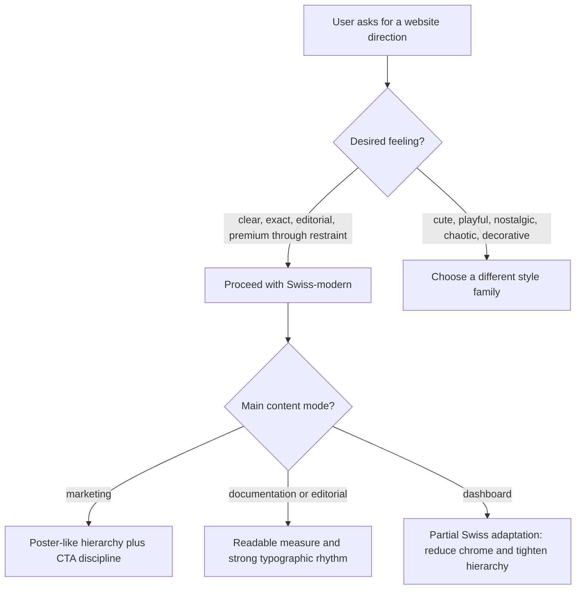

```mermaid
flowchart TD
    A["User asks for a website direction"] --> B{"Desired feeling?"}
    B -->|"clear, exact, editorial, premium through restraint"| C["Proceed with Swiss-modern"]
    B -->|"cute, playful, nostalgic, chaotic, decorative"| D["Choose a different style family"]
    C --> E{"Main content mode?"}
    E -->|"marketing"| F["Poster-like hierarchy plus CTA discipline"]
    E -->|"documentation or editorial"| G["Readable measure and strong typographic rhythm"]
    E -->|"dashboard"| H["Partial Swiss adaptation: reduce chrome and tighten hierarchy"]
```
