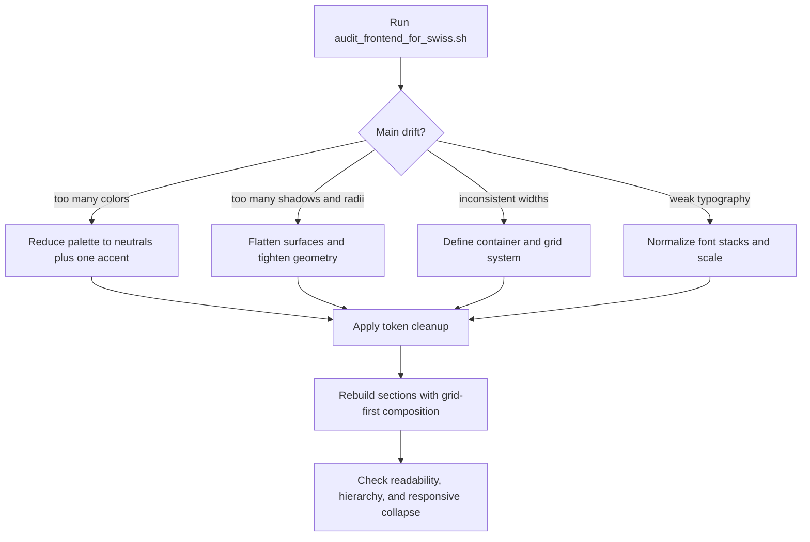

```mermaid
flowchart TD
    A["Run audit_frontend_for_swiss.sh"] --> B{"Main drift?"}
    B -->|"too many colors"| C["Reduce palette to neutrals plus one accent"]
    B -->|"too many shadows and radii"| D["Flatten surfaces and tighten geometry"]
    B -->|"inconsistent widths"| E["Define container and grid system"]
    B -->|"weak typography"| F["Normalize font stacks and scale"]
    C --> G["Apply token cleanup"]
    D --> G
    E --> G
    F --> G
    G --> H["Rebuild sections with grid-first composition"]
    H --> I["Check readability, hierarchy, and responsive collapse"]
```
