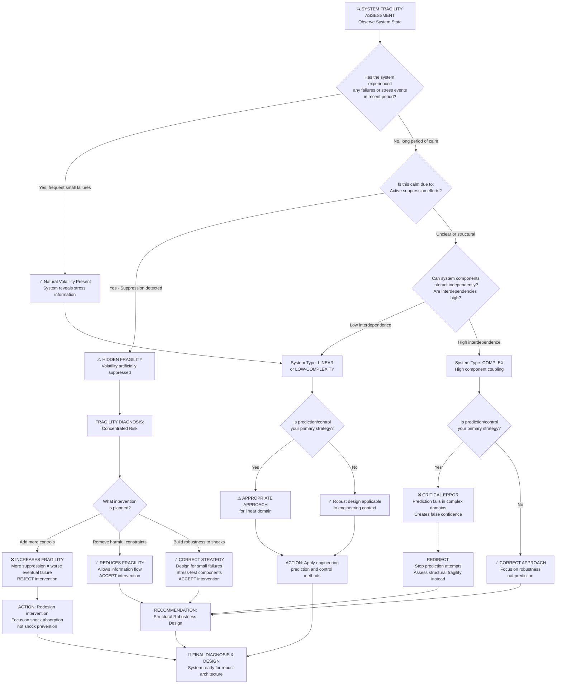

# System Fragility Assessment Decision Tree

```mermaid
flowchart TD
    A["🔍 SYSTEM FRAGILITY ASSESSMENT<br/>Observe System State"] --> B{Has the system experienced<br/>any failures or stress events<br/>in recent period?}
    
    B -->|Yes, frequent small failures| C["✓ Natural Volatility Present<br/>System reveals stress information"]
    B -->|No, long period of calm| D{Is this calm due to:<br/>Active suppression efforts?}
    
    D -->|Yes - Suppression detected| E["⚠️ HIDDEN FRAGILITY<br/>Volatility artificially suppressed"]
    D -->|Unclear or structural| F{Can system components<br/>interact independently?<br/>Are interdependencies high?}
    
    C --> G["System Type: LINEAR<br/>or LOW-COMPLEXITY"]
    E --> H["FRAGILITY DIAGNOSIS:<br/>Concentrated Risk"]
    
    F -->|Low interdependence| G
    F -->|High interdependence| I["System Type: COMPLEX<br/>High component coupling"]
    
    G --> J{Is prediction/control<br/>your primary strategy?}
    I --> K{Is prediction/control<br/>your primary strategy?}
    
    J -->|Yes| L["⚠️ APPROPRIATE APPROACH<br/>for linear domain"]
    J -->|No| M["✓ Robust design applicable<br/>to engineering context"]
    
    K -->|Yes| N["❌ CRITICAL ERROR<br/>Prediction fails in complex domains<br/>Creates false confidence"]
    K -->|No| O["✓ CORRECT APPROACH<br/>Focus on robustness<br/>not prediction"]
    
    H --> P{What intervention<br/>is planned?}
    N --> Q["REDIRECT:<br/>Stop prediction attempts<br/>Assess structural fragility instead"]
    
    P -->|Add more controls| R["❌ INCREASES FRAGILITY<br/>More suppression = worse eventual failure<br/>REJECT intervention"]
    P -->|Remove harmful constraints| S["✓ REDUCES FRAGILITY<br/>Allows information flow<br/>ACCEPT intervention"]
    P -->|Build robustness to shocks| T["✓ CORRECT STRATEGY<br/>Design for small failures<br/>Stress-test components<br/>ACCEPT intervention"]
    
    Q --> U["RECOMMENDATION:<br/>Structural Robustness Design"]
    R --> V["ACTION: Redesign intervention<br/>Focus on shock absorption<br/>not shock prevention"]
    S --> U
    T --> U
    O --> U
    M --> W["ACTION: Apply engineering<br/>prediction and control methods"]
    L --> W
    
    U --> X["🎯 FINAL DIAGNOSIS & DESIGN<br/>System ready for robust architecture"]
    W --> X
    V --> X
```
