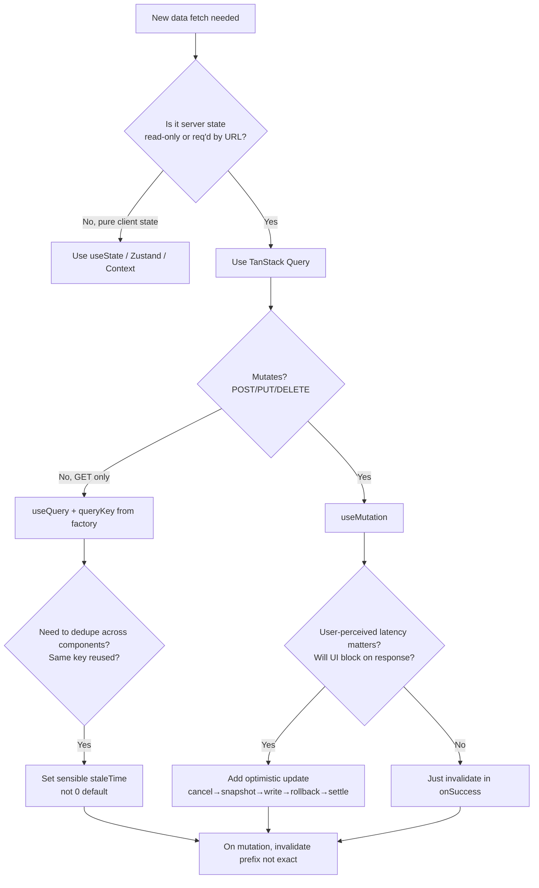

# TanStack Query Server State

> **TL;DR**: Server state is not client state — it goes stale on its own. TanStack Query v5 manages it with a stale-while-revalidate cache keyed by deterministic arrays. Build a typed query-key factory, set `staleTime` deliberately (not 0), invalidate by *prefix*, and on mutations always cancel-then-snapshot-then-write before optimistic updates.

---

## Jump to your fire

| Symptom | Section |
|---|---|
| "Why does my query refetch on every focus / tab switch?" | [Defaults & staleTime](#1-the-defaults-that-bite) |
| "I changed the API but old data still shows" | [Invalidation](#3-invalidation-prefix-matching) |
| "Optimistic update flickered back" | [Optimistic updates](#4-optimistic-updates-the-cancel-snapshot-rollback-dance) |
| "Type-safe query keys exploding into typos" | [Query key factory](#2-query-key-factory-pattern) |
| "Page double-fetches on Next.js navigation" | [Next.js hydration](#5-nextjs-app-router-hydration) |
| "Mutation succeeded but UI didn't update" | [onSuccess vs onSettled](#4-optimistic-updates-the-cancel-snapshot-rollback-dance) |

---

## Decision diagram



---

## 1. The defaults that bite

From [TanStack v5 important defaults](https://tanstack.com/query/latest/docs/framework/react/guides/important-defaults):

> By default, queries consider cached data as stale. Inactive queries are garbage collected after **5 minutes**.

That's the v5 ground truth. In practice:

| Option | Default | What it controls |
|---|---|---|
| `staleTime` | `0` | How long after fetch the data is considered fresh (no refetch on mount/focus) |
| `gcTime` (was `cacheTime` in v4) | `5 * 60 * 1000` | How long inactive (unobserved) cache entries survive before garbage collection |
| `refetchOnMount` | `true` | Refetch when a component mounting subscribes to a stale query |
| `refetchOnWindowFocus` | `true` | Refetch when the user returns to the tab |
| `refetchOnReconnect` | `true` | Refetch when network comes back |

**The default `staleTime: 0` means every component mount re-hits your server for the same data**, even if a sibling fetched it 50ms ago. The cache exists, but the query is "stale," so the network goes out anyway. This is the single most-cited "why is React Query making so many requests" complaint.

**Set staleTime per query family deliberately:**

```ts
// Reference data — barely changes
useQuery({ queryKey: keys.permissions(), staleTime: 'static' })  // never refetches automatically

// User profile — fine for a couple minutes
useQuery({ queryKey: keys.user.me(), staleTime: 2 * 60 * 1000 })

// Live feed — refetch aggressively
useQuery({ queryKey: keys.notifications(), staleTime: 10 * 1000 })
```

`staleTime: 'static'` blocks all background refetches; `invalidateQueries` still works. Use it for feature flags, permissions, and other immutable-ish reference data.

`staleTime: Infinity` is similar but `'static'` is preferred in v5 when you really mean "this is reference data."

---

## 2. Query key factory pattern

From [TanStack v5 Query Keys](https://tanstack.com/query/latest/docs/framework/react/guides/query-keys):

> Query keys have to be an Array at the top level, and can be as simple as an Array with a single string, or as complex as an array of many strings and nested objects.

Deterministic hashing: object property *order* doesn't matter, but array element *order* does:

```ts
// Same query — objects compared by value:
['todos', { status: 'done', page: 1 }]
['todos', { page: 1, status: 'done' }]   // ✅ matches

// Different queries — array order matters:
['todos', 'done', 1]
['todos', 1, 'done']                       // ❌ different
```

**Build a typed factory**. Stop sprinkling `['todos', userId]` strings around the codebase:

```ts
// keys.ts — single source of truth
export const todoKeys = {
  all: ['todos'] as const,
  lists: () => [...todoKeys.all, 'list'] as const,
  list: (filters: TodoFilters) => [...todoKeys.lists(), filters] as const,
  details: () => [...todoKeys.all, 'detail'] as const,
  detail: (id: string) => [...todoKeys.details(), id] as const,
}
```

Now consumers get autocomplete and refactor safety:

```ts
useQuery({ queryKey: todoKeys.detail(id), queryFn: () => fetchTodo(id) })
useQuery({ queryKey: todoKeys.list({ status: 'open' }), queryFn: () => fetchTodos({ status: 'open' }) })

// And invalidation by prefix is trivial:
queryClient.invalidateQueries({ queryKey: todoKeys.lists() })   // all list variants
queryClient.invalidateQueries({ queryKey: todoKeys.all })        // every todos query
```

The hierarchy (`all` → `lists` → `list(filters)` → `details` → `detail(id)`) is what makes prefix invalidation in §3 work cleanly.

---

## 3. Invalidation: prefix matching

From [TanStack v5 invalidation](https://tanstack.com/query/v5/docs/react/guides/query-invalidation):

> When a query is invalidated… it will be refetched if it's currently being rendered… it will be marked stale.

Default behavior is **partial / prefix matching**:

| Filter | Matches |
|---|---|
| `{ queryKey: ['todos'] }` | `['todos']`, `['todos', 1]`, `['todos', { status: 'open' }]`, `['todos', 'list', {...}]` — everything that starts with `'todos'` |
| `{ queryKey: ['todos'], exact: true }` | only `['todos']` |
| `{ queryKey: ['todos', { status: 'open' }] }` | only queries whose key includes that exact filter object (deep value compare) |
| `{ predicate: (q) => q.queryKey[0] === 'todos' && q.state.dataUpdatedAt < cutoff }` | full-control filtering by query state |

**The single biggest invalidation mistake**: invalidating only the exact key after a mutation that could affect *list* variants too.

```ts
// ❌ Updates the detail cache, but the listing page still shows stale row
queryClient.invalidateQueries({ queryKey: todoKeys.detail(id), exact: true })

// ✅ Invalidates the detail AND every list view at once
queryClient.invalidateQueries({ queryKey: todoKeys.all })
```

The factory makes this safe. Prefer broader invalidation; the cost is one refetch per active observer, not one per cached entry.

---

## 4. Optimistic updates: the cancel-snapshot-rollback dance

From [TanStack v5 optimistic updates](https://tanstack.com/query/v5/docs/react/guides/optimistic-updates), the canonical four-step pattern:

```ts
useMutation({
  mutationFn: addTodo,

  // 1. CANCEL in-flight refetches that would overwrite our optimistic write
  onMutate: async (newTodo) => {
    await queryClient.cancelQueries({ queryKey: todoKeys.lists() })

    // 2. SNAPSHOT current cache (used for rollback)
    const previousTodos = queryClient.getQueryData(todoKeys.lists())

    // 3. WRITE the optimistic value
    queryClient.setQueryData(todoKeys.lists(), (old: Todo[] = []) => [...old, newTodo])

    // Return context for onError
    return { previousTodos }
  },

  // 4a. ROLLBACK on failure using the snapshot
  onError: (err, newTodo, context) => {
    if (context?.previousTodos) {
      queryClient.setQueryData(todoKeys.lists(), context.previousTodos)
    }
  },

  // 4b. SETTLE — refetch from server regardless of success/failure
  onSettled: () => {
    queryClient.invalidateQueries({ queryKey: todoKeys.lists() })
  },
})
```

**Why each step matters:**

- **Cancel first** — without it, an in-flight `GET /todos` started 200ms ago lands *after* your `setQueryData` and silently overwrites the optimistic value with stale server data. The user sees their addition appear, then disappear, then reappear after refetch. Worst-of-both-worlds flicker.
- **Snapshot before write** — you cannot reconstruct cache state from variables alone (server-assigned IDs, timestamps, computed fields). Snapshot is the only safe source of rollback truth.
- **Settle with invalidate** — even on success, the server may have computed something different (auto-tags, normalized whitespace, conflict resolution). Invalidating after settled keeps client and server consistent.

**onSuccess vs onSettled**: `onSuccess` only runs if the mutation didn't throw. `onSettled` runs in both cases. For invalidation after a mutation, prefer `onSettled` — you want the server's truth even after a 500.

---

## 5. Next.js App Router hydration

The Server-Component-friendly pattern: **prefetch on the server, hydrate the cache on the client**.

```tsx
// app/todos/page.tsx — Server Component
import { dehydrate, HydrationBoundary, QueryClient } from '@tanstack/react-query'
import TodoList from './todo-list'  // Client Component

export default async function Page() {
  const queryClient = new QueryClient()

  await queryClient.prefetchQuery({
    queryKey: todoKeys.lists(),
    queryFn: fetchTodos,
  })

  return (
    <HydrationBoundary state={dehydrate(queryClient)}>
      <TodoList />
    </HydrationBoundary>
  )
}
```

```tsx
// app/todos/todo-list.tsx — Client Component
'use client'
import { useQuery } from '@tanstack/react-query'

export default function TodoList() {
  const { data } = useQuery({ queryKey: todoKeys.lists(), queryFn: fetchTodos })
  // First render reads from hydrated cache — zero waterfall, zero loading state
  return <ul>{data?.map(t => <li key={t.id}>{t.title}</li>)}</ul>
}
```

**Required: a fresh `QueryClient` per request** on the server. Sharing a client across requests leaks one user's data into another's response.

For the app-wide `QueryClientProvider`, use the singleton pattern that creates the client once on the client and once-per-request on the server (see TanStack's [Next.js App Router guide](https://tanstack.com/query/latest/docs/framework/react/guides/advanced-ssr)).

---

## 6. useSuspenseQuery (when to use)

`useSuspenseQuery` throws a Promise during loading instead of returning `{ isLoading: true }`. Use it when:

- A `<Suspense>` boundary above the component handles the loading state cleanly.
- You want `data` to be non-null in the component body (eliminates `if (!data) return null` boilerplate).
- The route already has Server-Component-prefetched data, so suspense resolves instantly on first render.

Don't use it when:

- You need conditional fetching (`enabled: false`) — Suspense queries throw if disabled.
- Multiple suspense queries in the same component cause sequential waterfalls — combine with `useSuspenseQueries` for parallel fetching, or prefetch all on the server.

---

## Anti-patterns

| Anti-pattern | Why it bites | Fix |
|---|---|---|
| `staleTime: 0` everywhere (the default) | Every mount re-fetches; siblings duplicate requests | Per-query-family `staleTime` based on actual change frequency |
| Inline string query keys | Typos invalidate nothing; refactors break silently | Factory in `queries/keys.ts`, typed |
| `invalidateQueries({ queryKey, exact: true })` after mutation | List/detail views diverge | Invalidate by *prefix* (the factory's parent level) |
| Optimistic update without `cancelQueries` first | Flicker as in-flight GET overwrites your write | Always `await cancelQueries` first |
| Sharing one `QueryClient` across SSR requests | Cross-user data leak | Create per-request client on server |
| `refetchInterval: 1000` for "real-time" data | Burns server budget; misses events | Use SSE/WebSocket for actual real-time, polling only as fallback |
| Using TanStack Query for pure client state (form drafts, modal open/closed) | Cache layer adds nothing; weird invalidation semantics | `useState` / Zustand / `useReducer` |
| Global default `gcTime: Infinity` | Cache balloons; rarely-used pages keep memory forever | Leave default 5 min unless a query is small + accessed often |

---

## Novice / Expert / Timeline

| | Novice | Expert |
|---|---|---|
| **First useQuery** | Inline string key, default options | Factory key, deliberate `staleTime`, considered `gcTime` |
| **After a mutation** | `setQueryData` to specific cache and prays | `onMutate` snapshot + `onSettled` invalidate prefix |
| **Sees too many requests** | Adds `refetchOnWindowFocus: false` globally | Diagnoses with React Query Devtools, sets per-query staleTime |
| **Adds optimistic updates** | Forgets `cancelQueries`, gets flicker | Cancel → snapshot → write → rollback → settle |
| **Multi-tenant SSR** | Reuses singleton `QueryClient` | Per-request client; Server Component prefetch + `HydrationBoundary` |

**Timeline test**: open React Query Devtools on the home page, navigate to a detail page and back. An expert codebase shows ≤1 fetch per query family per minute on this round-trip. A novice codebase shows the same query firing 4-8 times.

---

## Quality gates

Server-state changes ship when:

- [ ] **Test:** A query key factory exists in a single file (`queries/keys.ts` or similar); grep finds zero inline `['todos', ...]` literals outside it.
- [ ] **Test:** Each query family has an explicit `staleTime` (not relying on the `0` default) — verified by lint rule or PR-time grep for `useQuery` without `staleTime`.
- [ ] **Test:** Mutation handlers either invalidate via factory prefix OR do a full optimistic-update flow (onMutate cancel+snapshot+write, onError rollback, onSettled invalidate).
- [ ] **Test:** Devtools open during a typical navigation flow shows no repeated fetches of the same query within the configured `staleTime` window.
- [ ] **Test (SSR):** `QueryClient` is created per request on the server (no module-level singleton); a multi-user load test shows zero cross-user data appearing.
- [ ] **Manual:** Optimistic update flicker test — disable network, perform a mutation, watch for the value bouncing. It should not.

---

## NOT for this skill

- Generic React state management (use `react-state-management`)
- Form state — use `react-hook-form` or similar; TanStack Query is for server state
- GraphQL-specific caching (use `urql-or-apollo-cache-design`)
- Real-time / WebSocket subscriptions — TanStack Query polls; use a WebSocket library for true push
- TanStack Router — different package, different scope (use `tanstack-router-design`)

---

## Sources

- TanStack Query v5: [Important Defaults](https://tanstack.com/query/latest/docs/framework/react/guides/important-defaults) — staleTime, gcTime, refetch triggers
- TanStack Query v5: [Query Keys](https://tanstack.com/query/latest/docs/framework/react/guides/query-keys) — array structure, deterministic hashing
- TanStack Query v5: [Query Invalidation](https://tanstack.com/query/v5/docs/react/guides/query-invalidation) — prefix vs exact match
- TanStack Query v5: [Optimistic Updates](https://tanstack.com/query/latest/docs/framework/react/guides/optimistic-updates) — cancelQueries → snapshot → setQueryData → rollback → settle
- TanStack Query v5: [Advanced SSR / Next.js App Router](https://tanstack.com/query/latest/docs/framework/react/guides/advanced-ssr) — HydrationBoundary, per-request QueryClient
- Lukemorales: [Query Key Factory](https://github.com/lukemorales/query-key-factory) — community pattern that inspired the typed-factory style
