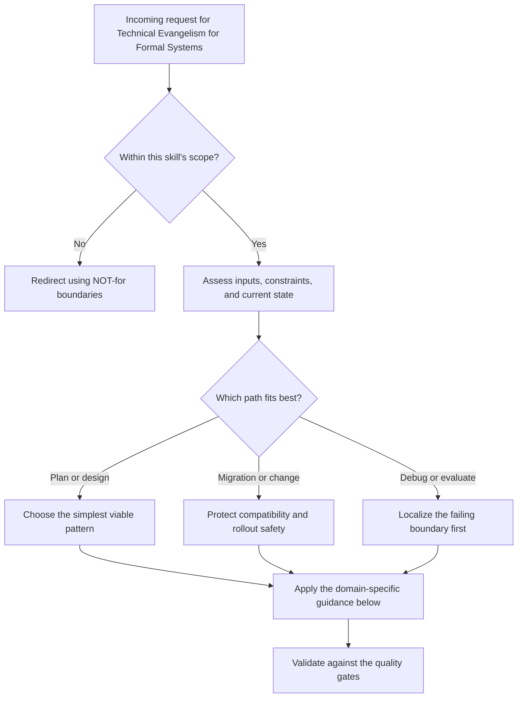

# Technical Evangelism for Formal Systems

Turn formally verified infrastructure into something developers actually install.
The gap between "provably correct" and "I'll try it this weekend" is 90% communication, 10% onboarding friction.

## Decision Points



Use this as the first-pass routing model:

- Confirm the request belongs in this skill before doing deeper work.
- Separate planning, migration, and debugging paths before choosing a solution.
- Prefer the simplest correct path that still survives the quality gates.


## When to Use

Use for:
- Writing blog posts that drive installs of formally verified tools
- Designing conference talks (5-min lightning to 45-min deep dive)
- Creating developer docs that reduce time-to-first-success below 15 minutes
- Explaining mechanism design concepts (bonds, collateral, settlement) to working engineers
- Academic venue selection and positioning (AAMAS, EC, IEEE S&P)
- Writing rebuttals for academic reviewers
- Open-source community building around formal infrastructure
- Translating TLA+ specs into intuitive mental models

## NOT for Boundaries

- Academic paper writing (use `research-craft`)
- Marketing copy for non-technical audiences
- Social media management or content calendars
- PR, press releases, or investor decks
- Writing the formal specs themselves (use `tlaplus-practitioner`)

---

## Failure Modes

Know these before you write a single word. Every evangelism effort dies to one of them.

### Failure Mode 1: Leading with Formalism

**Symptom:** Your opening paragraph contains the words "temporal logic," "safety property," or "bisimulation."
**Why it kills:** Developers pattern-match on jargon density. Two unfamiliar terms in the first 100 words and they close the tab. They are not hostile to formal methods -- they are hostile to feeling stupid.
**Detection:** Read your opening aloud to someone who writes JavaScript for a living. If they squint, you led with formalism.
**Fix:** Lead with the problem they already have. Show the crash. Show the race condition. Show the 3 AM page. Then reveal that the fix was found by a machine that checked every possible execution order.

### Failure Mode 2: Leading with Hype

**Symptom:** "Revolutionary," "game-changing," "the future of," "never write a bug again."
**Why it kills:** Developers have been lied to by every framework launch since 2015. Hype triggers the immune response. They will find the weakness in your claim and tweet about it.
**Detection:** Count superlatives. More than one per 500 words is hype.
**Fix:** Understate. "We found 3 bugs in production code that tests missed. Here is the spec that found them." Let the reader supply their own excitement.

### Failure Mode 3: Undersimplifying (Talking Down)

**Symptom:** "Think of it like a spell-checker for your code!" Metaphors so aggressive they strip all technical content.
**Why it kills:** Developers are smart. Oversimplified metaphors insult them and, worse, create wrong mental models that break when they actually use the tool.
**Detection:** Would a senior engineer feel patronized reading this?
**Fix:** Use precise analogies that compress complexity without distorting it. "It is a linter that runs against every possible schedule of your concurrent operations" is better than "spell-checker for your code."

### Failure Mode 4: Oversimplifying the Onboarding

**Symptom:** "Just add this to your config!" when the actual path is: install runtime, write a spec, learn the assertion language, run the checker, interpret counterexamples.
**Why it kills:** The reader follows your blog post, hits a wall at step 3, and now they are angry. They trusted you. You said 10 minutes. It has been 45 and they do not have a working spec.
**Detection:** Time yourself doing the tutorial from scratch on a clean machine. If it takes you more than 15 minutes, it will take a first-timer 45.
**Fix:** Be honest about the investment. Show what they get in 10 minutes (a running demo with canned specs). Show what they get in an hour (their own spec on their own code). Never hide the second step.

---

## Master Decision Tree: Audience

Before writing anything, walk this tree.

```
START: Who is your audience?
|
+-- Technical (writes code daily)?
|   |
|   +-- YES: What is their formalism exposure?
|   |   |
|   |   +-- HIGH (knows TLA+, Alloy, Coq, etc.)
|   |   |   --> Skip analogies. Show specs. Discuss tradeoffs.
|   |   |   --> Medium: paper, deep-dive talk, technical RFC
|   |   |
|   |   +-- MEDIUM (knows types, property-based testing, maybe QuickCheck)
|   |   |   --> Bridge from what they know. "Like property-based testing, but exhaustive."
|   |   |   --> Medium: blog post, 25-min talk, workshop
|   |   |
|   |   +-- LOW (writes tests, ships features, has not heard of TLA+)
|   |       --> Lead with the bug. Show the fix. Introduce the tool last.
|   |       --> Medium: blog post, lightning talk, README
|   |
|   +-- NO: Executive / technical manager?
|       |
|       +-- YES: Show ROI, not code
|       |   --> "We reduced production incidents by 40% in 3 months"
|       |   --> "Mean time to resolve concurrency bugs: 6 hours -> 20 minutes"
|       |   --> Medium: case study, exec summary, 10-min presentation
|       |
|       +-- NO: Academic reviewer?
|           --> See Academic Venue Strategy below
|
+-- What format?
    |
    +-- 5-min lightning talk
    |   --> ONE concept. ONE demo. ONE takeaway.
    |   --> Structure: Problem (1 min) -> Demo (3 min) -> "Try it" (1 min)
    |
    +-- 25-min conference talk
    |   --> Problem -> Naive solution -> Why it fails -> Formal solution -> Live demo -> CTA
    |   --> The Hobbes Slide goes here (see Conference Talk Design)
    |
    +-- 45-min deep dive
    |   --> Full narrative arc. History. Theory. Practice. Live coding. Q&A.
    |   --> Budget: 5 min context, 10 min theory, 20 min live demo, 10 min implications
    |
    +-- Blog post
    |   --> See Blog Post Strategy below
    |
    +-- Developer docs
    |   --> See Developer Docs below
    |
    +-- Academic paper positioning
        --> See Academic Venue Strategy below
```

---

## Master Decision Tree: Lead Strategy

```
START: Lead with problem or solution?
|
+-- Does the audience ALREADY FEEL the pain?
|   |
|   +-- YES (they have been paged at 3 AM for race conditions)
|   |   --> Lead with the problem. "You know that Heisenbug..."
|   |   --> They will lean in because you described their Tuesday.
|   |
|   +-- NO (they think their tests are sufficient)
|       --> Lead with a surprising result.
|       --> "We ran our model checker against a well-tested production system
|           and found 3 executions that violate safety. None were caught by
|           2,400 unit tests."
|       --> Surprise creates the problem awareness you need.
|
+-- Is the tool installable in under 10 minutes?
    |
    +-- YES --> End with install command. Literally. Last line of the post.
    |
    +-- NO --> End with a sandbox/playground link, or a canned demo they
              can clone and run without understanding the spec language.
```

---

## Conference Talk Design

### The Hobbes Slide

The single most important slide in any formal-systems talk aimed at practitioners.

**Concept:** Thomas Hobbes argued that without a sovereign, rational agents devolve into "war of all against all." Your agent swarm without coordination guarantees is Hobbes's state of nature. The Leviathan is the formally verified coordinator.

**Design (25-min talk, slide 8 of ~25):**
- Left side: Agents in chaos. Arrows crossing. Red conflict markers. Caption: "State of Nature"
- Right side: Same agents, mediated by a central authority. Clean flow. Caption: "Leviathan"
- Bottom: One sentence -- "The coordinator's correctness is not a matter of opinion. It is a proof."

**When to deploy it:** After you have shown the failure mode (agents stomping each other's files, double-claiming ports, corrupting shared state). The audience needs to FEEL the chaos before the Leviathan feels like relief rather than tyranny.

**When NOT to deploy it:** Lightning talks (no time for philosophy), audiences that skew libertarian about infrastructure (lead with voluntary coordination instead).

### Talk Structure Templates

**Lightning (5 min):**
1. "Here is a bug none of your tests will catch." [1 min]
2. Live demo: tool finds it.  [3 min]
3. Install command on screen. [1 min]

**Standard (25 min):**
1. The war story -- a real production failure from concurrency [3 min]
2. "We tried testing harder. Here is why that ceiling exists." [4 min]
3. What formal verification actually means (no jargon) [3 min]
4. Live demo on a real codebase [8 min]
5. The Hobbes Slide -- why your agent swarm needs a Leviathan [3 min]
6. Results: bugs found, incidents prevented, developer experience [2 min]
7. CTA: install, try, join community [2 min]

**Deep Dive (45 min):**
1. Context: the multi-agent coordination problem [5 min]
2. History: what Hobbes, Ostrom, and Lamport have in common [5 min]
3. The formal model (accessible, with running code) [10 min]
4. Live demo: writing a spec, running the checker, finding a bug [15 min]
5. Implications: what changes when coordination is provable [5 min]
6. Community, roadmap, how to contribute [5 min]

---

## Blog Post Strategy

### Quality Gate

**The 15-Minute Rule:** A developer who reads the post must be able to install and run `pd begin` within 15 minutes of finishing. If your blog post does not achieve this, it is not a blog post -- it is a thought piece, and you should label it as such.

### Depth Calibration

```
START: How deep should this post go?
|
+-- Target reader: has they USED a model checker before?
|   +-- YES --> You can show specs. Discuss state spaces. Compare tools.
|   +-- NO  --> You must not show specs until after they have seen the demo work.
|
+-- Target reader: do they MANAGE infrastructure?
|   +-- YES --> Show operational metrics. MTTR, incident rates, deploy confidence.
|   +-- NO  --> Show developer experience. "Here is what your morning looks like."
|
+-- Post length?
    +-- < 1000 words --> ONE idea. ONE demo command. ONE install link.
    +-- 1000-2500 words --> Problem, solution, demo, deeper explanation, CTA.
    +-- > 2500 words --> You are writing a tutorial, not a blog post. That is fine,
                         but put the install command in the first 200 words anyway.
```

### Worked Example: "Why Your Agent Swarm Needs a Leviathan"

Load [references/leviathan-blog-outline.md](references/leviathan-blog-outline.md) for the full outline, hook calibration, and call-to-action sequence. Use it when the audience runs multi-agent infrastructure but has low formal-methods exposure.

---

## Developer Docs That Drive Adoption

### Structure Decision Tree

```
START: What does the reader need RIGHT NOW?
|
+-- "What is this?" (discovery)
|   --> README.md: 1 paragraph, 1 install command, 1 demo gif
|   --> Time budget: 30 seconds to understand, 2 minutes to install
|
+-- "How do I start?" (onboarding)
|   --> Getting Started guide: install, first command, first result
|   --> Time budget: under 10 minutes to first success
|   --> MUST end with something working, not something explained
|
+-- "How do I do X?" (task-oriented)
|   --> Cookbook/tutorial: specific task, copy-paste commands, expected output
|   --> Every code block must be runnable. No pseudocode. No ellipses.
|
+-- "Why does it work this way?" (understanding)
|   --> Architecture docs: for AFTER they are using it, not before
|   --> This is where you can discuss formal properties
|   --> Link to specs for the deeply curious
|
+-- "Something broke." (recovery)
    --> Troubleshooting: symptom-first, not cause-first
    --> "If you see X, run Y."
```

### Anti-Pattern: The Wall of Concepts

Never put a "Concepts" page between install and first use. The reader does not need to understand your type system to run `pd begin`. Concepts are reference material, not prerequisites.

---

## Explaining "Collateralized Work Contracts"

When your system uses bonds, escrow, or collateral and your audience has never heard of a performance bond:

### The Bridge Sequence

1. **Start with what they know:** "When you hire a contractor to remodel your kitchen, they often post a performance bond. If they abandon the job, the bond pays for someone else to finish."

2. **Map to software:** "An AI agent claiming a file is like a contractor claiming a job. The 'bond' is the agent's session context -- its notes, its file claims, its heartbeat. If the agent dies, that context is preserved so another agent can pick up where it left off."

3. **Name the formal concept last:** "In mechanism design, this is called a collateralized work contract. The collateral is not money -- it is structured context that makes the work recoverable."

4. **Show the code:**
   ```bash
   pd begin --identity myapp:api --purpose "refactoring auth module"
   pd session files claim $SID src/auth.ts src/auth.test.ts
   pd note "Starting with token refresh. Current impl has race condition in refresh/retry."
   # If this agent dies, `pd salvage` shows another agent exactly what was being done.
   ```

5. **Name the invariant in English:** "No work is lost. If an agent dies, its last known state is available to its successor. That is the guarantee."

### Anti-Pattern: Starting with "Mechanism Design"

Never open with "In mechanism design..." to a practitioner audience. They will assume the next 10 minutes are theory. Start with the kitchen contractor. They will remember that forever.

---

## Open-Source Community Building

### The Contributor Funnel

```
Awareness --> Install --> Use --> File Issue --> Fix Issue --> Maintain
   |            |          |         |              |            |
   blog       README    tutorial   good-first    PR review    core team
   talk        docs     cookbook    issue labels   mentoring    governance
   word of                         templates
   mouth
```

### Decision Tree: Contribution Friction

```
START: Someone wants to contribute.
|
+-- Can they build the project in under 5 minutes?
|   +-- NO --> Fix this first. Nothing else matters.
|   +-- YES --> Continue
|
+-- Can they run the test suite in under 2 minutes?
|   +-- NO --> Fix this second.
|   +-- YES --> Continue
|
+-- Are there issues labeled "good first issue" with clear scope?
|   +-- NO --> Create 5+ before any evangelism push.
|   +-- YES --> Continue
|
+-- Does the PR template explain what reviewers look for?
    +-- NO --> Write one. "Tests pass, types check, docs updated."
    +-- YES --> Community is ready for growth.
```

---

## Academic Venue Strategy

### Venue Selection

| Contribution Type | Venue | Reviewers Expect | Key Question |
|---|---|---|---|
| Multi-agent coordination protocols | AAMAS | Game-theoretic analysis, convergence proofs | "What properties does your protocol guarantee that existing approaches do not?" |
| Economic mechanism design | EC | Equilibrium analysis, incentive compatibility | "Is this strategy-proof? What is the price of anarchy?" |
| Security properties | IEEE S&P | Threat models, formal security proofs | "What is your threat model and what does the proof cover?" |
| Verified distributed systems | OSDI/SOSP (systems), CAV (verification), POPL (PL) | Depends on emphasis | Systems contribution vs. verification novelty |
| Practical tool + empirical evaluation | ICSE / FSE | User studies, bug-finding results | "Did developers actually use this? What did it find?" |

### Reviewer Calibration

| Reviewer Type | Lead With | Include | Never |
|---|---|---|---|
| Formal methods | Proof structure | Full proofs or appendix | Oversell impact without evidence |
| Systems | Performance numbers, deployments | Benchmarks, overhead, case studies | Lead with proofs -- lead with the system |
| Economics / game theory | Clean model definition | Equilibrium analysis, incentive proofs | Bury the mechanism in implementation details |
| Software engineering | Evidence of practitioner benefit | User studies, adoption metrics | Assume they know your formal framework |

### Rebuttal Strategy

| Objection | Response Pattern |
|---|---|
| "Incremental over [X]." | Name the specific advance. "X guarantees liveness but not fairness. We add fairness with O(n) overhead." Be surgical. |
| "Evaluation is insufficient." | Do NOT argue your eval is fine. Add what they want. "We will add [baseline] comparison." Then do it. |
| "I don't understand the formal model." | This is YOUR fault. "We will add a running example tracing the model step by step." Add a figure. |
| "No practical impact." | Show deployments, downloads, user quotes. If you have none, be honest. Do not fabricate impact. |
| "Proofs are wrong / incomplete." | Take seriously. Check every step. If right, fix and say so. If wrong, walk through the questioned step in detail. |

---

## Anti-Patterns Reference

| Anti-Pattern | What It Looks Like | Why It Fails | Fix |
|---|---|---|---|
| Jargon Front-Loading | "We use CTL* to verify liveness properties of our BDI agent protocol" | Reader leaves in sentence 1 | Lead with the bug, not the logic |
| The Concept Wall | 3 pages of definitions before the first install command | Reader never installs | Install first, concepts after |
| Fake Simplicity | "Just add this one line to your config!" | Reader hits a wall at step 2 and feels lied to | Be honest about the learning curve |
| Proof Flex | Showing a TLA+ spec to prove you are rigorous | Reader feels excluded | Link to the spec. Summarize the invariant in English. |
| Straw Man Comparison | "Unlike EVERY other tool, we actually verify..." | Insults tools the reader uses and trusts | "We complement existing testing with exhaustive state exploration" |
| Premature Generality | "This works for any formally verified system!" | Reader cannot map to their specific problem | Pick ONE use case. Nail it. Generalize later. |
| Missing CTA | Beautiful explanation, no install command | Reader nods approvingly and never tries it | Every piece ends with a runnable command |
| Hobbes Overload | Three slides of Hobbes, Locke, and Rousseau | It is a tech talk, not a seminar | One slide. One metaphor. Move on. |

---

## Worked Examples

- Minimal case: apply the simplest in-scope path to a small, low-risk request.
- Migration case: preserve compatibility while changing one constraint at a time.
- Failure-recovery case: show how to detect the wrong path and recover before final output.


## Quality Gates Checklist

Before publishing any evangelism artifact, verify:

- [ ] A developer unfamiliar with the project can install and run the first command within 15 minutes
- [ ] The opening 100 words contain zero undefined jargon
- [ ] Superlative count is at most 1 per 500 words
- [ ] Every code block is copy-pasteable and produces the described output
- [ ] The CTA is a runnable command, not a link to "learn more"
- [ ] A senior engineer would not feel patronized
- [ ] A junior engineer would not feel lost
- [ ] The Hobbes metaphor (if used) appears AFTER the failure demo, not before
- [ ] The post does not promise "10 minutes" for something that takes 30
- [ ] At least one real (not hypothetical) result is cited
