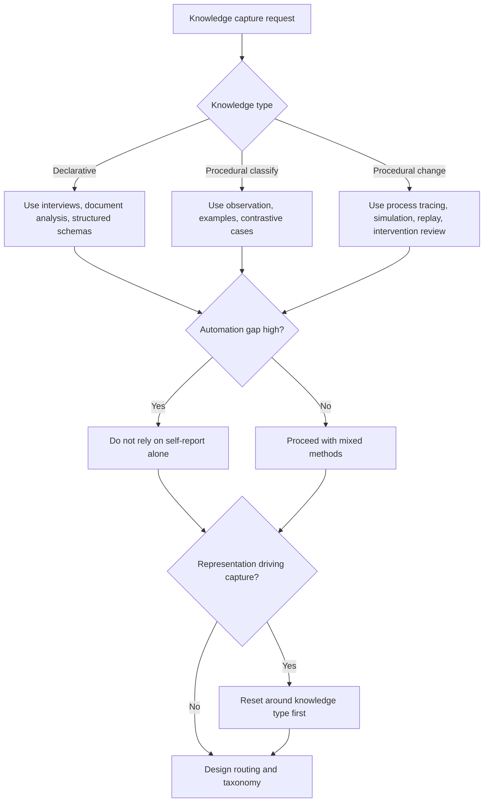

# Towards a Taxonomy of Cognitive Task Analysis Methods

Source basis: Kenneth Anthony Yates on how elicitation methods bias what kinds of expert knowledge get captured and how that affects system design.

## When to Use

- An agent underperforms experts and the missing capability feels tacit or hard to verbalize.
- A knowledge base or prompt was built mainly from expert interviews or self-report.
- You need to decide how to capture, represent, or route expertise across a skill library.
- A taxonomy keeps growing without an organizing theory or any reduction pressure.
- You suspect the chosen representation format is driving the capture method instead of the other way around.

## NOT for

- Generic label taxonomies or ontology cleanup with no link to expert-performance capture.
- Benchmark-focused model evaluation that does not involve knowledge elicitation or capability routing.
- Pure machine learning architecture selection divorced from the problem of expert knowledge capture.

## Decision Points

1. Classify the target knowledge: declarative, procedural-classify, or procedural-change.
2. Estimate automation-gap risk. If experts are fast and reliable but poor at explanation, self-report alone is insufficient.
3. Choose capture methods based on the knowledge type, not on the output format you hope to build.
4. Decide whether the library is a typology or a real taxonomy by asking what theory would let categories consolidate over time.

## Decision Flow

## Working Model

- Expertise has an automation gap. The knowledge that makes experts fast and reliable is often the part they can least report directly.
- Knowledge has architecture. Declarative facts, procedural classification, and procedural change skills are different targets and need different capture strategies.
- Methods are not neutral. Interviews, concept maps, protocol analysis, and observation open access to different layers of cognition.
- Representation bias is circular. If rules, templates, or embeddings dictate capture method, you will overfit the knowledge to the format.
- Taxonomies should reduce, not just proliferate. Growth without consolidation signals missing theory.

## Failure Modes

- Interviewing experts and mistaking articulate explanations for complete knowledge capture.
- Choosing capture methods because they map neatly to a preferred output format.
- Using one expert or one method and assuming the blind spots will average out.
- Routing skills by keyword or name when the real difference is knowledge type.
- Growing a capability library by accretion instead of revising the underlying organizing theory.

## Anti-Patterns and Shibboleths

- Anti-pattern: collecting articulate interview answers and calling the tacit layer captured.
- Anti-pattern: designing the embedding schema or template first and then forcing the elicitation method to fit it.
- Shibboleth: if routing logic could be replaced by keyword matching with no loss, the CTA taxonomy is still too shallow.

## Worked Examples

- A dispatcher-support agent fails on edge cases even though its prompt contains expert-written rules. The likely issue is procedural knowledge captured declaratively; add observation and process tracing before rewriting the prompt.
- A large skill library keeps spawning near-duplicate skills for planning, diagnosis, and review. The likely issue is typological growth; reorganize by knowledge type produced and consumed, then consolidate.

## Fork Guidance

- Stay in-process when you are classifying one task and choosing one capture strategy.
- Fork separate subagents only when you need independent audits of knowledge type, capture method, and routing theory for the same system before merging findings.

## Quality Gates

- The target task is decomposed by knowledge type before method selection starts.
- Capture methods are justified by what knowledge they can reach, not by what output artifact they produce.
- Procedural blind spots are named explicitly when self-report is used.
- The resulting taxonomy has a path to consolidation, not just more categories.
- Routing logic uses theory about knowledge type rather than surface naming alone.

## Reference Routing

- `references/expert-knowledge-automation-gap.md`: load when experts outperform the system in ways they struggle to explain.
- `references/declarative-vs-procedural-knowledge-in-agent-systems.md`: load when representation is mismatched to the kind of expertise required.
- `references/method-selection-drives-knowledge-outcomes.md`: load when choosing among capture methods.
- `references/representation-bias-and-knowledge-fidelity.md`: load when format is starting to dictate what knowledge gets captured.
- `references/skill-selection-as-cognitive-task-analysis-problem.md`: load when routing or orchestration fails on ambiguous cases.
- `references/building-theory-driven-agent-capability-taxonomies.md`: load when the library needs an organizing theory instead of more names.
- `references/taxonomy-theory-and-the-proliferation-trap.md`: load when category growth outpaces explanatory power.
