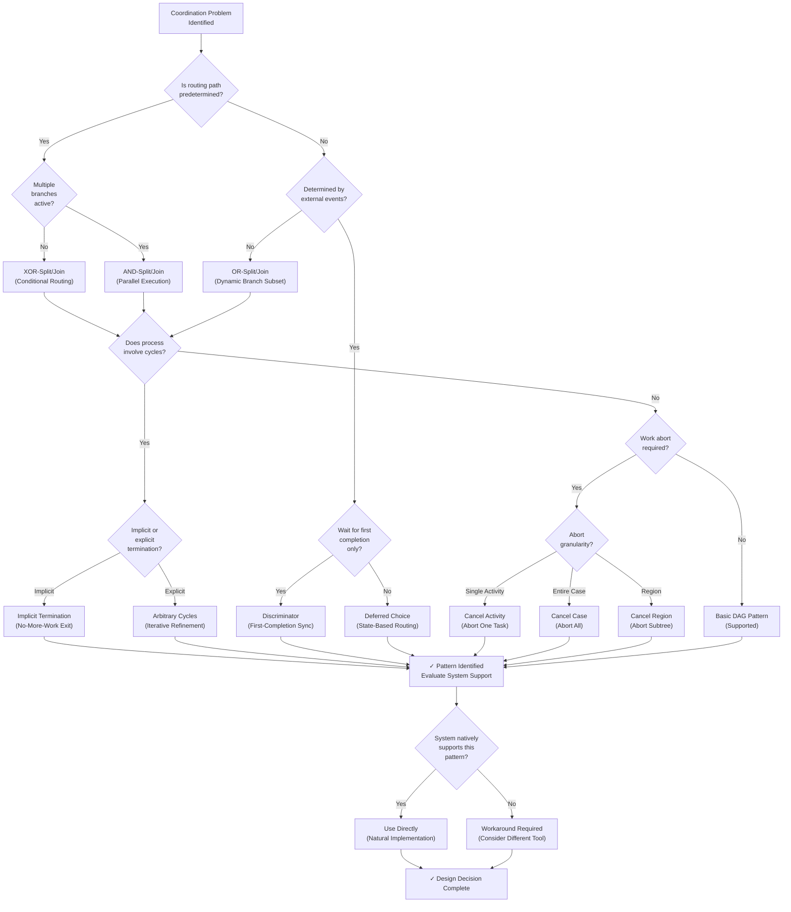

# Control Flow Pattern Taxonomy - Decision Tree

```mermaid
flowchart TD
    Start["Coordination Problem<br/>Identified"] --> Q1{Is routing path<br/>predetermined?}
    
    Q1 -->|Yes| Q2{Multiple<br/>branches<br/>active?}
    Q1 -->|No| Q3{Determined by<br/>external events?}
    
    Q2 -->|Yes| AND["AND-Split/Join<br/>(Parallel Execution)"]
    Q2 -->|No| XOR["XOR-Split/Join<br/>(Conditional Routing)"]
    
    Q3 -->|Yes| Q4{Wait for first<br/>completion<br/>only?}
    Q3 -->|No| OR["OR-Split/Join<br/>(Dynamic Branch Subset)"]
    
    Q4 -->|Yes| DISC["Discriminator<br/>(First-Completion Sync)"]
    Q4 -->|No| DEFER["Deferred Choice<br/>(State-Based Routing)"]
    
    XOR --> Q5{Does process<br/>involve cycles?}
    AND --> Q5
    OR --> Q5
    
    Q5 -->|Yes| Q6{Implicit or<br/>explicit<br/>termination?}
    Q5 -->|No| Q7{Work abort<br/>required?}
    
    Q6 -->|Implicit| IMPLICIT["Implicit Termination<br/>(No-More-Work Exit)"]
    Q6 -->|Explicit| CYCLES["Arbitrary Cycles<br/>(Iterative Refinement)"]
    
    Q7 -->|Yes| Q8{Abort<br/>granularity?}
    Q7 -->|No| BASIC["Basic DAG Pattern<br/>(Supported)"]
    
    Q8 -->|Single Activity| CANCEL_ACT["Cancel Activity<br/>(Abort One Task)"]
    Q8 -->|Entire Case| CANCEL_CASE["Cancel Case<br/>(Abort All)"]
    Q8 -->|Region| CANCEL_REGION["Cancel Region<br/>(Abort Subtree)"]
    
    IMPLICIT --> EVAL["✓ Pattern Identified<br/>Evaluate System Support"]
    CYCLES --> EVAL
    DISC --> EVAL
    DEFER --> EVAL
    CANCEL_ACT --> EVAL
    CANCEL_CASE --> EVAL
    CANCEL_REGION --> EVAL
    BASIC --> EVAL
    
    EVAL --> CHECK{System natively<br/>supports this<br/>pattern?}
    CHECK -->|Yes| USE["Use Directly<br/>(Natural Implementation)"]
    CHECK -->|No| WORKAROUND["Workaround Required<br/>(Consider Different Tool)"]
    
    USE --> END["✓ Design Decision Complete"]
    WORKAROUND --> END
```
