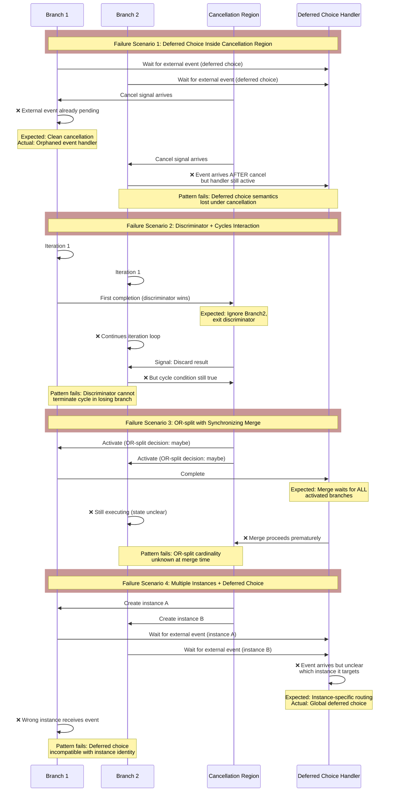

# Pattern Interaction Failure Scenarios

```mermaid
sequenceDiagram
    participant Branch1 as Branch 1
    participant Branch2 as Branch 2
    participant CancelRegion as Cancellation Region
    participant DeferredChoice as Deferred Choice Handler

    rect rgb(200, 150, 150)
    Note over Branch1,DeferredChoice: Failure Scenario 1: Deferred Choice Inside Cancellation Region
    end

    Branch1->>DeferredChoice: Wait for external event (deferred choice)
    Branch2->>DeferredChoice: Wait for external event (deferred choice)
    CancelRegion->>Branch1: Cancel signal arrives
    Branch1->>Branch1: ❌ External event already pending
    Note over Branch1: Expected: Clean cancellation<br/>Actual: Orphaned event handler
    CancelRegion->>Branch2: Cancel signal arrives
    Branch2->>DeferredChoice: ❌ Event arrives AFTER cancel<br/>but handler still active
    Note over Branch2,DeferredChoice: Pattern fails: Deferred choice semantics<br/>lost under cancellation

    rect rgb(200, 150, 150)
    Note over Branch1,DeferredChoice: Failure Scenario 2: Discriminator + Cycles Interaction
    end

    Branch1->>Branch1: Iteration 1
    Branch2->>Branch2: Iteration 1
    Branch1->>CancelRegion: First completion (discriminator wins)
    Note over CancelRegion: Expected: Ignore Branch2,<br/>exit discriminator
    Branch2->>Branch2: ❌ Continues iteration loop
    CancelRegion->>Branch2: Signal: Discard result
    Branch2->>CancelRegion: ❌ But cycle condition still true
    Note over Branch1,Branch2: Pattern fails: Discriminator cannot<br/>terminate cycle in losing branch

    rect rgb(200, 150, 150)
    Note over Branch1,DeferredChoice: Failure Scenario 3: OR-split with Synchronizing Merge
    end

    CancelRegion->>Branch1: Activate (OR-split decision: maybe)
    CancelRegion->>Branch2: Activate (OR-split decision: maybe)
    Branch1->>DeferredChoice: Complete
    Note over DeferredChoice: Expected: Merge waits for ALL<br/>activated branches
    Branch2->>Branch2: ❌ Still executing (state unclear)
    DeferredChoice->>CancelRegion: ❌ Merge proceeds prematurely
    Note over Branch2,CancelRegion: Pattern fails: OR-split cardinality<br/>unknown at merge time

    rect rgb(200, 150, 150)
    Note over Branch1,DeferredChoice: Failure Scenario 4: Multiple Instances + Deferred Choice
    end

    CancelRegion->>Branch1: Create instance A
    CancelRegion->>Branch2: Create instance B
    Branch1->>DeferredChoice: Wait for external event (instance A)
    Branch2->>DeferredChoice: Wait for external event (instance B)
    DeferredChoice->>DeferredChoice: ❌ Event arrives but unclear<br/>which instance it targets
    Note over DeferredChoice: Expected: Instance-specific routing<br/>Actual: Global deferred choice
    Branch1->>Branch1: ❌ Wrong instance receives event
    Note over Branch1,Branch2: Pattern fails: Deferred choice<br/>incompatible with instance identity
```
