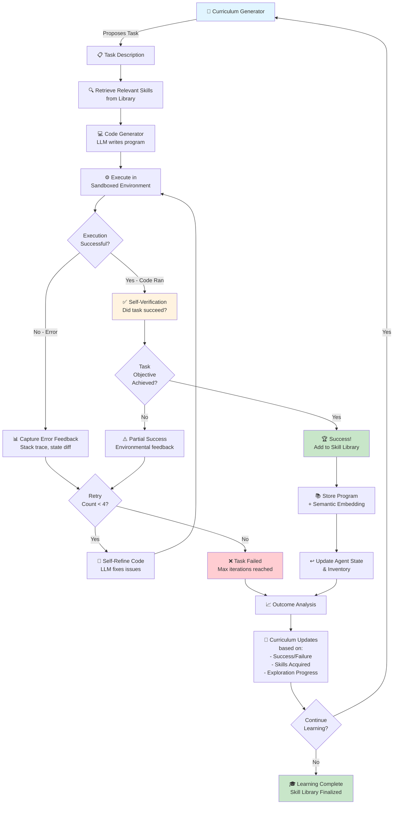

# Curriculum-Skill-Verification Loop

```mermaid
flowchart TD
    A["🎯 Curriculum Generator"] -->|Proposes Task| B["📋 Task Description"]
    B --> C["🔍 Retrieve Relevant Skills<br/>from Library"]
    C --> D["💻 Code Generator<br/>LLM writes program"]
    D --> E["⚙️ Execute in<br/>Sandboxed Environment"]
    E --> F{Execution<br/>Successful?}
    
    F -->|No - Error| G["📊 Capture Error Feedback<br/>Stack trace, state diff"]
    G --> H{Retry<br/>Count < 4?}
    H -->|Yes| I["🔧 Self-Refine Code<br/>LLM fixes issues"]
    I --> E
    H -->|No| J["❌ Task Failed<br/>Max iterations reached"]
    
    F -->|Yes - Code Ran| K["✅ Self-Verification<br/>Did task succeed?"]
    K --> L{Task<br/>Objective<br/>Achieved?}
    
    L -->|Yes| M["🏆 Success!<br/>Add to Skill Library"]
    M --> N["📚 Store Program<br/>+ Semantic Embedding"]
    N --> O["↩️ Update Agent State<br/>& Inventory"]
    
    L -->|No| P["⚠️ Partial Success<br/>Environmental feedback"]
    P --> H
    
    J --> Q["📈 Outcome Analysis"]
    O --> Q
    Q --> R["🔄 Curriculum Updates<br/>based on:<br/>- Success/Failure<br/>- Skills Acquired<br/>- Exploration Progress"]
    
    R --> S{Continue<br/>Learning?}
    S -->|Yes| A
    S -->|No| T["🎓 Learning Complete<br/>Skill Library Finalized"]
    
    style A fill:#e1f5ff
    style K fill:#fff3e0
    style M fill:#c8e6c9
    style J fill:#ffcdd2
    style T fill:#c8e6c9
```
