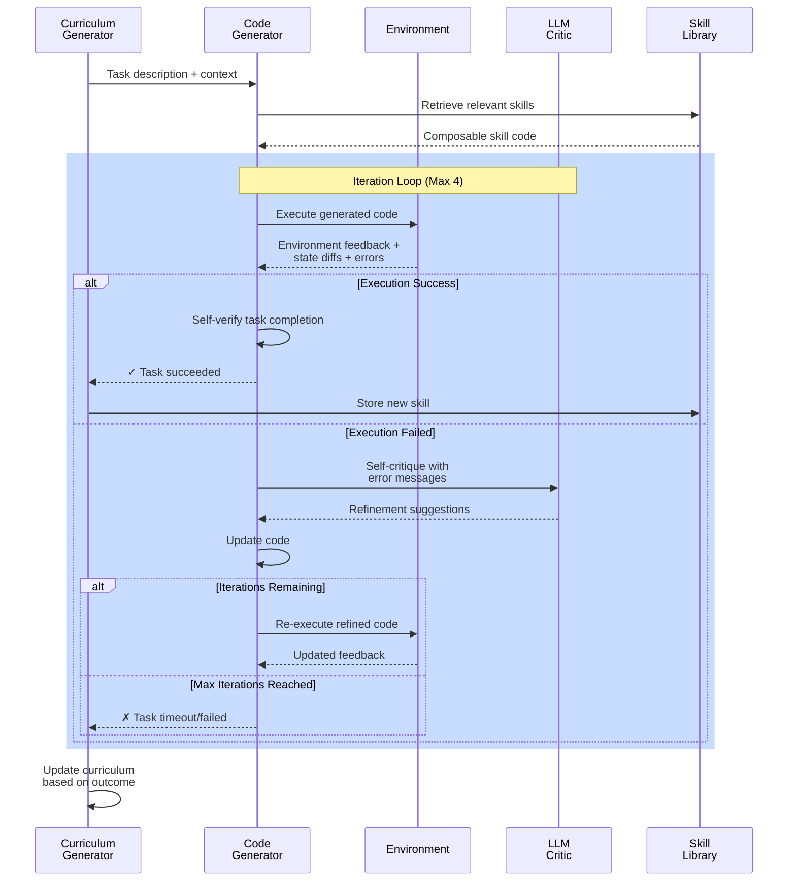

# Iterative Code Refinement Cycle (Single Task Attempt)

```mermaid
sequenceDiagram
    participant Curriculum as Curriculum<br/>Generator
    participant CodeGen as Code<br/>Generator
    participant Env as Environment
    participant LLM as LLM<br/>Critic
    participant SkillLib as Skill<br/>Library

    Curriculum->>CodeGen: Task description + context
    CodeGen->>SkillLib: Retrieve relevant skills
    SkillLib-->>CodeGen: Composable skill code
    
    rect rgb(200, 220, 255)
    note over CodeGen,LLM: Iteration Loop (Max 4)
    
    CodeGen->>Env: Execute generated code
    Env-->>CodeGen: Environment feedback +<br/>state diffs + errors
    
    alt Execution Success
        CodeGen->>CodeGen: Self-verify task completion
        CodeGen-->>Curriculum: ✓ Task succeeded
        Curriculum->>SkillLib: Store new skill
    else Execution Failed
        CodeGen->>LLM: Self-critique with<br/>error messages
        LLM-->>CodeGen: Refinement suggestions
        CodeGen->>CodeGen: Update code
        alt Iterations Remaining
            CodeGen->>Env: Re-execute refined code
            Env-->>CodeGen: Updated feedback
        else Max Iterations Reached
            CodeGen-->>Curriculum: ✗ Task timeout/failed
        end
    end
    end
    
    Curriculum->>Curriculum: Update curriculum<br/>based on outcome
```
