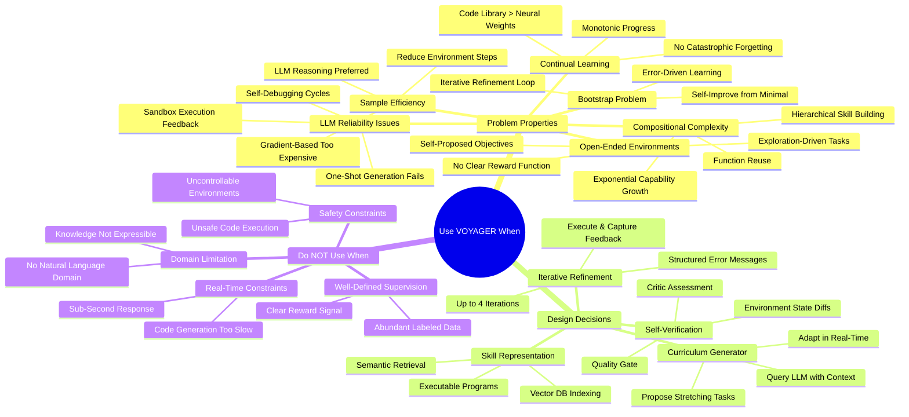

# Decision Framework Tree (When to Apply VOYAGER)

```mermaid
mindmap
  root((Use VOYAGER When))
    Problem Properties
      Continual Learning
        Code Library > Neural Weights
        No Catastrophic Forgetting
        Monotonic Progress
      Open-Ended Environments
        No Clear Reward Function
        Exploration-Driven Tasks
        Self-Proposed Objectives
      Sample Efficiency
        Gradient-Based Too Expensive
        LLM Reasoning Preferred
        Reduce Environment Steps
      Compositional Complexity
        Hierarchical Skill Building
        Function Reuse
        Exponential Capability Growth
      Bootstrap Problem
        Self-Improve from Minimal
        Iterative Refinement Loop
        Error-Driven Learning
      LLM Reliability Issues
        One-Shot Generation Fails
        Sandbox Execution Feedback
        Self-Debugging Cycles
    Design Decisions
      Curriculum Generator
        Query LLM with Context
        Propose Stretching Tasks
        Adapt in Real-Time
      Skill Representation
        Executable Programs
        Vector DB Indexing
        Semantic Retrieval
      Iterative Refinement
        Execute & Capture Feedback
        Structured Error Messages
        Up to 4 Iterations
      Self-Verification
        Environment State Diffs
        Critic Assessment
        Quality Gate
    Do NOT Use When
      Well-Defined Supervision
        Abundant Labeled Data
        Clear Reward Signal
      Real-Time Constraints
        Sub-Second Response
        Code Generation Too Slow
      Safety Constraints
        Unsafe Code Execution
        Uncontrollable Environments
      Domain Limitation
        Knowledge Not Expressible
        No Natural Language Domain
```
