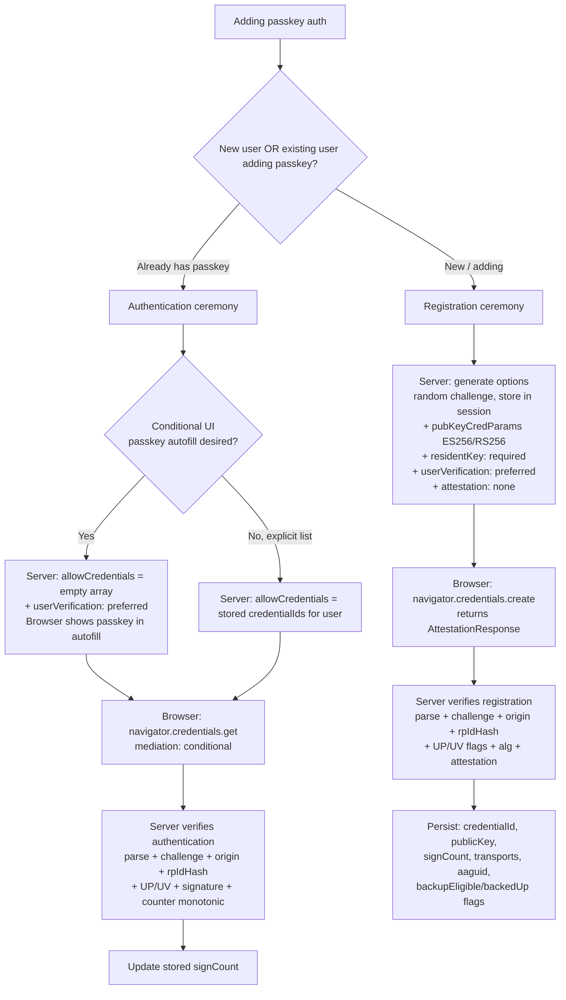

# WebAuthn / Passkey Implementation

> **TL;DR**: Two ceremonies (registration + authentication), each with strict server-side verification: parse `clientDataJSON`, verify `type`, `challenge`, and `origin`; parse `authenticatorData`, verify `rpIdHash`, `UP`/`UV` flags; verify the signature; check `signCount` is monotonic. Use `@simplewebauthn/server` (Node) — don't roll your own crypto. For passkeys: `residentKey: "required"`, `userVerification: "preferred"`, `attestation: "none"`. For autofill: `autocomplete="username webauthn"` + `mediation: "conditional"`.

---

## Jump to your fire

| Symptom | Section |
|---|---|
| "Need to add passkeys to my login flow" | [Two ceremonies](#1-the-two-ceremonies) |
| "What does the server have to verify exactly?" | [Verification steps](#3-server-verification-steps) |
| "Browser autofill / conditional UI" | [Conditional UI](#4-conditional-ui-passkey-autofill) |
| "Synced vs device-bound — what do I store?" | [Backup flags](#2-the-key-data-shapes) |
| "Should I require attestation?" | [Attestation policy](#5-attestation-when-to-bother) |

---

## Decision diagram



---

## 1. The two ceremonies

WebAuthn has exactly two flows. Both are initiated by the relying party (RP) generating options containing a **challenge**, sent to the browser, which calls a `navigator.credentials` method, which returns a response, which the server verifies against the original challenge.

| | Registration | Authentication |
|---|---|---|
| Browser API | `navigator.credentials.create({ publicKey: ... })` | `navigator.credentials.get({ publicKey: ... })` |
| Options shape | `PublicKeyCredentialCreationOptions` | `PublicKeyCredentialRequestOptions` |
| Response shape | `AuthenticatorAttestationResponse` | `AuthenticatorAssertionResponse` |
| Server stores | new credential record | nothing new (updates signCount) |
| Server verifies against | RP-generated challenge from session | RP-generated challenge from session |

**The challenge MUST be**:
- Cryptographically random (≥16 bytes, [W3C §13.4.3](https://www.w3.org/TR/webauthn-3/))
- Server-generated (never trust client-supplied)
- Stored in session (or short-lived store) before issuing options
- Validated on response (`clientDataJSON.challenge` must match)

If you skip any of these, you have a replay vulnerability.

---

## 2. The key data shapes

### `PublicKeyCredentialCreationOptions` (registration)

Required:

```ts
{
  rp: { name: "Acme Inc", id: "acme.example.com" },
  user: {
    id: <random 16-64 byte buffer, NOT email/PII>,
    name: "alice@example.com",
    displayName: "Alice",
  },
  challenge: <random ≥16 bytes>,
  pubKeyCredParams: [
    { type: "public-key", alg: -7 },    // ES256 (mandatory for passkeys)
    { type: "public-key", alg: -257 },  // RS256 (broad compat)
  ],
}
```

For **passkeys** specifically, add:

```ts
authenticatorSelection: {
  residentKey: "required",       // discoverable credential — passkey-defining
  userVerification: "preferred", // require biometric/PIN
  // requireResidentKey: true   // legacy alias; setting residentKey: "required" suffices
},
attestation: "none",             // 99% of passkey RPs don't need attestation
excludeCredentials: [
  // For each existing credential of this user, prevent re-registration:
  { type: "public-key", id: <credentialIdBuffer>, transports: ["internal", "hybrid"] }
]
```

### `PublicKeyCredentialRequestOptions` (authentication)

```ts
{
  challenge: <random ≥16 bytes>,
  rpId: "acme.example.com",         // must match registration
  userVerification: "preferred",
  allowCredentials: [],              // empty array → conditional UI / discoverable
  // OR for non-conditional: list specific credentialIds
  timeout: 60_000,
}
```

For **conditional UI** (autofill), `allowCredentials: []` is required so the browser offers any of the user's discoverable credentials.

### What the server stores per credential

The shape `@simplewebauthn/server` calls `WebAuthnCredential`:

```ts
{
  credentialId: <bytes, base64url; INDEXED in DB>,
  credentialPublicKey: <COSE_Key bytes>,
  counter: <uint32>,                  // signCount; updates on every auth
  transports: ["internal" | "usb" | "nfc" | "ble" | "hybrid"],
  aaguid: <16 bytes>,                 // identifies authenticator MODEL, not user
  deviceType: "singleDevice" | "multiDevice",  // derived from BE flag
  backedUp: <boolean>,                 // BS flag — currently in cloud backup
  userId: <FK to user>,
  createdAt: <timestamp>,
}
```

The `deviceType` and `backedUp` fields tell you whether this is a synced passkey (iCloud Keychain, Google Password Manager, 1Password, Dashlane) or device-bound (FIDO Security Key). Synced passkeys survive device loss; device-bound do not.

---

## 3. Server verification steps

### Registration response

Per [W3C WebAuthn-3 §7.1](https://www.w3.org/TR/webauthn-3/#sctn-registering-a-new-credential):

1. **Parse `response.clientDataJSON`** (UTF-8 JSON). Verify:
   - `type === "webauthn.create"`
   - `challenge` (base64url) **equals** the session-stored challenge
   - `origin` matches the expected origin (`https://login.example.com`)
   - `crossOrigin === false` (or per RP policy)
2. **Compute `clientDataHash = SHA-256(clientDataJSON)`**.
3. **Parse `response.attestationObject` (CBOR)** → `{ fmt, attStmt, authData }`.
4. **Parse `authData` (binary)**:
   - `rpIdHash` (32 bytes) — MUST equal `SHA-256(rpId)`.
   - `flags` byte — `UP` (User Present, bit 0) MUST be set; `UV` (User Verified, bit 2) MUST be set if `userVerification: "required"`. `BE` (Backup Eligible, bit 3) and `BS` (Backup State, bit 4) describe synced passkey status.
   - `signCount` (uint32).
   - `attestedCredentialData`: `aaguid` (16 bytes) + `credentialIdLength` + `credentialId` + `credentialPublicKey` (COSE_Key, CBOR).
5. **Verify `alg`** of `credentialPublicKey` is in your `pubKeyCredParams` whitelist.
6. **If `attestation !== "none"`**, verify `attStmt` per the format-specific rules in W3C §8 (packed, tpm, android-key, fido-u2f, apple, none).
7. **Check uniqueness**: this `credentialId` is not already registered to a different user.
8. **Persist** all fields above.

### Authentication response

Per [W3C WebAuthn-3 §7.2](https://www.w3.org/TR/webauthn-3/#sctn-verifying-assertion):

1. If `allowCredentials` was non-empty, verify `response.id` is in that list.
2. Look up the stored credential by `credentialId`. For discoverable-credential flow, identify the user via `response.userHandle === storedUser.id`.
3. **Parse `clientDataJSON`**. Verify `type === "webauthn.get"`, `challenge`, `origin`.
4. **Parse `authenticatorData`**. Verify `rpIdHash`, `UP` set, `UV` set if required.
5. **Compute `signedData = authenticatorData ‖ SHA-256(clientDataJSON)`**.
6. **Verify `response.signature`** over `signedData` using the *stored* `credentialPublicKey`.
7. **Counter check**: if `authenticatorData.signCount > 0` OR stored `counter > 0`, the new value MUST be strictly greater than the stored. If not, possible cloned authenticator — reject or flag. (Synced passkeys often return `0`; the check is skipped in that case.)
8. **Update stored counter**.

**Don't roll this yourself.** Use [SimpleWebAuthn](https://simplewebauthn.dev/docs/) (Node), [py_webauthn](https://github.com/duo-labs/py_webauthn) (Python), [webauthn4j](https://github.com/webauthn4j/webauthn4j) (Java). The CBOR / COSE / attestation-format parsing is exactly where DIY implementations have CVEs.

---

## 4. Conditional UI (passkey autofill)

Conditional UI lets the browser offer the user's saved passkey directly in the username input's autofill — no clicked-button required.

**Client-side**:

```html
<!-- The autocomplete value is the trigger -->
<input type="text" name="username" autocomplete="username webauthn">
```

```js
if (
  PublicKeyCredential.isConditionalMediationAvailable &&
  await PublicKeyCredential.isConditionalMediationAvailable()
) {
  navigator.credentials.get({
    publicKey: {
      challenge,
      rpId: 'acme.example.com',
      userVerification: 'preferred',
      allowCredentials: [],   // empty → any discoverable credential offered
    },
    mediation: 'conditional',
    signal: abortController.signal,
  }).then(handleAssertion)
}
```

The promise resolves only when the user picks a passkey from the autofill dropdown — non-blocking, runs in parallel with the password form. If they type a password and submit instead, the conditional `get` call simply doesn't resolve (or aborts on form submission).

**Server-side requirements** for conditional UI:

- `allowCredentials: []` (so any discoverable credential is offered)
- `userVerification: "preferred"` or `"required"`
- `rpId` matches the page origin's registrable domain

The exact string `webauthn` in the `autocomplete` attribute is the verbatim trigger per the spec — typos break the feature silently.

---

## 5. Attestation: when to bother

Attestation is the authenticator's cryptographic claim about itself ("I'm a YubiKey 5 NFC, model AAGUID `...`"). The RP can use this to enforce a hardware policy.

| `attestation` value | Use case |
|---|---|
| `"none"` | **Default for passkeys.** Most consumer RPs. Privacy-friendly. |
| `"indirect"` | Want some attestation, but okay with anonymized batch certs |
| `"direct"` | Want full attestation chain — verify against FIDO MDS |
| `"enterprise"` | Want individually identifying attestation for enterprise RPs (e.g., govt) |

For passkeys: **always `"none"`**. The FIDO Alliance's stance is that consumer passkey RPs should not require attestation:

> Most consumer passkey deployments don't need attestation; AAGUID identifies authenticator model when `direct` is requested.

You'd require attestation only if you're a high-assurance RP that needs to enforce "only certified hardware tokens for this account type" — banking compliance, government, or specific enterprise SSO contracts.

---

## Anti-patterns

| Anti-pattern | Why it bites | Fix |
|---|---|---|
| Using the user's email as `user.id` | Privacy issue (PII in authenticator); breaks email change flows | Random 16-64 byte opaque ID; map to user separately |
| Trusting client-supplied challenge | Replay attacks | Server generates, stores in session, validates on response |
| Skipping origin check | Phishing site can capture passkey assertion and replay | `clientDataJSON.origin === expected` MUST be checked |
| Skipping `rpIdHash` check | Cross-origin credential reuse | `authData.rpIdHash === SHA-256(rpId)` MUST match |
| Counter check absent | Cloned authenticator goes undetected | Compare `signCount > stored_counter`; reject if not |
| Requiring attestation for consumer auth | Breaks platform passkeys (iCloud, Google) that don't always attest | `attestation: "none"` for passkeys |
| Storing public key as PEM but specs use COSE_Key bytes | Format mismatch on verification | Store the raw COSE_Key bytes; let the library parse |
| `excludeCredentials` empty during registration of a 2nd passkey | User accidentally registers a second credential | Always pass the user's existing credentialIds |
| Hand-rolling CBOR / COSE parsing | CVEs lurk in attestation format edge cases | Use SimpleWebAuthn or equivalent |
| Synchronizing the "passwordless" mental model with the username flow | Users land on password page after pressing passkey button | Conditional UI: passkey + password coexist on same input |
| Forgetting `autocomplete="username webauthn"` | Conditional UI silently doesn't activate | The exact `webauthn` token is the trigger |

---

## Novice / Expert / Timeline

| | Novice | Expert |
|---|---|---|
| **Auth library** | Hand-rolls CBOR parsing | Uses SimpleWebAuthn or equivalent; reviews verifyRegistration's source |
| **`user.id`** | User's email | Random opaque per-account ID |
| **Challenge** | Reused; or client-generated | Server-generated, session-bound, single-use |
| **Conditional UI** | Doesn't know it exists | `autocomplete="username webauthn"` + `mediation: "conditional"` running in parallel with password form |
| **Counter** | Not stored | Monotonic check, flag clones |
| **Synced vs device-bound** | Doesn't distinguish | Stores `backedUp` flag; warns user if they only have device-bound passkeys |
| **Attestation** | Defaults to `"direct"` to "be secure" | `"none"` for consumer; `"direct"` only with concrete compliance need |

**Timeline test**: 2018 — only USB security keys; 2019 (W3C Rec) — first browsers ship; 2022 — passkey synced credentials announced (Apple/Google/MS); 2023+ — discoverable credentials become the norm; 2026 (W3C-3 CR) — `hints` field, PRF extension, large-blob. Don't ship a 2019-style "must plug in your YubiKey" UX in 2026.

---

## Quality gates

A passkey implementation ships when:

- [ ] **Test:** Registration ceremony rejects responses with mismatched challenge / origin / rpIdHash. Three integration tests, one per dimension.
- [ ] **Test:** Authentication ceremony does the same checks plus signature verification with the stored public key.
- [ ] **Test:** signCount is persisted and a replay with the *same* counter is rejected.
- [ ] **Test:** `user.id` is a random opaque buffer, not email or numeric DB id. Code grep / type check.
- [ ] **Test:** Challenge is single-use (deleted from session after one verification attempt).
- [ ] **Test:** Conditional UI works in Chrome and Safari — manual test that the passkey appears in the autofill dropdown when the input is focused.
- [ ] **Test:** `excludeCredentials` is populated during registration, preventing accidental dual-registration of the same authenticator.
- [ ] **Test:** Origin allowlist is finite and matches what's in `clientDataJSON` (production origin only; no `localhost` in prod).
- [ ] **Test:** A user with only device-bound passkeys gets a UI hint to add a synced passkey before losing the device.
- [ ] **Manual:** Test recovery flow — what happens when the user loses all their passkeys?
- [ ] **Manual:** SimpleWebAuthn (or equivalent) version is recent — track the GitHub releases for spec changes.

---

## NOT for this skill

- Browser-side WebAuthn integration details (handled by `navigator.credentials` directly; see the React hook libraries)
- CTAP (the authenticator-side protocol) — out of scope; that's authenticator vendors
- OAuth / OIDC integration on top of passkey auth (use `oauth2-and-oidc-from-scratch`)
- TOTP / SMS / email-link MFA (different mechanism — use `mfa-design`)
- Recovery account flows (use `account-recovery-design`)
- Enterprise SSO + passkeys (use `enterprise-sso-with-passkeys`)
- Cross-device authentication / hybrid transport details (use `webauthn-hybrid-transport`)

---

## Sources

- W3C: [Web Authentication Level 3 (CR, 13 Jan 2026)](https://www.w3.org/TR/webauthn-3/) — §5.4 Options, §6.1 authenticatorData, §7.1 Registering, §7.2 Verifying Assertion, §8 Attestation Formats
- passkeys.dev: [What are passkeys?](https://passkeys.dev/docs/intro/what-are-passkeys/) and [Reference / terms](https://passkeys.dev/docs/reference/terms)
- FIDO Alliance: [Passkeys](https://fidoalliance.org/passkeys/)
- SimpleWebAuthn: [Server docs (v13)](https://simplewebauthn.dev/docs/packages/server)
- Chrome / web.dev: [WebAuthn Conditional UI](https://developer.chrome.com/docs/identity/webauthn-conditional-ui)
- web.dev: [Sign in with a passkey through form autofill](https://web.dev/articles/passkey-form-autofill)
- web.dev: [Create a passkey for passwordless logins](https://web.dev/articles/passkey-registration)
