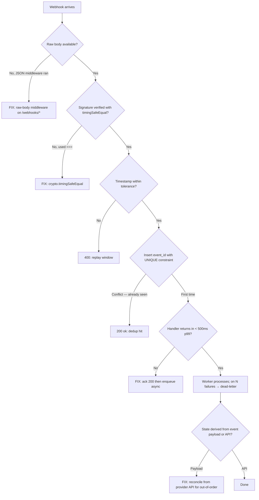

# Webhook Receiver Design

A webhook receiver is "an HTTP endpoint that takes durable async traffic from a third party that may retry forever." Get any of three things wrong — signatures, idempotency, latency budget — and you'll be debugging duplicate side effects at 2am.

## Decision diagram



**Jump to your fire:**
- Signature verification randomly fails → [Get the raw body](#get-the-raw-body)
- Duplicate side effects on retry → [Idempotency](#idempotency)
- Webhooks timing out under load → [Latency budget](#latency-budget)
- Out-of-order events leaving state inconsistent → [Out-of-order events](#out-of-order-events)
- One bad event blocking the queue → [Dead-letter and replay](#dead-letter-and-replay)
- Stripe / GitHub / Slack quirk → [provider-specific concerns](#stripe-specific-concerns)

## When to use

- Receiving Stripe, GitHub, Slack, Twilio, Shopify webhooks.
- Internal service-to-service async events over HTTP.
- Implementing the receiver side of an "outbox pattern."
- Building a webhook replay UI for support engineers.

## Core capabilities

### Verify signatures (HMAC)

Every reputable webhook provider signs the request. Verify before parsing.

```ts
// Stripe — recommended pattern
import Stripe from 'stripe';
const stripe = new Stripe(process.env.STRIPE_SECRET_KEY!);

app.post('/webhooks/stripe', async (req, res) => {
  const sig = req.headers['stripe-signature'];
  let event: Stripe.Event;
  try {
    // The library does HMAC + tolerance + replay-window checks.
    event = stripe.webhooks.constructEvent(
      req.rawBody,                       // RAW bytes, not JSON-parsed
      sig as string,
      process.env.STRIPE_WEBHOOK_SECRET!,
    );
  } catch (err) {
    return res.status(400).send('bad signature');
  }
  // ... handle event ...
});
```

For GitHub:

```ts
import { createHmac, timingSafeEqual } from 'crypto';

function verifyGithub(rawBody: Buffer, sigHeader: string, secret: string): boolean {
  const expected = 'sha256=' + createHmac('sha256', secret).update(rawBody).digest('hex');
  const a = Buffer.from(expected);
  const b = Buffer.from(sigHeader);
  return a.length === b.length && timingSafeEqual(a, b);
}
```

`timingSafeEqual` matters — comparing strings with `===` leaks timing info to an attacker.

### Get the raw body

```ts
// Express
app.use('/webhooks/stripe', express.raw({ type: 'application/json' }));
// req.body is a Buffer here; JSON middleware NOT applied.

// Hono
app.post('/webhooks/stripe', async (c) => {
  const rawBody = await c.req.text();   // string of the raw body
  // ...
});
```

JSON parsing changes whitespace; HMAC over parsed-then-stringified JSON gives a different digest. Always verify against the bytes that arrived on the wire.

### Replay window

Most providers include a timestamp in the signed payload. Reject anything older than ~5 minutes:

```ts
const tolerance = 300; // seconds
const now = Math.floor(Date.now() / 1000);
if (Math.abs(now - event.created) > tolerance) {
  return res.status(400).send('timestamp out of tolerance');
}
```

This prevents an attacker who captured a webhook from replaying it days later.

### Idempotency

Webhooks retry. Your handler MUST be safe to call twice with the same event:

```ts
// Use the provider's event ID as the dedup key.
const eventId = event.id;

const inserted = await db.insert('webhook_events', {
  id: eventId,
  type: event.type,
  payload: JSON.stringify(event),
  received_at: new Date(),
}).onConflict('id').ignore();   // ON CONFLICT DO NOTHING

if (!inserted) {
  // Already processed.
  return res.status(200).send('ok');
}

// First time. Do the work.
await processEvent(event);
```

The DB unique constraint on `id` is your idempotency primitive. Don't use Redis for this unless you're prepared to handle Redis being down (which would skip dedup).

### Latency budget

Most providers timeout in 5-10 seconds and retry. Acknowledge fast, work slow.

```ts
app.post('/webhooks/stripe', express.raw({...}), async (req, res) => {
  const event = verifyAndParse(req);
  await db.insert('webhook_events', { id: event.id, ... });
  res.status(200).send('ok');                   // ack immediately

  // Schedule async work.
  await queue.publish('process-stripe', { eventId: event.id });
});
```

The handler returns 200 in <100ms; a worker drains the queue. If the worker is down, events accumulate in the DB or queue, not in the provider's retry buffer.

### Out-of-order events

Webhooks arrive out of order. A "subscription canceled" webhook can arrive before "subscription created."

Two strategies:

1. **Reconcile from the source of truth.** When you process a Stripe event, fetch the current subscription state from Stripe API rather than trusting the event payload.
2. **Apply event-sourced state.** Store events; compute current state by replay. Only feasible if you control the schema.

For simple cases, strategy 1. The event is a notification; the API is the truth.

### Dead-letter and replay

```ts
// In the worker
async function processEvent(event: StripeEvent, attempt = 1) {
  try {
    await handle(event);
  } catch (err) {
    if (attempt >= 5) {
      await db.insert('webhook_dead_letter', {
        event_id: event.id, error: String(err), attempt,
      });
      return;
    }
    await sleep(2 ** attempt * 1000);
    return processEvent(event, attempt + 1);
  }
}
```

Build a UI (or just a script) to:
- List dead-lettered events with the failure reason.
- Replay one by ID.
- Replay a range by timestamp.

This is the difference between "we lost three days of webhooks" and "Sarah replayed them on Monday."

### Stripe-specific concerns

- Use `stripe-signature` header, not `Authorization`.
- Webhook secret is per-endpoint. Multiple endpoints (test/prod, staging) → multiple secrets.
- `event.api_version` may differ from your installed SDK; lock or migrate together.
- "Live mode" vs "test mode" — separate endpoint secrets, separate logic.

### GitHub-specific concerns

- `X-GitHub-Event` header tells you the event type before you parse.
- `X-GitHub-Delivery` is the GitHub-side event ID — use it as the idempotency key.
- Pull request events have many sub-types (`opened`, `synchronize`, `reopened`); handle the union explicitly.

### Slack-specific concerns

- Slack URL verification: respond with the `challenge` field from the request body within 3 seconds.
- Signature header is `X-Slack-Signature`; basestring is `v0:{ts}:{body}`.
- Some events (slash commands) need a response within 3s; others are fire-and-forget.

## Anti-patterns

### Parsing JSON before verifying signature

**Symptom:** Signature verification randomly fails with subtle re-serialization differences.
**Diagnosis:** JSON middleware ran first; you HMAC the re-serialized body.
**Fix:** Apply raw-body middleware to webhook routes specifically. Verify against the raw bytes.

### Comparing signatures with `===`

**Symptom:** Production passes; security audit flags timing attack.
**Diagnosis:** String comparison short-circuits on first mismatch.
**Fix:** `crypto.timingSafeEqual(Buffer.from(a), Buffer.from(b))`.

### No idempotency key

**Symptom:** Duplicate side effects when provider retries.
**Diagnosis:** Handler runs the work even if the event ID has been seen.
**Fix:** Insert the event ID with a unique constraint; only proceed if insert succeeded.

### Long synchronous handler

**Symptom:** Webhooks timeout under load, retries pile up, eventual delivery fails.
**Diagnosis:** Handler does 30s of work before returning 200.
**Fix:** Verify + persist + ack in <500ms. Async worker does the heavy lifting.

### Trusting the payload over the API

**Symptom:** Out-of-order events leave state inconsistent.
**Diagnosis:** Applied event payload directly without reconciling.
**Fix:** Fetch current state from the provider's API on each processing pass. Treat webhook as a notification, not a delta.

### No dead-letter

**Symptom:** A bad event blocks the queue forever; engineer manually deletes.
**Diagnosis:** Failed events keep retrying with no escape.
**Fix:** After N retries, dead-letter with reason. Build a UI/CLI to replay.

## Worked example: the 2am duplicate-charge incident

**Scenario.** Stripe webhooks for `charge.succeeded` are being processed; on retry, customers got charged twice in your downstream ledger. Pager is firing.

**Novice would:** Add a Redis SET-NX dedup key on `event.id`, mark the bug fixed, wait for the next page. Misses two things: Redis can be down (silently skipping dedup), and the actual duplication may not be from retries — it may be from two replicas of the worker processing the same row.

**Expert catches:**
1. **DB unique constraint, not Redis.** Move the dedup primitive to a `webhook_events.id` UNIQUE column. The DB is the same authority that records the ledger entry, so the dedup and the side-effect commit in the same transaction. Redis-down then becomes a non-issue for correctness.
2. **Worker-level idempotency too.** Even with insert-then-process, if the worker crashes between insert and side-effect, the next retry sees the row and skips. Fix: a `processed_at` column the side-effect commit sets. Workers only process rows where `processed_at IS NULL`, with a row-level lock.
3. **Verify with replay.** Capture the last 1000 production events, replay them through the receiver locally, assert the ledger has exactly N entries. This is the only test that catches transactional gaps.

**Timeline.** Novice ships the Redis fix in 30 minutes; same incident reoccurs the next quarter when Redis has a memory blip. Expert ships the DB-constraint + replay-test version in a day; the same ledger never double-charges again.

## Quality gates

- [ ] **Test:** captured-event replay suite runs in CI, asserts handler is idempotent (replay 100 events twice → identical DB state).
- [ ] HMAC verification runs against `req.rawBody` / `c.req.text()` (raw body), not parsed JSON. Confirmed by a test that posts a valid payload with whitespace mutations and asserts signature still verifies.
- [ ] Signature comparison uses `crypto.timingSafeEqual`. Lint or grep CI fails on `===` of signature strings.
- [ ] Replay-window rejection: a unit test with `event.created` 10 minutes in the past returns 400.
- [ ] Idempotency primitive is a DB UNIQUE constraint on `(provider, event_id)`. Migration reviewed.
- [ ] Handler p99 latency budget < 500ms documented; alert fires if breached for 5 minutes (see `grafana-dashboard-builder`).
- [ ] Dead-letter table exists; replay UI or CLI tested against a synthetic dead-letter row.
- [ ] Per-environment webhook secrets in env: `STRIPE_WEBHOOK_SECRET_TEST` vs `STRIPE_WEBHOOK_SECRET_LIVE`. CI fails if both share a value.
- [ ] State reconciled from provider API on each event (not from event payload alone). Test: feed an out-of-order pair (cancel before create), assert final state matches API.
- [ ] OTel span around the handler with `webhook.provider`, `webhook.event_type`, `webhook.event_id` attributes (see `opentelemetry-instrumentation`).

## NOT for

- **Outbound webhook publishing** — different concerns (delivery guarantees, customer secret management). No dedicated skill yet; design from scratch.
- **Internal pubsub** (Redis Streams, Kafka) — same problems, different transports. → `redis-patterns-expert` for the Streams side.
- **Polling integrations** — entirely different pattern. No dedicated skill.
- **Server-Sent Events from third parties** — overlapping but distinct. No dedicated skill.
- **Stripe billing modeling** (subscriptions, prorations, invoices) — webhook is the transport, not the model. No dedicated skill yet.
