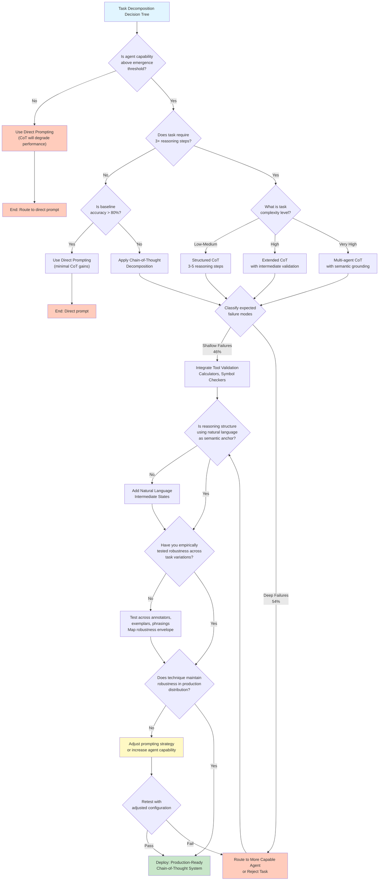

# Task Decomposition Decision Tree

```mermaid
flowchart TD
    A["Task Decomposition Decision Tree"] --> B{Is agent capability<br/>above emergence<br/>threshold?}
    
    B -->|No| C["Use Direct Prompting<br/>(CoT will degrade performance)"]
    C --> Z1["End: Route to direct prompt"]
    
    B -->|Yes| D{Does task require<br/>3+ reasoning steps?}
    
    D -->|No| E{Is baseline<br/>accuracy > 80%?}
    E -->|Yes| F["Use Direct Prompting<br/>(minimal CoT gains)"]
    F --> Z2["End: Direct prompt"]
    
    E -->|No| G["Apply Chain-of-Thought<br/>Decomposition"]
    
    D -->|Yes| H{What is task<br/>complexity level?}
    
    H -->|Low-Medium| I["Structured CoT<br/>3-5 reasoning steps"]
    H -->|High| J["Extended CoT<br/>with intermediate validation"]
    H -->|Very High| K["Multi-agent CoT<br/>with semantic grounding"]
    
    I --> L{Classify expected<br/>failure modes}
    J --> L
    K --> L
    
    L -->|Shallow Failures<br/>46%| M["Integrate Tool Validation<br/>Calculators, Symbol Checkers"]
    L -->|Deep Failures<br/>54%| N["Route to More Capable Agent<br/>or Reject Task"]
    
    M --> O{Is reasoning structure<br/>using natural language<br/>as semantic anchor?}
    N --> O
    
    O -->|No| P["Add Natural Language<br/>Intermediate States"]
    O -->|Yes| Q{Have you empirically<br/>tested robustness across<br/>task variations?}
    
    P --> Q
    
    Q -->|No| R["Test across annotators,<br/>exemplars, phrasings<br/>Map robustness envelope"]
    Q -->|Yes| S{Does technique maintain<br/>robustness in production<br/>distribution?}
    
    R --> S
    
    S -->|No| T["Adjust prompting strategy<br/>or increase agent capability"]
    S -->|Yes| U["Deploy: Production-Ready<br/>Chain-of-Thought System"]
    
    T --> V{Retest with<br/>adjusted configuration}
    V -->|Pass| U
    V -->|Fail| N
    
    G --> L
    
    style A fill:#e1f5ff
    style U fill:#c8e6c9
    style C fill:#ffccbc
    style Z1 fill:#ffccbc
    style Z2 fill:#ffccbc
    style N fill:#ffccbc
    style T fill:#fff9c4
```
