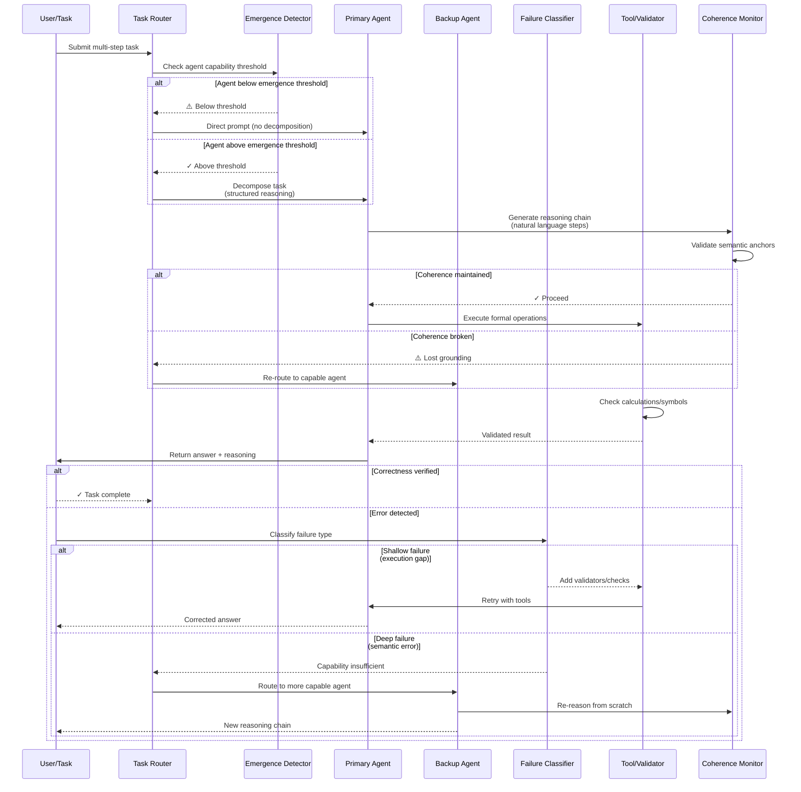

# Multi-Agent Reasoning Coordination Protocol

```mermaid
sequenceDiagram
    participant User as User/Task
    participant Router as Task Router
    participant EmergenceCheck as Emergence Detector
    participant Agent1 as Primary Agent
    participant Agent2 as Backup Agent
    participant FailureClassifier as Failure Classifier
    participant ToolValidator as Tool/Validator
    participant SemanticCoherence as Coherence Monitor

    User->>Router: Submit multi-step task
    Router->>EmergenceCheck: Check agent capability threshold
    
    alt Agent below emergence threshold
        EmergenceCheck-->>Router: ⚠️ Below threshold
        Router->>Agent1: Direct prompt (no decomposition)
    else Agent above emergence threshold
        EmergenceCheck-->>Router: ✓ Above threshold
        Router->>Agent1: Decompose task<br/>(structured reasoning)
    end
    
    Agent1->>SemanticCoherence: Generate reasoning chain<br/>(natural language steps)
    SemanticCoherence->>SemanticCoherence: Validate semantic anchors
    
    alt Coherence maintained
        SemanticCoherence-->>Agent1: ✓ Proceed
        Agent1->>ToolValidator: Execute formal operations
    else Coherence broken
        SemanticCoherence-->>Router: ⚠️ Lost grounding
        Router->>Agent2: Re-route to capable agent
    end
    
    ToolValidator->>ToolValidator: Check calculations/symbols
    ToolValidator-->>Agent1: Validated result
    
    Agent1->>User: Return answer + reasoning
    
    alt Correctness verified
        User-->>Router: ✓ Task complete
    else Error detected
        User->>FailureClassifier: Classify failure type
        
        alt Shallow failure<br/>(execution gap)
            FailureClassifier-->>ToolValidator: Add validators/checks
            ToolValidator->>Agent1: Retry with tools
            Agent1-->>User: Corrected answer
        else Deep failure<br/>(semantic error)
            FailureClassifier-->>Router: Capability insufficient
            Router->>Agent2: Route to more capable agent
            Agent2->>SemanticCoherence: Re-reason from scratch
            Agent2-->>User: New reasoning chain
        end
    end
```
