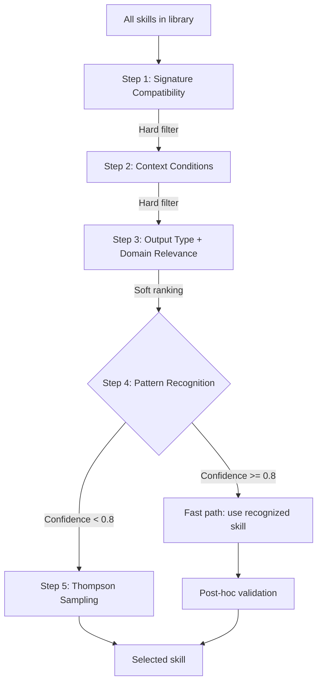

# WinDAGs Skill Ecosystem Architecture

What skills the meta-DAG agents have loaded, how skills are selected, and the three-layer loading model.

---

## The Three-Layer Loading Model

Every meta-DAG agent loads skills in three layers:

```
Layer 1: PRELOADED (always in context)
├── The agent's core SKILL.md
├── Behavioral contracts for its role
├── Decision trees and output formats
└── ~200-400 lines, entered on activation

Layer 2: DYNAMIC (selected per problem)
├── Domain-specific skills from the skill library
├── Selected by the Skill Selection Cascade (ADR-007)
├── Five steps: signature → context → relevance → recognition → Thompson
└── 0-3 skills per execution

Layer 3: REFERENCE (consulted on demand)
├── Constitution sections relevant to this agent
├── Type definitions for inputs/outputs
├── Worked examples and patterns
└── Read only when the agent needs specific detail
```

This model is LLM-agnostic. Any system that loads skills from structured text can implement it.

---

## Meta-DAG Agent Skill Assignments

### Sensemaker

**Role**: Problem analysis, classification, halt gate
**Model Tier**: Tier 2 (Sonnet)
**Preloaded skill**: `windags-sensemaker`

**What the skill contains**:
- Problem classification flowchart (well-structured / ill-structured / wicked)
- Principal parts extraction (unknown, data, conditions, output_type)
- Validity assessment (clarity, feasibility, coherence → overall score)
- Halt gate logic: if overall < 0.6, HALT_CLARIFY with structured guidance
- Domain classification and meta-skill matching
- Deliberation budget computation

**Behavioral contracts enforced**: BC-DECOMP-001

**Dynamic skills**: Domain classifiers (e.g., software-engineering-classifier, research-classifier)

**Output type**: `ProblemUnderstanding`

---

### Decomposer

**Role**: Three-pass decomposition, wave planning
**Model Tier**: Tier 2 (Sonnet)
**Preloaded skill**: `windags-decomposer`

**What the skill contains**:
- Three-pass protocol:
  - Pass 1 (Structure): Problem → task hierarchy using domain meta-skill
  - Pass 2 (Capability): Task hierarchy → skill matching (no LLM calls)
  - Pass 3 (Topology): DAG → failure domain isolation, cascade depth scoring
- Vague node creation rules (role_description required, no agent config)
- Wave definition algorithm
- Commitment level assignment (COMMITTED/TENTATIVE/EXPLORATORY)
- Epistemic annotation graduated by commitment level

**Behavioral contracts enforced**: BC-DECOMP-002, BC-DECOMP-003, BC-DECOMP-004, BC-DECOMP-005

**Dynamic skills**: Domain meta-skills (software-engineering, research, data-analysis, content-creation, code-review)

**Output type**: `DecompositionResult`

---

### PreMortem

**Role**: Failure pattern scanning, risk assessment
**Model Tier**: Tier 1 (Haiku)
**Preloaded skill**: `windags-premortem`

**What the skill contains**:
- Lightweight scan: known failure patterns from failure store
- Timing analysis (Chef's concern)
- Escalation logic: if recognition confidence < 0.7 OR known failure patterns found, escalate to deep analysis
- Deep analysis: structured what-if for each high-risk node
- PreMortem recommendation: proceed / accept with monitoring / escalate to human

**Behavioral contracts enforced**: BC-PLAN-004

**Dynamic skills**: Domain-specific failure pattern knowledge

**Output type**: `PreMortemResult`

---

### Evaluator

**Role**: Two-stage review, four-layer quality
**Model Tier**: Stage 1 = Tier 1 (Haiku), Stage 2 = Tier 2 (Sonnet)
**Preloaded skill**: `windags-evaluator`

**What the skill contains**:
- Four-layer quality model:
  - Floor: Did it satisfy the contract? (binary)
  - Wall: Does it fit the context? (binary/graded)
  - Ceiling: Did it reason well? (graded, process evaluation)
  - Envelope: How much stress was the execution under? (deterministic metrics)
- Stage 1 review: cheap, always runs, checks Floor + Wall
- Stage 2 escalation formula: `estimateFailureProbability(node) * downstreamWaste(node) > reviewCost`
- Stage 2 review: deep, runs Ceiling, position-swapped evaluation
- Bias mitigation: position swapping, self-eval excluded from outcome scoring
- Four evaluator sources: self (0.15), peer (0.25), downstream (0.35), human (0.50)

**Behavioral contracts enforced**: BC-EVAL-001 through BC-EVAL-006

**Dynamic skills**: Domain-specific evaluation criteria, FORMALJUDGE templates

**Output type**: `ReviewResult` (containing `QualityVector`)

---

### Mutator

**Role**: Failure diagnosis, DAG mutation, escalation
**Model Tier**: Tier 1 (Haiku)
**Preloaded skill**: `windags-mutator`

**What the skill contains**:
- Failure diagnosis from four-dimensional classification
- Seven mutation types: add_node, remove_node, replace_node, add_edge, split_parallel, loop_back, escalate_human
- Saga classification for each mutation (compensatable, pivot, retriable)
- Escalation ladder (5 levels): fix node → diagnose structure → generate alternative → fix topology → human
- Circuit breaker awareness: check all three levels before acting

**Behavioral contracts enforced**: BC-EXEC-002, BC-EXEC-003, BC-FAIL-002, BC-FAIL-005

**Dynamic skills**: Based on failure type and domain

**Output type**: `MutationEvent`

---

### Curator (optional, post-execution)

**Role**: Skill crystallization, monster-barring detection, learning updates
**Model Tier**: Tier 1 (Haiku)
**Preloaded skill**: `windags-curator`

**What the skill contains**:
- Crystallization criteria: 3+ verified successes, quality >= 0.75, pattern generalizable
- Monster-barring detection: track NOT_FOR growth vs. WHEN_TO_USE growth
- Thompson sampling update rules (per-node, using Evaluator score, not self-assessment)
- Elo ranking update with stage-gated K-factors
- Method quality tracking (independent of skill quality)
- Kuhnian crisis detection (PSI >= 0.25, Hellinger distance)
- Near-miss event logging (10% margin)

**Behavioral contracts enforced**: BC-LEARN-001 through BC-LEARN-006

**Dynamic skills**: None (operates on execution data)

**Output type**: `LearningResult`

---

### Looking Back (runs as part of post-execution)

**Role**: Polya's four questions
**Model Tier**: Tier 1 (Haiku) for Q1-Q2, Tier 2 (Sonnet) for Q3-Q4
**Preloaded skill**: `windags-looking-back`

**What the skill contains**:
- Q1: Was the contract satisfied? (mandatory, every DAG)
- Q2: Were there unstated assumptions? (mandatory, every DAG)
- Q3: Can this solution method be generalized? (conditional: quality >= 0.8, cost <= $0.01)
- Q4: Does this connect to a broader problem class? (conditional: quality >= 0.9, cost <= $0.02)
- Verification protocol for contract satisfaction
- Assumption detection heuristics
- Method generalization criteria

**Behavioral contracts enforced**: BC-LEARN-003, BC-CROSS-009

**Dynamic skills**: None

**Output type**: `LookingBackResult`

---

## The Executor (NOT a Skill-Loading Agent)

The Executor is runtime infrastructure, not an LLM agent. It:
- Runs Kahn's algorithm for topological scheduling
- Manages batch dispatch with failure domain isolation
- Implements the Expediter function (cost/time/quality drift monitoring)
- Enforces protocol state machines (BC-EXEC-006)
- Manages circuit breakers at three levels (node, skill, model)
- Handles checkpoint/restore for recovery

The Executor loads no skills because LLMs cannot reliably implement state machines.

---

## Skill Selection Cascade (ADR-007)

When a meta-DAG agent needs a dynamic skill, it uses the five-step cascade:



Steps 1-2 are hard filters (eliminate incompatible skills).
Step 3 is soft ranking (prioritize by relevance).
Step 4 is a fast path (skip Thompson if pattern is recognized with high confidence).
Step 5 is Thompson sampling (explore/exploit among remaining candidates).

---

## Existing Skills That Map to Meta-DAG Roles

Several existing Claude Code skills partially cover meta-DAG agent functionality. They need V3 updates:

| Existing Skill | Meta-DAG Role | Status |
|----------------|---------------|--------|
| `dag-planner` | Decomposer | Needs V3 three-pass protocol |
| `dag-mutation-strategist` | Mutator | Needs V3 escalation ladder |
| `dag-quality` | Evaluator | Needs V3 four-layer model |
| `dag-skills-matcher` | Skill Selector | Needs V3 five-step cascade |
| `template-dag-library` | Decomposer (seed templates) | Needs V3 seed template list |
| `human-gate-designer` | Sensemaker/Executor | Needs V3 gate classification |
| `cost-optimizer` | Expediter function | Needs V3 cost drift watchdog |
| `task-decomposer` | Decomposer (Pass 1) | Needs V3 principal parts analysis |
| `output-contract-enforcer` | Evaluator (Floor) | Needs V3 contract enforcement |

These existing skills should be updated to V3 or replaced by the new meta-DAG agent skills.
