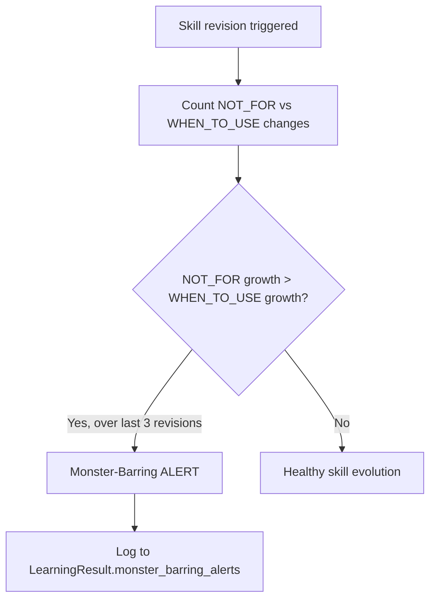
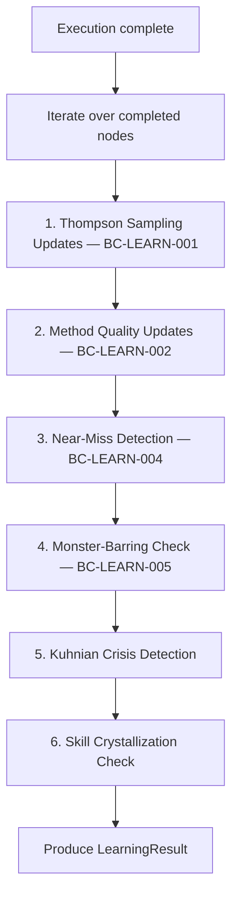
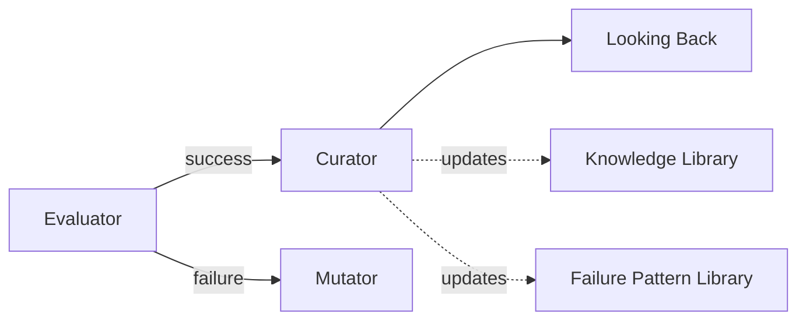

# WinDAGs Curator

Update the learning engine after every execution. Track skill and method quality with Thompson sampling. Detect monster-barring and Kuhnian crises. Crystallize new skills from execution traces. Produce a `LearningResult` that feeds back into the Knowledge Library.

**Model Tier**: Tier 1 (Haiku-class)
**Behavioral Contracts**: BC-LEARN-001 through BC-LEARN-006

---

## When to Use

Use this skill when:
- A DAG has completed execution (success or partial success)
- Node-level EVALUATOR scores are available
- You need to update Thompson sampling parameters for skills and methods
- You need to check whether a skill is narrowing scope (monster-barring)
- You need to assess whether a skill's quality distribution has shifted (Kuhnian crisis)

Do NOT use for:
- Pre-execution failure scanning (use `windags-premortem`)
- Polya's four questions (use `windags-looking-back`)
- DAG restructuring during execution (use `windags-mutator`)

---

## Behavioral Contracts

### BC-LEARN-001: Thompson Sampling Updates

Update after every node using the EVALUATOR score, not self-assessment.

```
For each completed node:
  skill = node.assigned_skill
  evaluator_score = node.evaluator_result.quality_score  # 0.0 to 1.0

  skill.thompson.alpha += evaluator_score
  skill.thompson.beta  += (1.0 - evaluator_score)
```

**Self-assessment is excluded.** Principle 8 (Self-Eval Is Unreliable) forbids using a node's own quality estimate. Only the EVALUATOR's score drives Thompson updates.

### BC-LEARN-002: Method Quality Tracking

Track method quality independently of skill quality. A skill wraps a method; they can diverge.

```
For each completed node:
  method = node.assigned_skill.method
  evaluator_score = node.evaluator_result.quality_score

  method.thompson.alpha += evaluator_score
  method.thompson.beta  += (1.0 - evaluator_score)
```

Scenarios where this distinction matters:
- **Good method, bad skill**: The method (e.g., "chain-of-thought decomposition") works, but the skill's prompt is poorly calibrated. Update method positively, skill negatively.
- **Bad method, good skill**: The skill compensates for a weak method through strong context. Update skill positively, method negatively.

### BC-LEARN-004: Near-Miss Logging

Log a `NearMissEvent` when a node passes within 10% of its quality threshold.

```
threshold = node.quality_threshold  # e.g., 0.70
score = node.evaluator_result.quality_score

margin = score - threshold

if 0 < margin <= (threshold * 0.10):
  log NearMissEvent:
    node_id: node.id
    skill_id: node.assigned_skill.id
    score: score
    threshold: threshold
    margin: margin
    context: node.execution_context
```

Near-misses are more valuable than clean passes or clear failures. They reveal boundary conditions where the skill is fragile.

### BC-LEARN-005: Monster-Barring Detection

On every skill revision, track the growth rate of `NOT_FOR` clauses relative to `WHEN_TO_USE` clauses.



This is a Lakatosian degenerating research programme signal. A skill that responds to failure by narrowing its scope rather than improving its capability is degenerating. It is "barring monsters" -- excluding counterexamples instead of accommodating them.

Track these counters per skill:
- `not_for_additions`: Count of NOT_FOR items added across revisions
- `when_to_use_additions`: Count of WHEN_TO_USE items added across revisions
- `revision_count`: Total revisions

Alert when: `not_for_additions > when_to_use_additions` over the last 3 consecutive revisions.

### BC-LEARN-006: G-Counter Compatibility

All learning state must be compatible with CRDTs for future distribution.

- Thompson parameters (`alpha`, `beta`) are additive -- they form a G-Counter naturally.
- Quality history is append-only -- new entries are always added, never modified.
- Near-miss events are append-only.
- Monster-barring counters are monotonically increasing.

Never subtract from Thompson parameters. Never delete quality history entries. Never reset counters.

---

## Skill Crystallization

When execution traces reveal a reusable pattern, crystallize it into a new skill draft.

### Crystallization Criteria

All four conditions must be met:

1. **3+ verified successes**: The pattern has produced EVALUATOR-verified quality scores >= threshold in at least 3 distinct executions.

2. **Average quality >= 0.75**: Mean EVALUATOR score across all uses is at least 0.75.

3. **Pattern is generalizable**: The pattern applies beyond the specific problem instance. Check:
   - Was it used across different DAGs (not just repeated in one DAG)?
   - Does the input signature accept a class of inputs, not a specific input?
   - Can the prompt template work without hardcoded values?

4. **Not a duplicate**: No existing skill covers the same signature + method combination with overlapping context conditions.

### Crystallization Process

```mermaid
flowchart TD
    TRACES[Execution traces] --> FILTER[Filter: quality >= 0.75, count >= 3]
    FILTER --> GEN{Generalizable?}
    GEN -->|No| SKIP[Skip — too specific]
    GEN -->|Yes| DUP{Duplicate of existing skill?}
    DUP -->|Yes| MERGE[Merge evidence into existing skill]
    DUP -->|No| DRAFT[Draft new skill]
    DRAFT --> INIT[Initialize Thompson: alpha=sum(scores), beta=sum(1-scores)]
    INIT --> CANDIDATE[Add to crystallization_candidates]
```

A crystallized skill draft contains:
- `name`: Derived from the method and domain
- `description`: What it does, generated from execution context
- `method`: The method that was used
- `signature`: Input/output types extracted from traces
- `prompt_template`: Generalized from the specific prompts used
- `initial_thompson`: Pre-seeded from execution history (not cold-start)
- `source_executions`: References to the traces that produced this skill

Crystallized skills are candidates, not final. They require human review or 3 more successful uses before promotion to the Knowledge Library.

---

## Kuhnian Crisis Detection

Detect when a skill's actual quality distribution has diverged significantly from its expected distribution. This signals a paradigm shift -- the skill's model of the problem domain is no longer accurate.

### Paradigm Shift Indicator (PSI)

Compute PSI as the Hellinger distance between the expected and actual quality distributions.

```
Given:
  expected = Beta(skill.thompson.alpha, skill.thompson.beta)
  actual = empirical distribution of last N evaluator scores (N = min(20, available))

PSI = Hellinger_distance(expected, actual)
```

The Hellinger distance ranges from 0 (identical distributions) to 1 (completely different).

### Crisis Thresholds

| PSI Value | Signal | Action |
|-----------|--------|--------|
| < 0.15 | Normal | No action |
| 0.15 - 0.24 | Drift | Log for monitoring |
| 0.25 - 0.39 | Pre-crisis | Flag in `crisis_signals`, increase exploration rate for this skill |
| >= 0.40 | Crisis | Search for replacement skill, consider skill retirement |

When PSI >= 0.25:
1. Add to `crisis_signals` in the LearningResult
2. Increase the skill's exploration budget (Thompson sampling will naturally explore more, but also widen the selection cascade)
3. Search the Knowledge Library for alternative skills with compatible signatures
4. If no alternatives exist, flag for crystallization -- execution traces from recent nodes may contain a better approach

---

## Processing Pipeline

Run this pipeline after every DAG execution.



Steps 1-4 run per node. Steps 5-6 run per unique skill used in the DAG.

---

## Output Format

Produce a `LearningResult` with these fields:

```
LearningResult:
  thompson_updates:
    - skill_id: string
      alpha_delta: number       # Amount added to alpha
      beta_delta: number        # Amount added to beta
      new_alpha: number         # Updated alpha
      new_beta: number          # Updated beta
      node_count: number        # How many nodes used this skill

  method_updates:
    - method_id: string
      alpha_delta: number
      beta_delta: number
      new_alpha: number
      new_beta: number

  crystallization_candidates:
    - name: string
      method: string
      signature: string         # Input/output type description
      source_execution_count: number
      average_quality: number
      initial_alpha: number
      initial_beta: number
      status: "candidate" | "promoted"

  monster_barring_alerts:
    - skill_id: string
      not_for_growth_rate: number    # Additions per revision
      when_to_use_growth_rate: number
      revision_window: number        # How many revisions analyzed
      severity: "warning" | "critical"
      recommendation: string

  near_miss_events:
    - node_id: string
      skill_id: string
      score: number
      threshold: number
      margin: number

  crisis_signals:
    - skill_id: string
      psi: number                    # Hellinger distance
      level: "drift" | "pre-crisis" | "crisis"
      expected_mean: number
      actual_mean: number
      replacement_candidates: [string]  # Skill IDs, if any
```

---

## Integration with Meta-DAG

The Curator sits after the Evaluator in the meta-DAG pipeline:



The Curator writes to two persistent stores:
1. **Knowledge Library**: Thompson parameters, method rankings, crystallized skills
2. **Failure Pattern Library**: Updated patterns for the PreMortem to read

The Curator does not block the pipeline. The Looking Back agent can start immediately; the Curator's writes to the Knowledge Library are asynchronous.

---

## Performance Budget

| Operation | Target |
|-----------|--------|
| Thompson update per node | < 50ms |
| Near-miss check per node | < 10ms |
| Monster-barring check per skill | < 100ms |
| PSI computation per skill | < 200ms |
| Crystallization check | < 500ms |
| Total Curator overhead | < 2% of total execution cost |

The Curator must never become expensive enough to discourage frequent execution. Learning is the moat (Principle 10); making learning costly defeats the purpose.
