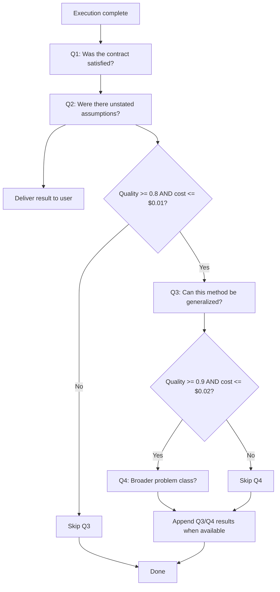
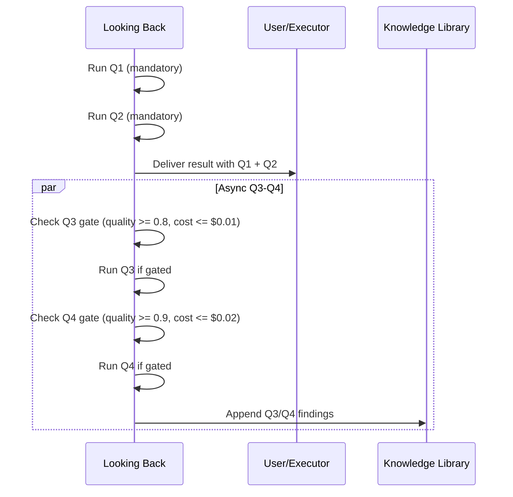
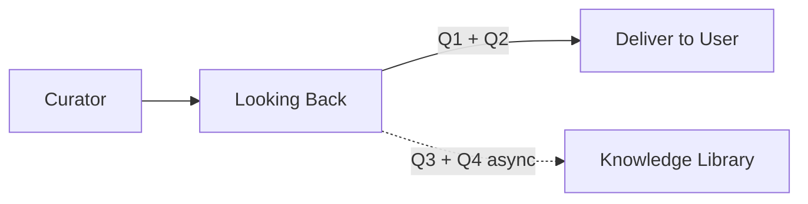

# WinDAGs Looking Back

Ask Polya's four questions at the end of every execution. Q1 and Q2 are mandatory and block completion. Q3 and Q4 are conditional, asynchronous, and never delay result delivery. Produce a `LookingBackResult` that feeds into the learning archive.

**Model Tier**: Q1-Q2 = Tier 1 (Haiku-class), Q3-Q4 = Tier 2 (Sonnet-class)
**Behavioral Contracts**: BC-LEARN-003, BC-CROSS-009

---

## When to Use

Use this skill when:
- A DAG execution has completed (the Evaluator has scored all nodes)
- The Curator has processed learning updates (or is processing them concurrently)
- You need to verify that the original contract was satisfied
- You need to surface unstated assumptions before delivering results

Do NOT use for:
- Thompson sampling or skill quality updates (use `windags-curator`)
- Pre-execution failure scanning (use `windags-premortem`)
- Mid-execution failure diagnosis (use `windags-mutator`)

---

## The Four Questions

Derived from Polya's "How to Solve It" -- the Looking Back phase. Adapted for DAG execution.



### Mandatory vs. Conditional

| Question | Requirement | Model Tier | Blocks Delivery? | Cost Gate |
|----------|------------|------------|-------------------|-----------|
| Q1 | MANDATORY, every DAG | Tier 1 | Yes | None |
| Q2 | MANDATORY, every DAG | Tier 1 | Yes | None |
| Q3 | CONDITIONAL | Tier 2 | No | quality >= 0.8, cost <= $0.01 |
| Q4 | CONDITIONAL | Tier 2 | No | quality >= 0.9, cost <= $0.02 |

**BC-LEARN-003**: Q1 and Q2 run on every DAG, including trivial single-node DAGs. No exceptions.

**BC-CROSS-009**: Q3 and Q4 are non-blocking. They run asynchronously after the result has been delivered to the user. Their findings are appended to the `LookingBackResult` when available.

---

## Q1: Was the Contract Satisfied?

Verify that the DAG's output matches what was promised.

### Verification Protocol

1. **Retrieve the original contract**: Pull the Sensemaker's problem statement and the Decomposer's output specification. The contract is what was promised, not what was attempted.

2. **Check output presence**: Verify that every required output field exists in the final result. Missing fields are an automatic Q1 failure.

3. **Check output types**: Verify that each output field matches its specified type. A field that exists but contains the wrong type (string where number expected, empty array where populated array expected) is a type violation.

4. **Check output content**: For each output field, verify that the content addresses the original problem statement. An output that is present, correctly typed, but irrelevant is a content failure.

5. **Check completeness**: If the contract specified multiple deliverables, verify all are present. Partial completion is noted with the specific gaps identified.

### Q1 Decision

```
q1_satisfied = all of:
  - All required fields present
  - All fields correctly typed
  - All fields contain relevant content
  - All specified deliverables accounted for

q1_evidence = list of:
  - For each check: pass/fail + specific details
  - If failed: which specific aspect failed and why
```

When Q1 fails, note the specific failure mode. This feeds back into the Evaluator's quality model and the Curator's Thompson updates.

---

## Q2: Were There Unstated Assumptions?

Surface assumptions that the DAG made implicitly but never validated.

### Assumption Categories

Scan for each category in order.

**1. Environment Assumptions**
- Operating system requirements (file paths, shell commands)
- Network availability (API endpoints, external services)
- Software dependencies (installed tools, library versions)
- Hardware requirements (GPU, memory, disk space)

**2. Data Assumptions**
- Input format expectations (JSON, CSV, plain text)
- Data quality expectations (completeness, consistency, encoding)
- Data volume expectations (fits in memory, single file, stream)
- Data freshness expectations (real-time, cached, historical)

**3. Dependency Assumptions**
- Implicit ordering between nodes not captured by edges
- Assumed availability of intermediate results
- Assumed idempotency of node operations
- Assumed determinism of model outputs

**4. Context Assumptions**
- User expertise level (beginner, intermediate, expert)
- Domain knowledge (assumed familiarity with terminology)
- Time constraints (assumed urgency or lack thereof)
- Security context (assumed trust level, permissions)

### Detection Method

For each node in the DAG:
1. Read the node's input specification and prompt
2. Identify any reference to external state not provided by upstream nodes
3. Identify any conditional logic that assumes a specific environment
4. Identify any data transformation that assumes a specific format

Collect all detected assumptions. Rate each by impact:
- **Low**: Assumption is likely true and failure would be graceful
- **Medium**: Assumption could be false and failure would degrade quality
- **High**: Assumption could be false and failure would be silent (wrong results delivered confidently)

High-impact assumptions are the most dangerous because they produce confident-incorrect outputs (Principle 8).

---

## Q3: Can This Solution Method Be Generalized?

Only run when: `average_quality >= 0.8 AND estimated_q3_cost <= $0.01`

This question uses a Tier 2 model because generalization requires reasoning about abstraction.

### Generalization Analysis

1. **Extract the method**: What sequence of operations did this DAG use to solve the problem? Abstract away the specific inputs and outputs. Describe the method as a template.

2. **Identify the invariant**: What properties of the input made this method work? What would need to be true of a new input for the same method to apply?

3. **Identify the variables**: What parts of the method changed based on the specific problem? These are the parameters of the generalized method.

4. **Test generalizability**: Mentally apply the method to 2-3 hypothetical problems in the same domain. Does it still make sense? Would it produce reasonable results?

5. **Assess scope**: How broad is the class of problems this method covers?
   - Narrow: Works for this specific sub-domain only
   - Medium: Works for this domain with parameter adjustment
   - Broad: Works across multiple domains with the same structure

### Output

```
q3_generalizable: true | false
q3_method_description: string  # The generalized method as a template
q3_scope: "narrow" | "medium" | "broad"
q3_invariants: [string]        # Conditions that must hold
q3_parameters: [string]        # Parts that vary per problem
```

When `q3_generalizable = true` and `q3_scope != "narrow"`, this feeds into the Curator's crystallization pipeline. A generalizable method is a candidate for a new skill.

---

## Q4: Does This Connect to a Broader Problem Class?

Only run when: `average_quality >= 0.9 AND estimated_q4_cost <= $0.02`

This question uses a Tier 2 model because identifying problem class connections requires broad reasoning.

### Connection Analysis

1. **Identify the problem class**: What type of problem was this? Classification options:
   - Transformation (input A -> output B)
   - Search (find X satisfying constraints)
   - Optimization (maximize/minimize objective)
   - Synthesis (combine elements into coherent whole)
   - Analysis (decompose whole into understood parts)
   - Diagnosis (identify cause from symptoms)
   - Planning (sequence of actions to achieve goal)

2. **Find structural analogies**: What other problems share the same structure, even if the domain is different? Look for:
   - Same dependency pattern (fan-out, fan-in, pipeline, diamond)
   - Same reasoning pattern (decompose-and-conquer, generate-and-test, constraint-propagation)
   - Same evaluation pattern (threshold-based, comparative, multi-criteria)

3. **Identify transfer opportunities**: If this method worked here, where else might it work? Be specific:
   - Name the target domain
   - Describe what would need to change
   - Estimate the transfer difficulty (low/medium/high)

### Output

```
q4_connections:
  - problem_class: string       # The broader class name
    structural_analogy: string  # What structure is shared
    transfer_targets:
      - domain: string
        adaptation_needed: string
        transfer_difficulty: "low" | "medium" | "high"
```

---

## Q3-Q4 Non-Blocking Protocol (BC-CROSS-009)

Q3 and Q4 run asynchronously after the result is delivered to the user.



The user receives their result without waiting for Q3 or Q4. These findings are available for subsequent executions and for the Curator's crystallization pipeline.

If Q3 or Q4 fail (model error, timeout, cost overrun), silently skip. They are enrichment, not requirements.

---

## Output Format

Produce a `LookingBackResult` with these fields:

```
LookingBackResult:
  q1_satisfied: boolean
  q1_evidence:
    - check: string             # What was verified
      result: "pass" | "fail"
      detail: string            # Specific evidence

  q2_assumptions:
    - category: string          # Environment | Data | Dependency | Context
      assumption: string        # What was assumed
      impact: "low" | "medium" | "high"
      validation_status: "confirmed" | "unvalidated" | "violated"

  q3_generalizable: boolean | null    # null if not run
  q3_method_description: string | null
  q3_scope: "narrow" | "medium" | "broad" | null
  q3_invariants: [string] | null
  q3_parameters: [string] | null

  q4_connections: list | null          # null if not run
    - problem_class: string
      structural_analogy: string
      transfer_targets:
        - domain: string
          adaptation_needed: string
          transfer_difficulty: "low" | "medium" | "high"

  execution_summary:
    total_nodes: number
    successful_nodes: number
    average_quality: number
    total_cost: number
    total_duration_seconds: number
```

---

## Integration with Meta-DAG

Looking Back is the final agent in the meta-DAG pipeline:



Looking Back reads the Evaluator's scores and the Curator's learning updates but does not modify them. It produces an independent assessment. If Q1 finds a contract violation that the Evaluator missed, this is logged as a discrepancy for future calibration.

---

## Performance Budget

| Operation | Target |
|-----------|--------|
| Q1 verification | < 2s |
| Q2 assumption scan | < 3s |
| Q3 generalization (Tier 2) | < 10s |
| Q4 connection analysis (Tier 2) | < 15s |
| Q1 + Q2 total (blocking) | < 5s |
| Q3 + Q4 total (non-blocking) | < 25s |

Q1 and Q2 together must complete in under 5 seconds. They block result delivery and must be fast. Q3 and Q4 have more latitude because they run in the background.
