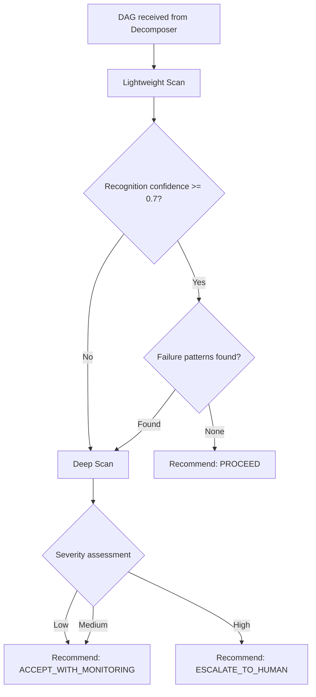
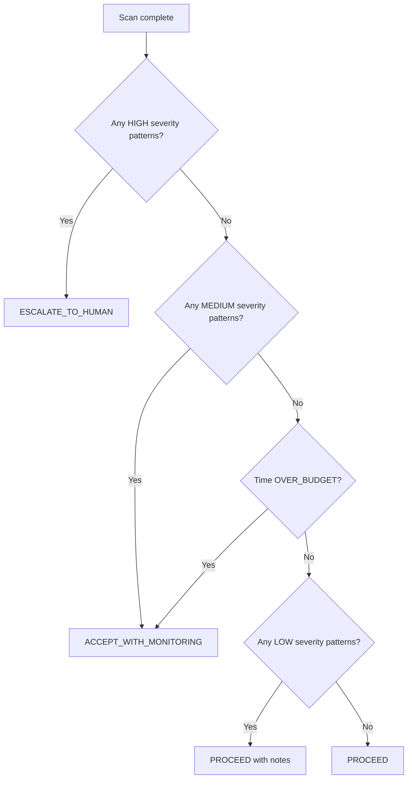
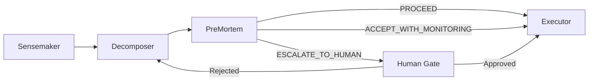

# WinDAGs PreMortem

Scan every DAG for failure patterns before execution begins. Run the lightweight scan unconditionally. Escalate to deep analysis when warranted. Produce a `PreMortemResult` that the Executor uses to decide whether to proceed, monitor, or halt.

**Model Tier**: Tier 1 (Haiku-class)
**Behavioral Contract**: BC-PLAN-004

---

## When to Use

Use this skill when:
- A DAG has been decomposed and is awaiting execution
- The Executor needs a go/no-go recommendation
- Timing estimates are needed for the critical path
- You need to identify shared failure domains across parallel batches

Do NOT use for:
- Post-execution analysis (use `windags-looking-back`)
- Learning updates after execution (use `windags-curator`)
- DAG restructuring after failure (use `windags-mutator`)

---

## Behavioral Contract: BC-PLAN-004

**The PreMortem lightweight scan runs on EVERY DAG, including trivial depth-1 DAGs.**

No exceptions. No "this DAG is too simple to scan." A depth-1 DAG with a single node still gets the lightweight scan. The cost is negligible (Tier 1 model, structured checks). The risk of skipping is not.

---

## Two-Level Scan Architecture



### Level 1: Lightweight Scan (Always Runs)

Execute these checks in order. Each check is a structured pattern match, not a generative task.

1. **Cascade Depth Check**: Walk the DAG and measure the longest path. Flag if depth > 3 with no isolation boundaries between failure domains.

2. **Shared Failure Domain Check**: For each parallel batch (wave), identify nodes that share a failure domain (same model provider, same API, same file system resource). Flag if any batch has > 50% of nodes in the same failure domain.

3. **Single Point of Failure Check**: Identify any node where `count(dependents) >= 3`. That node's failure cascades to 3+ downstream nodes. Flag it.

4. **Resource Contention Check**: Identify nodes in the same wave that require the same expensive resource (GPU, large model, exclusive file lock, rate-limited API). Flag contention.

5. **Timing Risk Check**: Estimate per-node duration using historical data or heuristics. Identify nodes on the critical path where a 2x slowdown would push total execution past the user's time expectation.

6. **Known Pattern Match**: Compare the DAG topology against the failure pattern library (see Failure Pattern Categories below). Log any matches with confidence scores.

### Level 2: Deep Scan (Conditional)

Trigger deep scan when:
- Recognition confidence < 0.7 (the Sensemaker was uncertain about this problem type)
- Lightweight scan found one or more failure patterns
- DAG depth >= 5 (complex enough to warrant deeper analysis)

Deep scan adds:

1. **Dependency Chain Analysis**: Trace every path from root to leaf. Score each path for fragility: `fragility = (path_length * max_fan_out) / isolation_boundaries`. Flag paths with fragility > 5.0.

2. **Failure Propagation Simulation**: For each flagged node, estimate the blast radius (how many downstream nodes fail if this node fails). Rank nodes by blast radius.

3. **Resource Budget Projection**: Sum estimated costs (tokens, API calls, time) across all nodes. Compare against the user's budget constraints. Flag if projected cost exceeds 80% of budget.

4. **Alternative Topology Suggestions**: If failure patterns are severe, propose specific mitigations:
   - Add isolation boundaries (split a wave)
   - Add redundancy (duplicate a critical node with a different model/skill)
   - Reorder waves to fail fast on high-risk nodes

---

## Failure Pattern Categories

Maintain and match against these five categories.

### 1. Cascading Dependency Chains

**Pattern**: Linear chain of depth > 3 with no isolation boundaries.
**Risk**: A single early failure wastes all downstream computation.
**Mitigation**: Insert checkpoint gates. Move high-risk nodes earlier. Add fallback paths.

### 2. Shared Failure Domains in Parallel Batches

**Pattern**: Multiple nodes in the same wave depend on the same external resource (API provider, model endpoint, file system).
**Risk**: One provider outage takes down the entire wave.
**Mitigation**: Distribute nodes across failure domains. Stagger API calls. Add circuit breakers per domain.

### 3. Single Points of Failure

**Pattern**: A node with fan-out >= 3 (three or more nodes depend on it).
**Risk**: This node's failure cascades broadly.
**Mitigation**: Add retry logic with backoff. Consider running the critical node with a more reliable (higher-tier) model. Add a fallback skill.

### 4. Resource Contention

**Pattern**: Multiple nodes in the same wave compete for the same scarce resource.
**Risk**: Serialization, timeouts, or resource exhaustion.
**Mitigation**: Stagger execution within the wave. Reduce parallelism for contended resources. Pre-allocate resources.

### 5. Timing Risks

**Pattern**: A slow node sits on the critical path with tight-deadline dependents downstream.
**Risk**: Delay cascades and the user's time expectation is violated.
**Mitigation**: Estimate critical path duration. Flag if critical path > 80% of user's time expectation. Consider parallel alternatives or faster model tiers for bottleneck nodes.

---

## Timing Analysis

Perform timing analysis on every DAG (lightweight level). This addresses the Chef's concern from the Constitutional Convention: users need realistic time expectations before execution begins.

### Critical Path Estimation

1. Assign each node an estimated duration:
   - Use historical execution data if available for the skill + model combination
   - Fall back to tier-based heuristics: Tier 1 = 5-15s, Tier 2 = 15-45s, Tier 3 = 30-120s
   - Add overhead per wave transition: 2-5s

2. Compute the critical path using longest-path algorithm on the DAG.

3. Compute total wall-clock estimate: `critical_path_duration + (wave_count * wave_overhead)`.

### Delay Cascade Identification

For each node on the critical path, compute `cascade_impact`:
```
cascade_impact = (node_duration / critical_path_duration) * count(downstream_nodes)
```

Flag nodes where `cascade_impact > 0.3` -- these are the nodes where a delay hurts the most.

### Time Budget Check

Compare estimated total duration against user expectation (if provided). Report one of:
- `WITHIN_BUDGET`: Estimate < 80% of user expectation
- `TIGHT`: Estimate is 80-100% of user expectation
- `OVER_BUDGET`: Estimate > user expectation (flag specific bottleneck nodes)

---

## Output Format

Produce a `PreMortemResult` with these fields:

```
PreMortemResult:
  scan_level: "lightweight" | "deep"

  failure_patterns_found:
    - pattern: string           # Category name
      severity: "low" | "medium" | "high"
      affected_nodes: [NodeId]
      description: string       # Human-readable explanation
      mitigation: string        # Suggested fix

  timing_analysis:
    critical_path_nodes: [NodeId]
    estimated_duration_seconds: number
    delay_cascade_nodes:
      - node_id: NodeId
        cascade_impact: number  # 0.0 to 1.0
    time_budget_status: "WITHIN_BUDGET" | "TIGHT" | "OVER_BUDGET"

  resource_analysis:
    contention_points:
      - resource: string
        competing_nodes: [NodeId]
        wave: number
    projected_cost: number      # Estimated total cost in dollars
    budget_utilization: number  # 0.0 to 1.0

  recommendation: "PROCEED" | "ACCEPT_WITH_MONITORING" | "ESCALATE_TO_HUMAN"
  recommendation_rationale: string
```

### Recommendation Decision Logic



- **PROCEED**: No significant risks found. Execute the DAG as planned.
- **ACCEPT_WITH_MONITORING**: Risks identified but manageable. Execute with enhanced monitoring on flagged nodes. The Executor activates the Resilience overlay.
- **ESCALATE_TO_HUMAN**: Serious risks found. Present the failure patterns and timing analysis to the user. Wait for human decision before proceeding.

---

## Integration with Meta-DAG

The PreMortem sits between the Decomposer and the Executor in the meta-DAG pipeline:



When the PreMortem recommends `ESCALATE_TO_HUMAN`, the Executor pauses and presents:
1. The failure patterns found (with severity and affected nodes)
2. The timing analysis (critical path, delay cascade nodes)
3. Suggested mitigations
4. Options: approve as-is, approve with mitigations applied, reject and re-decompose

---

## Performance Budget

| Operation | Target |
|-----------|--------|
| Lightweight scan | < 2s for DAGs with <= 20 nodes |
| Deep scan | < 8s for DAGs with <= 20 nodes |
| Failure pattern match | < 200ms per pattern category |
| Timing estimation | < 500ms |
| Total PreMortem overhead | < 3% of total execution cost |

The PreMortem must never become a bottleneck. If the scan itself takes longer than 10% of the estimated DAG execution time, truncate to lightweight-only and note the truncation in the result.

---

## Failure Pattern Library

Maintain a persistent library of failure patterns observed across executions. The Curator updates this library post-execution. The PreMortem reads it pre-execution.

Each pattern entry contains:
- `pattern_id`: Unique identifier
- `category`: One of the five categories above
- `topology_signature`: Graph structure that triggers the pattern
- `frequency`: How often this pattern has been observed
- `severity_distribution`: Historical severity outcomes
- `effective_mitigations`: Mitigations that worked in the past

The library starts with the five built-in categories and grows through execution experience. This is part of the learning loop (Principle 10).
