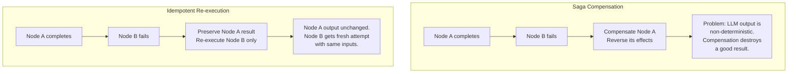

# Diagram 1: flowchart

```mermaid
flowchart TD
    subgraph saga["Saga Compensation"]
        S1["Node A completes"] --> S2["Node B fails"]
        S2 --> S3["Compensate Node A\nReverse its effects"]
        S3 --> S4["Problem: LLM output is\nnon-deterministic.\nCompensation destroys\na good result."]
    end

    subgraph idem["Idempotent Re-execution"]
        I1["Node A completes"] --> I2["Node B fails"]
        I2 --> I3["Preserve Node A result\nRe-execute Node B only"]
        I3 --> I4["Node A output unchanged.\nNode B gets fresh attempt\nwith same inputs."]
    end
```
