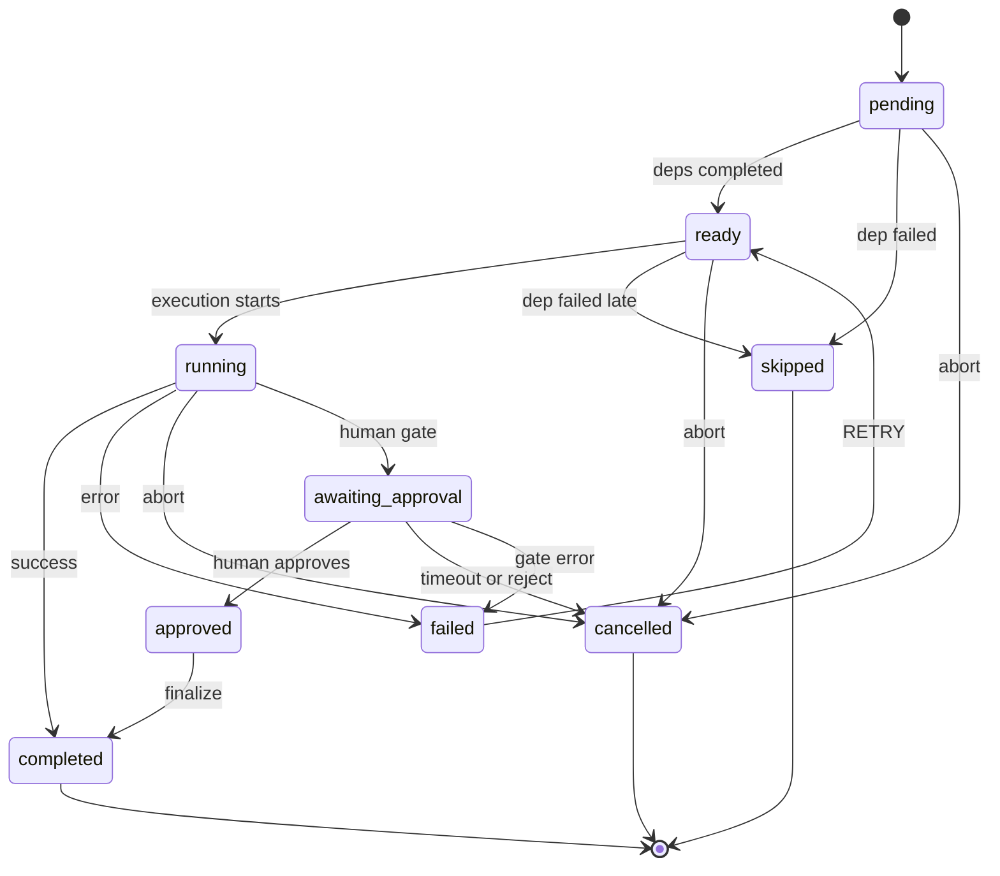

# Diagram 2: stateDiagram-v2

```mermaid
stateDiagram-v2
    [*] --> pending
    pending --> ready: deps completed
    pending --> skipped: dep failed
    pending --> cancelled: abort
    ready --> running: execution starts
    ready --> skipped: dep failed late
    ready --> cancelled: abort
    running --> completed: success
    running --> failed: error
    running --> cancelled: abort
    running --> awaiting_approval: human gate
    awaiting_approval --> approved: human approves
    awaiting_approval --> cancelled: timeout or reject
    awaiting_approval --> failed: gate error
    approved --> completed: finalize
    failed --> ready: RETRY
    completed --> [*]
    skipped --> [*]
    cancelled --> [*]
```
