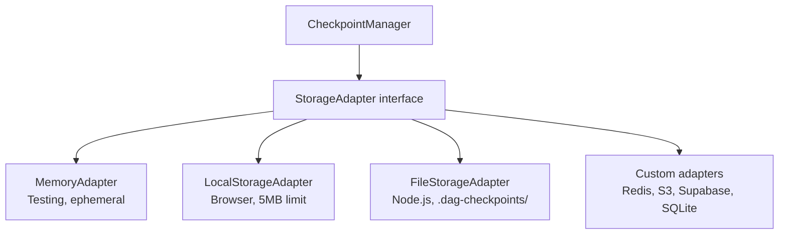

# Diagram 3: flowchart

```mermaid
flowchart TD
    CM["CheckpointManager"] --> SA["StorageAdapter interface"]
    SA --> MEM["MemoryAdapter\nTesting, ephemeral"]
    SA --> LS["LocalStorageAdapter\nBrowser, 5MB limit"]
    SA --> FS["FileStorageAdapter\nNode.js, .dag-checkpoints/"]
    SA --> CUSTOM["Custom adapters\nRedis, S3, Supabase, SQLite"]
```
